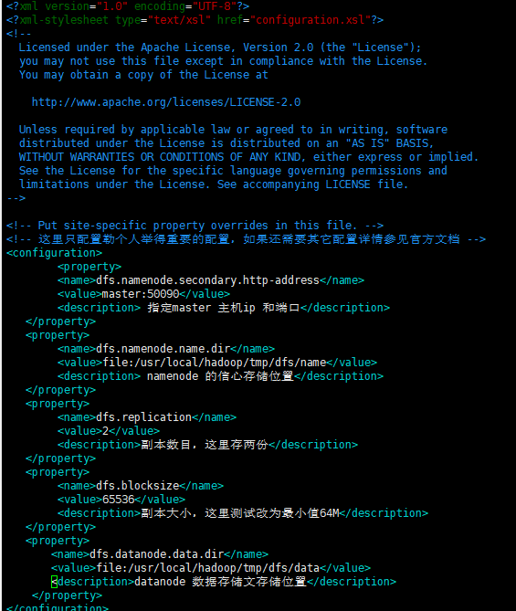
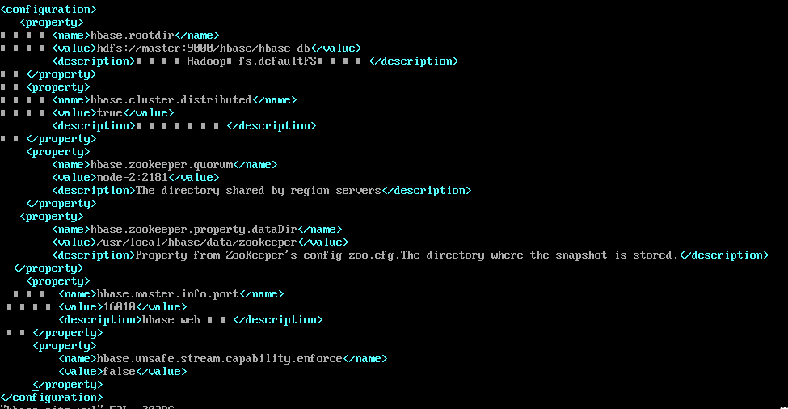

###hadoop安装步骤
#### 一、HDFS
 1. 创建hadoop用户
    * useradd -m hadoop -s /bin/bash    &nbsp;&nbsp;&nbsp;&nbsp;&nbsp;&nbsp;// 创建hadoop用户
    * passwd hadoop &nbsp;&nbsp;&nbsp;&nbsp;&nbsp;&nbsp; 创建了可以登陆的 hadoop 用户，并使用 /bin/bash 作为shell
    * visudo 给hadoop赋权  等效于 vim /etc/sudoers
    
    
    * 配置hadoop免密码登陆
        1. rpm -qa | grep ssh   &nbsp;&nbsp; 查看是否安装勒SSH client、SSH server
        2. 如果没安装安装 sudo yum install openssh-clients sudo yum install openssh-server
        3. cd ~/.ssh/   &nbsp;&nbsp;# 若没有该目录，请先执行一次ssh localhost
        4. ssh-keygen -t rsa  &nbsp;&nbsp; # 会有提示，都按回车就可以 
        
        5. cat id_rsa.pub >> authorized_keys &nbsp;&nbsp; # 加入授权
        6. ssh-copy-id -i  ~/.ssh/id_rsa.pub root@192.168.168.202 
        7. chmod 600 ./authorized_keys &nbsp;&nbsp; # 修改文件权限
 2. 下载解压hadoop 
    * wget https://mirrors.tuna.tsinghua.edu.cn/apache/hadoop/common/hadoop-3.2.1/hadoop-3.2.1.tar.gz
    * tar -zxf  hadoop-3.2.1.tar.gz
    * 添加hadoop倒环境变量（只是为了方便启动hadoop 所以配置到环境变量）
        1. 配置 hadoop 倒环境变量&nbsp;&nbsp;vim /etc/profile 
        
        2. source profile 使 profile文件马上生效
 3. 配置hadoop 
    集群/分布式模式需要修改 /usr/local/hadoop/etc/hadoop 中的5个配置文件，更多设置项可点击查看官方说明，这里仅设置了正常启动所必须的设置项： slaves、core-site.xml、hdfs-site.xml、mapred-site.xml、yarn-site.xml 。
    * workers &nbsp;&nbsp; 
    
    * core-site.xml &nbsp;&nbsp; hadoop 核心环境的配置 
    
    * hdfs-site.xml &nbsp;&nbsp; 需要使用hdfs所以对hdfs 的配置如下 
    
 4. 复制配置文件到所有的子节点下面 
    
    
 5.  一个 Hadoop HDFS Datanode 有一个同时处理文件的上限. 这个参数叫 xcievers (Hadoop的作者把这个单词拼错了). 在你加载之前，先确认下你有没有配置这个文件conf/hdfs-site.xml里面的xceivers参数，至少要有4096:
   
 6. 首次运行需要执行  hadoop namenode -format
 7. hadoop sbin 下启动 ../hadoop/sbin/start-dfs.sh
 8. http://10.10.0.55:9870 &nbsp;&nbsp; hdfs管理界面
 
####二、YARN 任务平台
 1. 配置yarn-evn.sh 的java_home 
    
    
    注意如果JDK是1.8以上的 需要在yarn-evn.sh
    
        export YARN_RESOURCEMANAGER_OPTS="--add-modules=ALL-SYSTEM"
        export YARN_NODEMANAGER_OPTS="--add-modules=ALL-SYSTEM"
    
 2. 配置 mapred-site.xml 
    
 3. 配置yarn-site.xml  
    
 4. 启动yarn 查看 http://10.10.0.55:8042/node 管理平台是否正常
####三、spark 部署

 1. yarn默认情况下，只根据内存调度资源，所以sparkon yarn运行的时候，即使通过--executor-cores指定vcore个数为N，但是在yarn的资源管理页面上看到使用的vcore个数还是1. 相关配置在capacity-scheduler.xml 文件
    * vim yarn-site.xml 
    
    
    
    
    yarn为每一个container分配的最小的内存：1024
    yarn.scheduler.minimum-allocation-mb  1024
    最大可分配的内存为8G:
    yarn.scheduler.maximum-allocation-mb  8192
    最小的cores： 1个  默认的就是一个
    yarn.scheduler.minimum-allocation-vcores 1 
    最多可分配的cores：32个
    yarn.scheduler.maximum-allocation-vcores 32 
    
   *  vim capacity-scheduler.xml 修改配置如下  
    
   * vim yarn-site.xml 新增如下配置  
     
    如果不配置这两个选项，在spark-on-yarn的client模式下，可能会报错,错误如下： 
    
   
   
    分析原因：内存不足，导致程序被终止。 
    yarn.nodemanager.pmem-check-enabled
    是否启动一个线程检查每个任务正使用的物理内存量，如果任务超出分配值，则直接将其杀掉，默认是true。
    yarn.nodemanager.vmem-check-enabled
    是否启动一个线程检查每个任务正使用的虚拟内存量，如果任务超出分配值，则直接将其杀掉，默认是true。
  2. 下载spark wget +下载地址注意spark 版本严格限制注意和hadoop的版本对应关系
  3. 解压下载的spark 包
  4. 配置spark环境参数 复制conf 下 spark-env.sh.template 为 spark-env.sh 配置如下 
    
   再次强调：提交spark任务的地方，就是客户端，所以配置一台机器即可。 
   待HDFS和YARN正常启动后，就可以提交任务到yarn集群中。 
  5. 配置结点信息 复制conf 下 slaves.template 为 slaves 配置如下 
      
  6. 配置好的spark 文件加复制到节点机子上
  7. 启动测试spark 是否安装完成 
  8. 注意如果需要在yarn 上启动 sbin/start-history-server.sh 否则启动 sbin/start-all.sh
####Flume安
  * wget 下载
  * 配置vim flume-env.sh 
  
  * 配置 vim flume-conf.properties  
  
  
 
    #Flume系统中核心的角色是agent，agent本身是一个Java进程，一般运行在日志收集节点。
    #每一个agent相当于一个数据传递员，内部有三个组件：
        Source：采集源，用于跟数据源对接，以获取数据；
        Sink：下沉地，采集数据的传送目的，用于往下一级agent传递数据或者往最终存储系统传递数据；
        Channel：agent内部的数据传输通道，用于从source将数据传递到sink；
    
    #在整个数据的传输的过程中，流动的是event，它是Flume内部数据传输的最基本单元。event将传输的数据进行封装。
     如果是文本文件，通常是一行记录，event也是事务的基本单位。event从source，流向channel，
     再到sink，本身为一个字节数组，并可携带headers(头信息)信息。event代表着一个数据的最小完整单元，
     从外部数据源来，向外部的目的地去。
    
    #一个完整的event包括：event headers、event body、event信息，其中event信息就是flume收集到的日记记录。
    
    # 定义一个agent格式如下
    #定义这个agent中各组件的名字
    test.sources = testSources
    test.channels = testChannel
    test.sinks = testSink
    
    #描述和配置source组件：testSources
    # 监听文件夹配置如下
    # test.sources.testSources.type = spooldir
    # test.sources.testSources.spoolDir = /logs
    # 监听端口如下
    test.sources.testSources.type = netcat
    test.sources.testSources.bind = node-2
    test.sources.testSources.port = 44444
    
    # sink到kafka里面
    test.sinks.testSink.channel = testChannel
    test.sinks.testSink.type =org.apache.flume.sink.kafka.KafkaSink
    #设置Kafka的Topic
    test.sinks.testSink.kafka.topic = test
    #设置Kafka的broker地址和端口号
    test.sinks.testSink.kafka.bootstrap.servers = node-2:9092
    #配置批量提交的数量
    test.sinks.testSink.kafka.flumeBatchSize = 20
    test.sinks.testSink.kafka.producer.acks = 1
    test.sinks.testSink.kafka.producer.linger.ms = 1
    test.sinks.testSink.kafka.producer.compression.type= snappy
                
    #对于channel的配置描述 使用文件做数据的临时缓存 这种的安全性要高
    test.channels.testChannel.type = file
    test.channels.testChannel.checkpointDir = /usr/local/flume/checkpoint
    test.channels.testChannel.dataDirs = /usr/local/flume/data
    
    #通过channel c1将source testSources和sink testSink关联起来
    test.sources.testSources.channels = testChannel
    test.sinks.testSink.channel = testChannel
  * 启动 nohup ./flume-ng agent -c conf -f ../conf/flume-conf.properties  -n first  -Dflume.root.logger=DEBUG,console &
        
        help 打印帮助信息  
        agent 运行一个Flume Agent
        avro-client 运行一个Avro Flume 客户端
        version 显示Flume版本。
        
        全局选项
        参数                    描述
        --conf,-c <conf>       在<conf>目录使用配置文件。指定配置文件放在什么目录
        --classpath,-C <cp>    追加一个classpath
        --dryrun,-d            不真正运行Agent，而只是打印命令一些信息。
        --plugins-path <dirs>  插件目录列表。默认：$FLUME_HOME/plugins.d
        -Dproperty=value	   设置一个JAVA系统属性值。
        -Xproperty=value	   设置一个JAVA -X的选项。
        
        
        Agent选项
        参数                     描述
        --conf-file,-f <file>   指定配置文件，这个配置文件必须在全局选项的--conf参数定义的目录下。（必填）
        --name,-n <name>        Agent的名称（必填）
        --help,-h               帮助
        
        Avro客户端选项
        参数                     描述
        --rpcProps,-P <file>    连接参数的配置文件。
        --host,-H <host>        Event所要发送到的Hostname。
        --port,-p <port>        Avro Source的端口。
        --dirname <dir>         Avro Source流到达的目录。
        --filename,-F <file>	Avro Source流到达的文件名。
        --headerFile,-R <file>	设置一个JAVA -X的选项。
#### kafaka 安装
  1. wget 下载
  2. 配置server.property 
  
  
  3. 启动zookeeper： nohup ./zookeeper-server-start.sh ../config/zookeeper.properties & 
  4. 启动kafaka ：./kafka-server-start.sh -daemon ../config/server.properties
####Hbase 安装
   1. wget 下载
   2. 配置环境变量 
   
   3. 设置所有节点时间一直，官网说：集群的时钟要保证基本的一致。稍有不一致是可以容忍的，但是很大的不一致会造成奇怪的行为。 运行 NTP 或者其他什么东西来同步你的时间.
      如果你查询的时候或者是遇到奇怪的故障，可以检查一下系统时间是否正确!
   4. ulimit 和 nproc    
      * HBase是数据库，会在同一时间使用很多的文件句柄。大多数linux系统使用的默认值1024是不能满足的，会导致FAQ: Why do I see "java.io.IOException...(Too many open files)" in my logs?异常。还可能会发生这样的异常
        1. 如果你使用的是Ubuntu,你可以这样设置:

            vim  /etc/security/limits.conf 
              
        2. 可以把 hadoop 替换成你运行HBase和Hadoop的用户。如果你用两个用户，你就需要配两个。还有配nproc hard 和 soft limits. 
           
            hadoop soft/hard nproc 32000
        3. vim /etc/pam.d/common-session 加上这一行:
        
            session required  pam_limits.so
            
            否则在 /etc/security/limits.conf上的配置不会生效.
   5. Hbase 环境配置：vim hbase-env.sh  
            
   6. vim hbase-site.xml 
           
   7. 启动hbase bin/start-hbase.sh
   8. 查看是否正常运行 #http://10.10.0.56:16010/
