#springSecurity + OAuth2 获取Token流程分析以及增加协议授权模式

## 一、什么是OAuth2协议？
OAuth 2.0 是一个关于授权的开放的网络协议，是目前最流行的授权机制。

数据的所有者告诉系统，同意授权第三方应用进入系统，获取这些数据。系统从而产生一个短期的进入令牌（token），用来代替密码，供第三方应用使用。

由于授权的场景众多，OAuth 2.0 协议定义了获取令牌的四种授权方式，分别是：

* 授权码模式：授权码模式（authorization code）是功能最完整、流程最严密的授权模式。它的特点就是通过客户端的后台服务器，与"服务提供商"的认证服务器进行互动。
* 简化模式：简化模式（implicit grant type）不通过第三方应用程序的服务器，直接在浏览器中向认证服务器申请令牌，跳过了"授权码"这个步骤，因此得名。所有步骤在浏览器中完成，令牌对访问者是可见的，且客户端不需要认证。
* 密码模式：密码模式（Resource Owner Password Credentials Grant）中，用户向客户端提供自己的用户名和密码。客户端使用这些信息，向"服务商提供商"索要授权。
* 客户端模式：客户端模式（Client Credentials Grant）指客户端以自己的名义，而不是以用户的名义，向"服务提供商"进行认证。严格地说，客户端模式并不属于OAuth框架所要解决的问题。在这种模式中，用户直接向客户端注册，客户端以自己的名义要求"服务提供商"提供服务，其实不存在授权问题。
* 四种授权模式分别使用不同的 grant_type 来区分

## 二、为什么要自定义授权类型？

虽然 OAuth2 协议定义了4种标准的授权模式，但是在实际开发过程中还是远远满足不了各种变态的业务场景，需要我们去扩展。

    例如增加图形验证码、手机验证码、手机号密码登录等等的场景

而常见的做法都是通过增加 过滤器Filter 的方式来扩展 Spring Security 授权，但是这样的实现方式有两个问题：

1. 脱离了 OAuth2 的管理
2. 不灵活：例如系统使用 密码模式 授权，网页版需要增加图形验证码校验，但是手机端APP又不需要的情况下，使用增加 Filter 的方式去实现就比较麻烦了。
所以目前在 Spring Security 中比较优雅和灵活的扩展方式就是通过自定义 grant_type 来增加授权模式。

## 三、实现思路
在扩展之前首先需要先了解 Spring Security 的整个授权流程，我以 密码模式 为例去展开分析，如下图所示
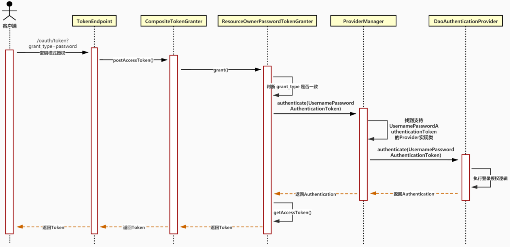
###3.1. 流程分析
整个授权流程关键点分为以下两个部分：

我们先看一下获取token的运行流程：

1. 在发起 URL+/oauth/token 获取token的请求后，实际上是请求 TokenEndpoint 类的postAccessToken或者getAccessToken方法，就相当于一个普通的concoller请求方法，根据请求类型是get或者post，其实get请求内部也是调用post请求的方法）    
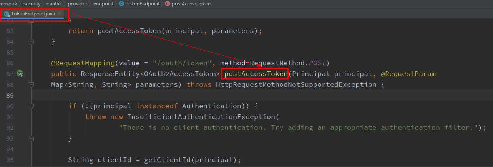
2. 在postAccessToken这个方法中，在这个方法的132行调用TokenGranter类的grant方法来获取token，这个方法也是最重要的，通过这个方法我们可以对请求的参数进行校验是否合法，是否给予令牌。
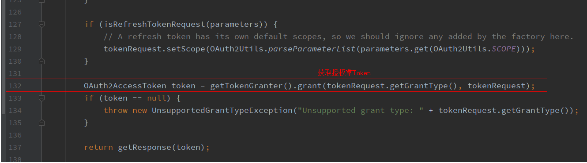
3. TokenGranter是一个接口，它有多个实现类，CompositeTokenGranter是其中之一，在grant方法中，会循环遍历所有的授权方式，根据请求参数携带的授权方式码，来匹配对应的授权处理实现类，调用实现类中的grant方法。那么关键点来了，请求参数中携带的是我们自定义的授权方式码，如果要匹配上，那么首先我们要创建自定义的授权处理类，然后把这个授权处理类放入Spring Security默认的授权处理集合中，这样才能循环匹配上，进行下一步。
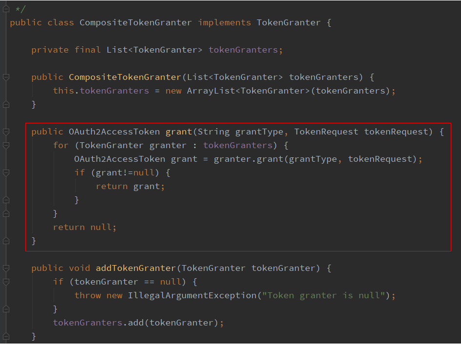
4. 创建自定义授权处理类，我们可以继承TokenGranter来实现自定义的身份验证以便获取token，而AbstractTokenGranter是一个继承TokenGranter的实现类，一般我们都会继承这个类进行使用。从下面代码可以看出，这个抽象类的grant方法返回token，在最后调用了getOAuth2Authentication方法，所以我们只需要继承AbstractTokenGranter类然后重写getOAuth2Authentication方法就可以了。
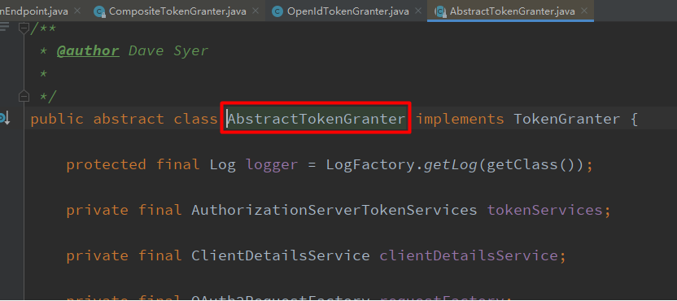
5. 对于参数的校验，在上图中36行代码，authenticationManager.authenticate(userAuth);这个方法中进行校验的，下面我们先看一下源码，再去实现自定义的认证提供商类AuthenticationProvider。在源码中，AuthenticationProvider是一个接口，里面有两个方法，一个是校验参数的方法，另一个则是根据当前认证信息匹配出对应的认证提供商类，这个接口有很多实现类，其中ProviderManager类是非常关键的，在这个类中的参数校验方法中，会根据当前要认证的对象，获取符合要求的所有的认证提供商，然后循环匹配出对应的认证提供商，在调取校验方法进行参数校验
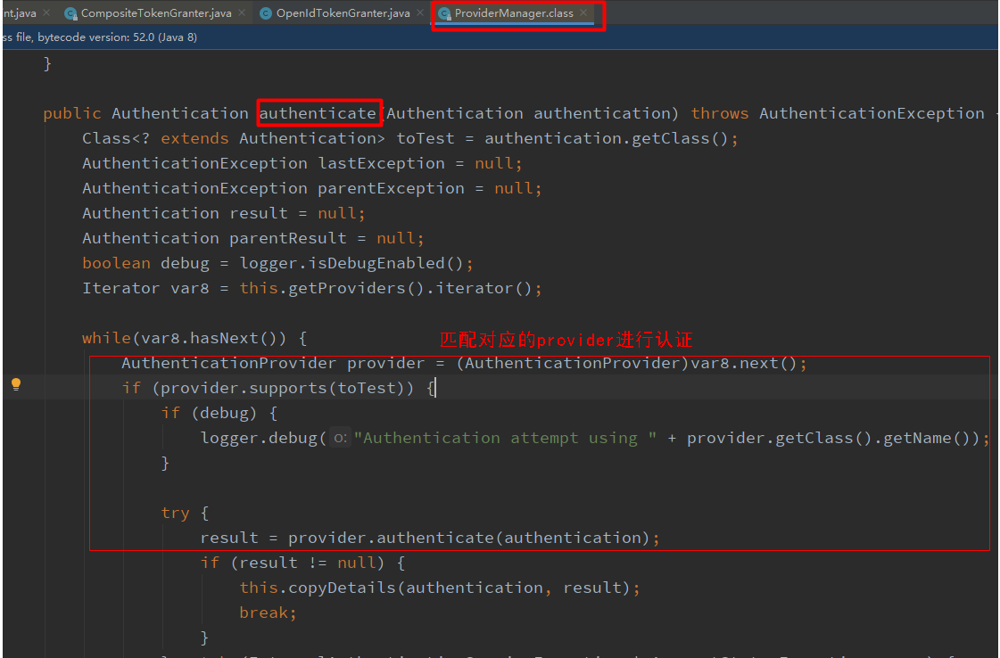
6. 由上图可知，我们只需要实现ProviderManager接口的两个方法，自定义自己的参数校验方法，并且把这个自定义的ProviderManager加入到认证提供商集合中，在循环匹配的时候即可匹配到我们自定义的ProviderManager，进行参数校验。
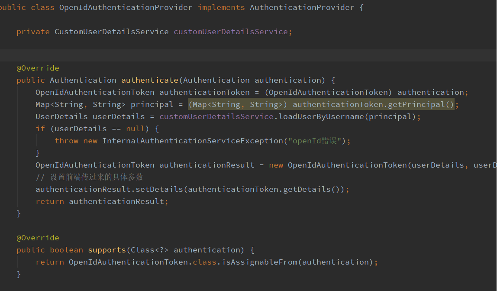
7. 把自定义的ProviderManager放入ProviderManager集合中，我的方法如下，在配置文件中，重写configure方法，配置ProviderManager，这里除了配置我们自定义的ProviderManager之外，还需要额外配置默认的密码授权模式的ProviderManager，否则client认证将不会通过。
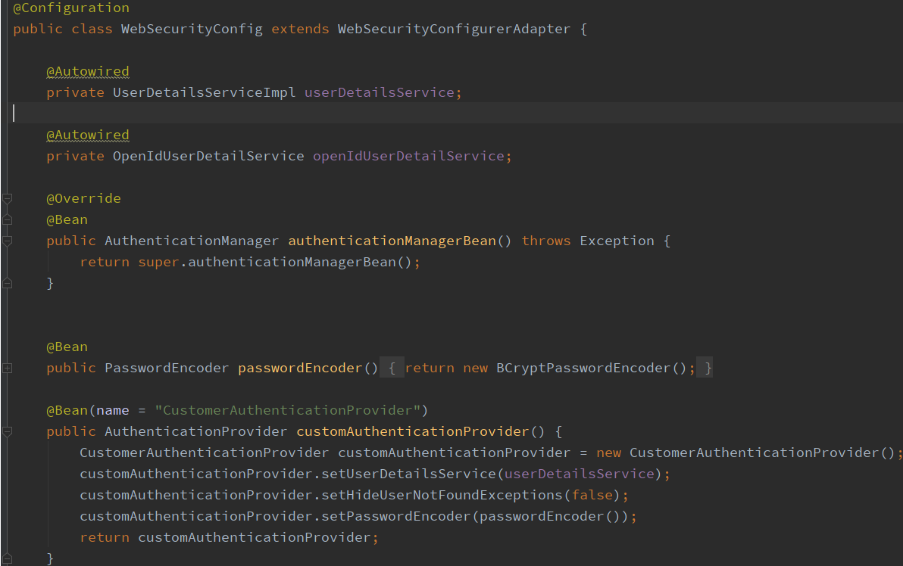
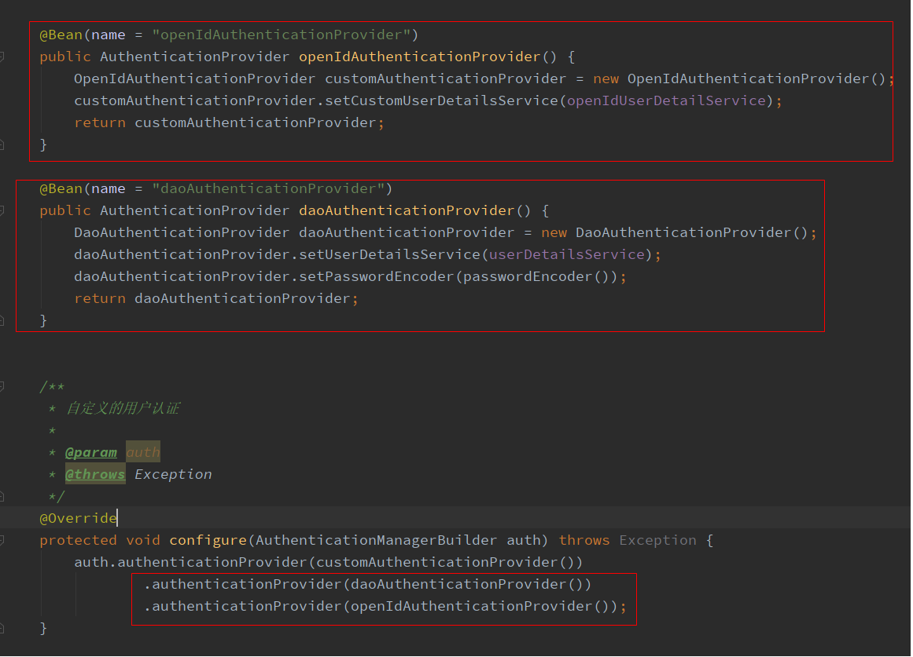
8. 经过以上步骤，已经实现自定义token的获取，最后要做的是把这个自定义授权模式类，放入系统默认的授权模式集合中，这样在CompositeTokenGranter的grant方法中，才能循环匹配到我们自定义的授权模式，进而直接获取token。我们先来看一下，系统默认的授权模式集合是在哪里初始化的？答案在AuthorizationServerEndpointsConfigurer这个类中559行，调用了getDefaultTokenGranters()方法，并且创建了 CompositeTokenGranter的实例对象，进行初始化。查看源码可以发现，系统已经把默认的授权模式全都写死在程序里了，因此我的解决思路是如下的
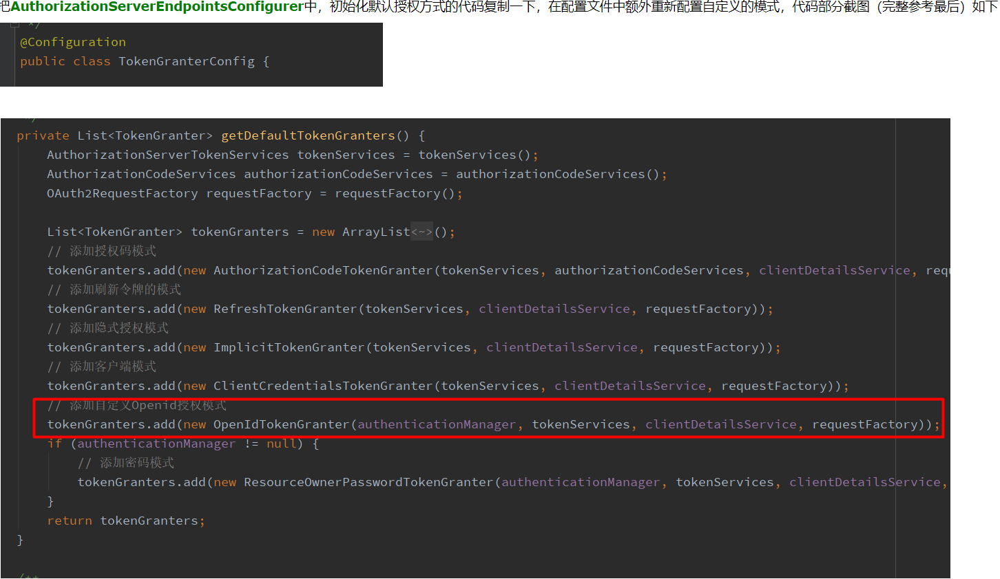
9. 授权认证服务端点配置
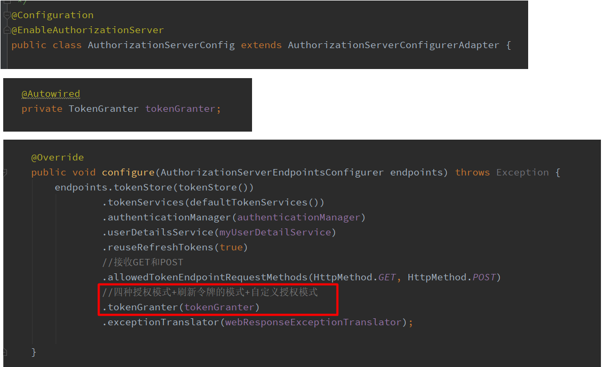
10. 最后：查看源码可以发现，当前clientid拥有的授权方式码是通过ClientDetails client = clientDetailsService.loadClientByClientId(clientId);获取的，在数据库中配置的，因此我们需要再oauth_client_details表中，在对应的 clientid 的  authorized_grant_types 字段中加上自定义的授权模式码。
####第一部分：关于授权类型 grant_type 的解析
* 每种 grant_type 都会有一个对应的 TokenGranter 实现类。
* 所有 TokenGranter 实现类都通过 CompositeTokenGranter 中的 tokenGranters 集合存起来。
* 然后通过判断 grantType 参数来定位具体使用那个 TokenGranter 实现类来处理授权。
####第二部分：关于授权登录逻辑
* 每种 授权方式 都会有一个对应的 AuthenticationProvider 实现类来实现。
* 所有 AuthenticationProvider 实现类都通过 ProviderManager 中的 providers 集合存起来。
* TokenGranter 类会 new 一个 AuthenticationToken 实现类，如 UsernamePasswordAuthenticationToken 传给 ProviderManager 类。
* 而 ProviderManager 则通过 AuthenticationToken 来判断具体使用那个 AuthenticationProvider 实现类来处理授权。
* 具体的登录逻辑由 AuthenticationProvider 实现类来实现，如 DaoAuthenticationProvider
