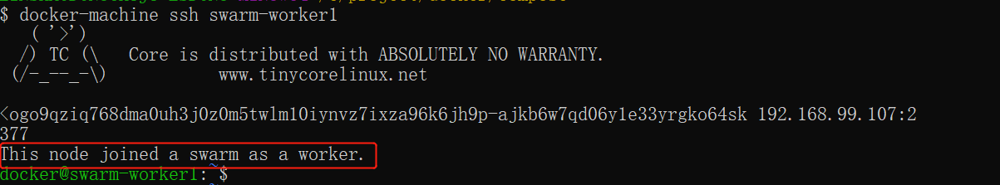

#Docker 架构
   Docker 包括三个基本概念:
   * 镜像（Image）：Docker 镜像（Image），就相当于是一个 root 文件系统。比如官方镜像 ubuntu:16.04 就包含了完整的一套 Ubuntu16.04 最小系统的 root 文件系统。
   * 容器（Container）：镜像（Image）和容器（Container）的关系，就像是面向对象程序设计中的类和实例一样，镜像是静态的定义，容器是镜像运行时的实体。容器可以被创建、启动、停止、删除、暂停等。
   * 仓库（Repository）：仓库可看成一个代码控制中心，用来保存镜像。
   
Docker 使用客户端-服务器 (C/S) 架构模式，使用远程API来管理和创建Docker容器。

Docker 容器通过 Docker 镜像来创建

容器与镜像的关系类似于面向对象编程中的对象与类。
<table>
   <tr><td> Docker</td><td>面向对象</td></tr>
   <tr><td> 容器</td><td>对象</td></tr>
   <tr><td> 镜像</td><td>类</td></tr>
</table>

  
  
<table>
   <tr><td> Docker 镜像(Images)</td><td>Docker 镜像是用于创建 Docker 容器的模板，比如 Ubuntu 系统</td></tr>
   <tr><td>Docker 容器(Container)</td><td>容器是独立运行的一个或一组应用，是镜像运行时的实体</td></tr>
   <tr><td>Docker 客户端(Client)</td><td>Docker 客户端通过命令行或者其他工具使用 Docker SDK (https://docs.docker.com/develop/sdk/) 与 Docker 的守护进程通信。</td></tr>
   <tr><td>Docker 主机(Host)</td><td>个物理或者虚拟的机器用于执行 Docker 守护进程和容器</td></tr>
   <tr><td>Docker Registry</td>
   <td>Docker 仓库用来保存镜像，可以理解为代码控制中的代码仓库。 
                                   Docker Hub(https://hub.docker.com) 提供了庞大的镜像集合供使用。 >
                                    一个 Docker Registry 中可以包含多个仓库（Repository）；每个仓库可以包含多个标签（Tag）；每个标签对应一个镜像
                                    通常，一个仓库会包含同一个软件不同版本的镜像，而标签就常用于对应该软件的各个版本。我们可以通过 <仓库名/>:<标签/> 的格式来指定具体是这个软件哪个版本的镜像。如果不给出标签，将以 latest 作为默认标签
                                    </td></tr>
</table>
#Docker 安装
        
   安装教程（参见菜鸟教程）：https://www.runoob.com/docker/centos-docker-install.html    
          
# hello word 为例 介绍Docker启动日志停止等常规操作

   Docker 允许你在容器内运行应用程序， 使用 docker run 命令来在容器内运行一个应用程序。
   
       runoob@runoob:~$ docker run ubuntu:15.10 /bin/echo "Hello world"
       Hello world
       
   各个参数解析：
   
   * docker: Docker 的二进制执行文件。
   * run: 与前面的 docker 组合来运行一个容器
   * ubuntu:15.10 指定要运行的镜像，Docker 首先从本地主机上查找镜像是否存在，如果不存在，Docker 就会从镜像仓库 Docker Hub 下载公共镜像 
   * /bin/echo "Hello world": 在启动的容器里执行的命令

   我们通过 docker 的两个参数 -i -t，让 docker 运行的容器实现"对话"的能力：
   
       runoob@runoob:~$ docker run -i -t ubuntu:15.10 /bin/bash
       root@0123ce188bd8:/#
各个参数解析：

   * -t: 在新容器内指定一个伪终端或终端。

   * -i: 允许你对容器内的标准输入 (STDIN) 进行交互。

我们可以通过运行 exit 命令或者使用 CTRL+D 来退出容器
        
        root@0123ce188bd8:/#  exit
        exit
        root@runoob:~# 
        
注意第三行中 root@runoob:~# 表明我们已经退出了当期的容器，返回到当前的主机中。

启动容器（后台模式）
    
    runoob@runoob:~$ docker run -d ubuntu:15.10 /bin/sh -c "while true; do echo hello world; sleep 1; done"
    2b1b7a428627c51ab8810d541d759f072b4fc75487eed05812646b8534a2fe63
    
在输出中，我们没有看到期望的 "hello world"，而是一串长字符

2b1b7a428627c51ab8810d541d759f072b4fc75487eed05812646b8534a2fe63

这个长字符串叫做容器 ID，对每个容器来说都是唯一的，我们可以通过容器 ID 来查看对应的容器发生了什么。

首先，我们需要确认容器有在运行，可以通过 docker ps 来查看：

    runoob@runoob:~$ docker ps
    CONTAINER ID        IMAGE                  COMMAND              ...  
    5917eac21c36        ubuntu:15.10           "/bin/sh -c 'while t…"    ...

输出详情介绍：

CONTAINER ID: 容器 ID。

IMAGE: 使用的镜像。

COMMAND: 启动容器时运行的命令。

CREATED: 容器的创建时间。

STATUS: 容器状态。

状态有7种：

  * created（已创建）
  * restarting（重启中）
  * running（运行中）
  * removing（迁移中）
  * paused（暂停）
  * exited（停止）
  * dead（死亡）
  
PORTS: 容器的端口信息和使用的连接类型（tcp\udp）。

NAMES: 自动分配的容器名称。

在宿主主机内使用 docker logs 命令，查看容器内的标准输出：

    runoob@runoob:~$ docker logs 2b1b7a428627

我们使用 docker stop 命令来停止容器:

# Docker 容器

    docker 客户端非常简单 ,我们可以直接输入 docker 命令来查看到 Docker 客户端的所有命令选项。
    可以通过命令 docker command --help 更深入的了解指定的 Docker 命令使用方法。
    
    可以通过命令 docker command --help 更深入的了解指定的 Docker 命令使用方法。
##容器使用
###获取镜像
   如果我们本地没有 ubuntu 镜像，我们可以使用 docker pull 命令来载入 ubuntu 镜像：
   
    $ docker pull ubuntu
###启动容器
    $ docker run -it ubuntu /bin/bash
参数说明：
 * -i: 交互式操作。
 * -t: 终端。
 * ubuntu: ubuntu 镜像。
 * /bin/bash：放在镜像名后的是命令，这里我们希望有个交互式 Shell，因此用的是 /bin/bash。
###查看所有的容器：
    $ docker ps -a
###启动已停止运行的容器
    $ docker start b750bbbcfd88 
###后台运行
    $ docker run -itd --name ubuntu-test ubuntu /bin/bash
###停止一个容器
    $ docker stop <容器 ID>
###重启一个容器
    $ docker restart <容器 ID>
###进入容器
在使用 -d 参数时，容器启动后会进入后台。此时想要进入容器，可以通过以下指令进入：
   * docker attach
   * docker exec：推荐大家使用 docker exec 命令，因为此退出容器终端，不会导致容器的停止。
###导出和导入容器
如果要导出本地某个容器，可以使用 docker export 命令

    $ docker export 1e560fca3906 > ubuntu.tar
导入容器快照

可以使用 docker import 从容器快照文件中再导入为镜像，以下实例将快照文件 ubuntu.tar 导入到镜像 test/ubuntu:v1
    
    $ cat docker/ubuntu.tar | docker import - test/ubuntu:v1
此外，也可以通过指定 URL 或者某个目录来导入，例如：    
$ docker import http://example.com/exampleimage.tgz example/imagerepo
###删除容器
删除容器使用 docker rm 命令：

    $ docker rm -f 1e560fca3906
###运行一个 web 应用

前面我们运行的容器并没有一些什么特别的用处。

接下来让我们尝试使用 docker 构建一个 web 应用程序。

我们将在docker容器中运行一个 Python Flask 应用来运行一个web应用。

    runoob@runoob:~# docker pull training/webapp  # 载入镜像
    runoob@runoob:~# docker run -d -P training/webapp python app.py
我们也可以通过 -p 参数来设置不一样的端口：

    runoob@runoob:~$ docker run -d -p 5000:5000 training/webapp python app.py
###检查 WEB 应用程序
    
    使用 docker inspect 来查看 Docker 的底层信息。它会返回一个 JSON 文件记录着 Docker 容器的配置和状态信息。
    [
        {
            "Id": "bf08b7f2cd897b5964943134aa6d373e355c286db9b9885b1f60b6e8f82b2b85",
            "Created": "2018-09-17T01:41:26.174228707Z",
            "Path": "python",
            "Args": [
                "app.py"
            ],
            "State": {
                "Status": "running",
                "Running": true,
                "Paused": false,
                "Restarting": false,
                "OOMKilled": false,
                "Dead": false,
                "Pid": 23245,
                "ExitCode": 0,
                "Error": "",
                "StartedAt": "2018-09-17T01:41:26.494185806Z",
                "FinishedAt": "0001-01-01T00:00:00Z"
            },
    ......
##Docker 镜像使用
###列出镜像列表
我们可以使用 docker images 来列出本地主机上的镜像。

    runoob@runoob:~$ docker images    
      
    REPOSITORY          TAG                 IMAGE ID            CREATED             SIZE
    ubuntu              14.04               90d5884b1ee0        5 days ago          188 MB
    php                 5.6                 f40e9e0f10c8        9 days ago          444.8 MB
    nginx               latest              6f8d099c3adc        12 days ago         182.7 MB
    mysql               5.6                 f2e8d6c772c0        3 weeks ago         324.6 MB
    httpd               latest              02ef73cf1bc0        3 weeks ago         194.4 MB
    ubuntu              15.10               4e3b13c8a266        4 weeks ago         136.3 MB
    hello-world         latest              690ed74de00f        6 months ago        960 B
    training/webapp     latest              6fae60ef3446        11 months ago       348.8 MB
同一仓库源可以有多个 TAG，代表这个仓库源的不同个版本，如 ubuntu 仓库源里，有 15.10、14.04 等多个不同的版本，我们使用 REPOSITORY:TAG 来定义不同的镜像。

所以，我们如果要使用版本为15.10的ubuntu系统镜像来运行容器时，命令如下：

    runoob@runoob:~$ docker run -t -i ubuntu:15.10 /bin/bash 
    root@d77ccb2e5cca:/#
###获取一个新的镜像
当我们在本地主机上使用一个不存在的镜像时 Docker 就会自动下载这个镜像。如果我们想预先下载这个镜像，我们可以使用 docker pull 命令来下载它

    Crunoob@runoob:~$ docker pull ubuntu:13.10
    13.10: Pulling from library/ubuntu
    6599cadaf950: Pull complete 
    23eda618d451: Pull complete 
    f0be3084efe9: Pull complete 
    52de432f084b: Pull complete 
    a3ed95caeb02: Pull complete 
    Digest: sha256:15b79a6654811c8d992ebacdfbd5152fcf3d165e374e264076aa435214a947a3
    Status: Downloaded newer image for ubuntu:13.10
###删除镜像
    $ docker rmi hello-world
###创建镜像
当我们从 docker 镜像仓库中下载的镜像不能满足我们的需求时，我们可以通过以下两种方式对镜像进行更改。

   * 1、从已经创建的容器中更新镜像，并且提交这个镜像
   * 2、使用 Dockerfile 指令来创建一个新的镜像
###构建镜像 
我们使用命令 docker build ， 从零开始来创建一个新的镜像。为此，我们需要创建一个 Dockerfile 文件，其中包含一组指令来告诉 Docker 如何构建我们的镜像。

    runoob@runoob:~$ cat Dockerfile 
    FROM    centos:6.7
    MAINTAINER      Fisher "fisher@sudops.com"
    
    RUN     /bin/echo 'root:123456' |chpasswd
    RUN     useradd runoob
    RUN     /bin/echo 'runoob:123456' |chpasswd
    RUN     /bin/echo -e "LANG=\"en_US.UTF-8\"" >/etc/default/local
    EXPOSE  22
    EXPOSE  80
    CMD     /usr/sbin/sshd -D
每一个指令都会在镜像上创建一个新的层，每一个指令的前缀都必须是大写的。

第一条FROM，指定使用哪个镜像源

RUN 指令告诉docker 在镜像内执行命令，安装了什么。。

然后，我们使用 Dockerfile 文件，通过 docker build 命令来构建一个镜像。

    runoob@runoob:~$ docker build -t runoob/centos:6.7 .
    Sending build context to Docker daemon 17.92 kB
    Step 1 : FROM centos:6.7
     ---&gt; d95b5ca17cc3
    Step 2 : MAINTAINER Fisher "fisher@sudops.com"
     ---&gt; Using cache
     ---&gt; 0c92299c6f03
    Step 3 : RUN /bin/echo 'root:123456' |chpasswd
     ---&gt; Using cache
     ---&gt; 0397ce2fbd0a
    Step 4 : RUN useradd runoob
    ......
参数说明：
 * -t ：指定要创建的目标镜像名
 * . ：Dockerfile 文件所在目录，可以指定Dockerfile 的绝对路径
###设置镜像标签
我们可以使用 docker tag 命令，为镜像添加一个新的标签。

    runoob@runoob:~$ docker tag 860c279d2fec runoob/centos:dev
###网络端口映射

我们创建了一个 python 应用的容器。

    runoob@runoob:~$ docker run -d -P training/webapp python app.py
    fce072cc88cee71b1cdceb57c2821d054a4a59f67da6b416fceb5593f059fc6d
两种方式的区别是:

-P :是容器内部端口随机映射到主机的高端口。

-p : 是容器内部端口绑定到指定的主机端口。    

另外，我们可以指定容器绑定的网络地址，比如绑定 127.0.0.1。    

    runoob@runoob:~$ docker run -d -p 127.0.0.1:5001:5000 training/webapp python app.py
    95c6ceef88ca3e71eaf303c2833fd6701d8d1b2572b5613b5a932dfdfe8a857c
    runoob@runoob:~$ docker ps
    CONTAINER ID        IMAGE               COMMAND           ...     PORTS                                NAMES
    95c6ceef88ca        training/webapp     "python app.py"   ...  5000/tcp, 127.0.0.1:5001->5000/tcp   adoring_stonebraker
    33e4523d30aa        training/webapp     "python app.py"   ...  0.0.0.0:5000->5000/tcp               berserk_bartik
    fce072cc88ce        training/webapp     "python app.py"   ...    0.0.0.0:32768->5000/tcp              grave_hopper
上面的例子中，默认都是绑定 tcp 端口，如果要绑定 UDP 端口，可以在端口后面加上 /udp。

    runoob@runoob:~$ docker run -d -p 127.0.0.1:5000:5000/udp training/webapp python app.py
    6779686f06f6204579c1d655dd8b2b31e8e809b245a97b2d3a8e35abe9dcd22a
    runoob@runoob:~$ docker ps
    CONTAINER ID        IMAGE               COMMAND           ...   PORTS                                NAMES
    6779686f06f6        training/webapp     "python app.py"   ...   5000/tcp, 127.0.0.1:5000->5000/udp   drunk_visvesvaraya
    95c6ceef88ca        training/webapp     "python app.py"   ...    5000/tcp, 127.0.0.1:5001->5000/tcp   adoring_stonebraker
    33e4523d30aa        training/webapp     "python app.py"   ...     0.0.0.0:5000->5000/tcp               berserk_bartik
    fce072cc88ce        training/webapp     "python app.py"   ...    0.0.0.0:32768->5000/tcp              grave_hopper
docker port 命令可以让我们快捷地查看端口的绑定情况。

    runoob@runoob:~$ docker port adoring_stonebraker 5000
    127.0.0.1:5001
##Docker 容器互联
端口映射并不是唯一把 docker 连接到另一个容器的方法。

docker 有一个连接系统允许将多个容器连接在一起，共享连接信息。

docker 连接会创建一个父子关系，其中父容器可以看到子容器的信息。
###容器命名
当我们创建一个容器的时候，docker 会自动对它进行命名。另外，我们也可以使用 --name 标识来命名容器，例如：
    
    runoob@runoob:~$  docker run -d -P --name runoob training/webapp python app.py
    43780a6eabaaf14e590b6e849235c75f3012995403f97749775e38436db9a441
###新建网络
下面先创建一个新的 Docker 网络。

    $ docker network create -d bridge test-net
参数说明：

-d：参数指定 Docker 网络类型，有 bridge、overlay。

其中 overlay 网络类型用于 Swarm mode，在本小节中你可以忽略它。
###连接容器
运行一个容器并连接到新建的 test-net 网络:

    $ docker run -itd --name test1 --network test-net ubuntu /bin/bash
打开新的终端，再运行一个容器并加入到 test-net 网络:

    $ docker run -itd --name test2 --network test-net ubuntu /bin/bash
手动指定容器的配置

如果只想在指定的容器设置 DNS，则可以使用以下命令：

    $ docker run -it --rm host_ubuntu  --dns=114.114.114.114 --dns-search=test.com ubuntu
Docker 教程
Docker 教程
Docker 架构

Docker 安装
Ubuntu Docker 安装
Debian Docker 安装
CentOS Docker 安装
Windows Docker 安装
MacOS Docker 安装
Docker 镜像加速
Linux 云服务器

Docker 使用
Docker Hello World
Docker 容器使用
Docker 镜像使用
Docker 容器连接
Docker 仓库管理
Docker Dockerfile
Docker Compose
Docker Machine
Swarm 集群管理

Docker 实例
Docker 安装 Ubuntu
Docker 安装 Centos
Docker 安装 Nginx
Docker 安装 Node.js
Docker 安装 PHP
Docker 安装 MySQL
Docker 安装 Tomcat
Docker 安装 Python
Docker 安装 Redis
Docker 安装 MongoDB
Docker 安装 Apache

Docker 参考手册
Docker 命令大全
Docker 资源汇总
 Docker 镜像使用Docker 仓库管理 
Docker 容器连接
前面我们实现了通过网络端口来访问运行在 docker 容器内的服务。

容器中可以运行一些网络应用，要让外部也可以访问这些应用，可以通过 -P 或 -p 参数来指定端口映射。

下面我们来实现通过端口连接到一个 docker 容器。

网络端口映射
我们创建了一个 python 应用的容器。

runoob@runoob:~$ docker run -d -P training/webapp python app.py
fce072cc88cee71b1cdceb57c2821d054a4a59f67da6b416fceb5593f059fc6d
另外，我们可以指定容器绑定的网络地址，比如绑定 127.0.0.1。

我们使用 -P 参数创建一个容器，使用 docker ps 可以看到容器端口 5000 绑定主机端口 32768。

runoob@runoob:~$ docker ps
CONTAINER ID    IMAGE               COMMAND            ...           PORTS                     NAMES
fce072cc88ce    training/webapp     "python app.py"    ...     0.0.0.0:32768->5000/tcp   grave_hopper
我们也可以使用 -p 标识来指定容器端口绑定到主机端口。

两种方式的区别是:

-P :是容器内部端口随机映射到主机的高端口。
-p : 是容器内部端口绑定到指定的主机端口。
runoob@runoob:~$ docker run -d -p 5000:5000 training/webapp python app.py
33e4523d30aaf0258915c368e66e03b49535de0ef20317d3f639d40222ba6bc0
runoob@runoob:~$ docker ps
CONTAINER ID        IMAGE               COMMAND           ...           PORTS                     NAMES
33e4523d30aa        training/webapp     "python app.py"   ...   0.0.0.0:5000->5000/tcp    berserk_bartik
fce072cc88ce        training/webapp     "python app.py"   ...   0.0.0.0:32768->5000/tcp   grave_hopper
另外，我们可以指定容器绑定的网络地址，比如绑定 127.0.0.1。

runoob@runoob:~$ docker run -d -p 127.0.0.1:5001:5000 training/webapp python app.py
95c6ceef88ca3e71eaf303c2833fd6701d8d1b2572b5613b5a932dfdfe8a857c
runoob@runoob:~$ docker ps
CONTAINER ID        IMAGE               COMMAND           ...     PORTS                                NAMES
95c6ceef88ca        training/webapp     "python app.py"   ...  5000/tcp, 127.0.0.1:5001->5000/tcp   adoring_stonebraker
33e4523d30aa        training/webapp     "python app.py"   ...  0.0.0.0:5000->5000/tcp               berserk_bartik
fce072cc88ce        training/webapp     "python app.py"   ...    0.0.0.0:32768->5000/tcp              grave_hopper
这样我们就可以通过访问 127.0.0.1:5001 来访问容器的 5000 端口。

上面的例子中，默认都是绑定 tcp 端口，如果要绑定 UDP 端口，可以在端口后面加上 /udp。

runoob@runoob:~$ docker run -d -p 127.0.0.1:5000:5000/udp training/webapp python app.py
6779686f06f6204579c1d655dd8b2b31e8e809b245a97b2d3a8e35abe9dcd22a
runoob@runoob:~$ docker ps
CONTAINER ID        IMAGE               COMMAND           ...   PORTS                                NAMES
6779686f06f6        training/webapp     "python app.py"   ...   5000/tcp, 127.0.0.1:5000->5000/udp   drunk_visvesvaraya
95c6ceef88ca        training/webapp     "python app.py"   ...    5000/tcp, 127.0.0.1:5001->5000/tcp   adoring_stonebraker
33e4523d30aa        training/webapp     "python app.py"   ...     0.0.0.0:5000->5000/tcp               berserk_bartik
fce072cc88ce        training/webapp     "python app.py"   ...    0.0.0.0:32768->5000/tcp              grave_hopper
docker port 命令可以让我们快捷地查看端口的绑定情况。

runoob@runoob:~$ docker port adoring_stonebraker 5000
127.0.0.1:5001
Docker 容器互联
端口映射并不是唯一把 docker 连接到另一个容器的方法。

docker 有一个连接系统允许将多个容器连接在一起，共享连接信息。

docker 连接会创建一个父子关系，其中父容器可以看到子容器的信息。

容器命名
当我们创建一个容器的时候，docker 会自动对它进行命名。另外，我们也可以使用 --name 标识来命名容器，例如：

runoob@runoob:~$  docker run -d -P --name runoob training/webapp python app.py
43780a6eabaaf14e590b6e849235c75f3012995403f97749775e38436db9a441
我们可以使用 docker ps 命令来查看容器名称。

runoob@runoob:~$ docker ps -l
CONTAINER ID     IMAGE            COMMAND           ...    PORTS                     NAMES
43780a6eabaa     training/webapp   "python app.py"  ...     0.0.0.0:32769->5000/tcp   runoob
新建网络
下面先创建一个新的 Docker 网络。
$ docker network create -d bridge test-net

参数说明：

-d：参数指定 Docker 网络类型，有 bridge、overlay。

其中 overlay 网络类型用于 Swarm mode，在本小节中你可以忽略它。

连接容器
运行一个容器并连接到新建的 test-net 网络:

$ docker run -itd --name test1 --network test-net ubuntu /bin/bash
打开新的终端，再运行一个容器并加入到 test-net 网络:

$ docker run -itd --name test2 --network test-net ubuntu /bin/bash
点击图片查看大图：

下面通过 ping 来证明 test1 容器和 test2 容器建立了互联关系。

如果 test1、test2 容器内中无 ping 命令，则在容器内执行以下命令安装 ping（即学即用：可以在一个容器里安装好，提交容器到镜像，在以新的镜像重新运行以上俩个容器）。

apt-get update
apt install iputils-ping
在 test1 容器输入以下命令：

点击图片查看大图：

同理在 test2 容器也会成功连接到:

点击图片查看大图：

这样，test1 容器和 test2 容器建立了互联关系。

如果你有多个容器之间需要互相连接，推荐使用 Docker Compose，后面会介绍。

配置 DNS
我们可以在宿主机的 /etc/docker/daemon.json 文件中增加以下内容来设置全部容器的 DNS：

{
  "dns" : [
    "114.114.114.114",
    "8.8.8.8"
  ]
}
设置后，启动容器的 DNS 会自动配置为 114.114.114.114 和 8.8.8.8。

配置完，需要重启 docker 才能生效。

查看容器的 DNS 是否生效可以使用以下命令，它会输出容器的 DNS 信息：

$ docker run -it --rm ubuntu  cat etc/resolv.conf
点击图片查看大图：

手动指定容器的配置

如果只想在指定的容器设置 DNS，则可以使用以下命令：

    $ docker run -it --rm host_ubuntu  --dns=114.114.114.114 --dns-search=test.com ubuntu

参数说明：

-h HOSTNAME 或者 --hostname=HOSTNAME： 设定容器的主机名，它会被写到容器内的 /etc/hostname 和 /etc/hosts。

--dns=IP_ADDRESS： 添加 DNS 服务器到容器的 /etc/resolv.conf 中，让容器用这个服务器来解析所有不在 /etc/hosts 中的主机名。

--dns-search=DOMAIN： 设定容器的搜索域，当设定搜索域为 .example.com 时，在搜索一个名为 host 的主机时，DNS 不仅搜索 host，还会搜索 host.example.com。
#Docker 仓库管理
仓库（Repository）是集中存放镜像的地方。以下介绍一下 Docker Hub。当然不止 docker hub，只是远程的服务商不一样，操作都是一样的。

目前 Docker 官方维护了一个公共仓库 Docker Hub。

大部分需求都可以通过在 Docker Hub 中直接下载镜像来实现
###登录和退出
   登录需要输入用户名和密码，登录成功后，我们就可以从 docker hub 上拉取自己账号下的全部镜像。
   
    $ docker login
    $ docker logout
    
推送镜像

   用户登录后，可以通过 docker push 命令将自己的镜像推送到 Docker Hub。

   以下命令中的 username 请替换为你的 Docker 账号用户名。

    $ docker tag ubuntu:18.04 username/ubuntu:18.04
    $ docker image ls
    
    REPOSITORY      TAG        IMAGE ID            CREATED           ...  
    ubuntu          18.04      275d79972a86        6 days ago        ...  
    username/ubuntu 18.04      275d79972a86        6 days ago        ...  
    $ docker push username/ubuntu:18.04
    $ docker search username/ubuntu
    
    NAME             DESCRIPTION       STARS         OFFICIAL    AUTOMATED
    username/ubuntu
##Docker Dockerfile
Dockerfile 是一个用来构建镜像的文本文件，文本内容包含了一条条构建镜像所需的指令和说明。

使用 Dockerfile 定制镜像

这里仅讲解如何运行 Dockerfile 文件来定制一个镜像，具体 Dockerfile 文件内指令详解，将在下一节中介绍，这里你只要知道构建的流程即可。

1、下面以定制一个 nginx 镜像（构建好的镜像内会有一个 /usr/share/nginx/html/index.html 文件）

在一个空目录下，新建一个名为 Dockerfile 文件，并在文件内添加以下内容：

    FROM nginx
    RUN echo '这是一个本地构建的nginx镜像' > /usr/share/nginx/html/index.html
2、FROM 和 RUN 指令的作用

FROM：定制的镜像都是基于 FROM 的镜像，这里的 nginx 就是定制需要的基础镜像。后续的操作都是基于 nginx。

RUN：用于执行后面跟着的命令行命令。有以下俩种格式：

shell 格式：

    RUN <命令行命令>
    # <命令行命令> 等同于，在终端操作的 shell 命令。

exec 格式：

    RUN ["可执行文件", "参数1", "参数2"]
    # 例如：
    # RUN ["./test.php", "dev", "offline"] 等价于 RUN ./test.php dev offline

注意：Dockerfile 的指令每执行一次都会在 docker 上新建一层。所以过多无意义的层，会造成镜像膨胀过大。例如：

    FROM centos
    RUN yum install wget
    RUN wget -O redis.tar.gz "http://download.redis.io/releases/redis-5.0.3.tar.gz"
    RUN tar -xvf redis.tar.gz
    以上执行会创建 3 层镜像。可简化为以下格式：
    FROM centos
    RUN yum install wget \
        && wget -O redis.tar.gz "http://download.redis.io/releases/redis-5.0.3.tar.gz" \
        && tar -xvf redis.tar.gz
###指令详解
COPY： 复制指令，从上下文目录中复制文件或者目录到容器里指定路径。

    COPY [--chown=<user>:<group>] <源路径1>...  <目标路径>
    COPY [--chown=<user>:<group>] ["<源路径1>",...  "<目标路径>"]
    
<源路径>：源文件或者源目录，这里可以是通配符表达式，其通配符规则要满足 Go 的 filepath.Match 规则。例如：

ADD: ADD 指令和 COPY 的使用格式一致（同样需求下，官方推荐使用 COPY）。功能也类似，不同之处如下：

ADD 的优点：在执行 <源文件> 为 tar 压缩文件的话，压缩格式为 gzip, bzip2 以及 xz 的情况下，会自动复制并解压到 <目标路径>。

ADD 的缺点：在不解压的前提下，无法复制 tar 压缩文件。会令镜像构建缓存失效，从而可能会令镜像构建变得比较缓慢。具体是否使用，可以根据是否需要自动解压来决定。

CMD: 类似于 RUN 指令，用于运行程序，但二者运行的时间点不同:

    CMD 在docker run 时运行。
    RUN 是在 docker build
作用：为启动的容器指定默认要运行的程序，程序运行结束，容器也就结束。CMD 指令指定的程序可被 docker run 命令行参数中指定要运行的程序所覆盖。

注意：如果 Dockerfile 中如果存在多个 CMD 指令，仅最后一个生效。

ENTRYPOINT: 类似于 CMD 指令，但其不会被 docker run 的命令行参数指定的指令所覆盖，而且这些命令行参数会被当作参数送给 ENTRYPOINT 指令指定的程序。
但是, 如果运行 docker run 时使用了 --entrypoint 选项，此选项的参数可当作要运行的程序覆盖 ENTRYPOINT 指令指定的程序

优点：在执行 docker run 的时候可以指定 ENTRYPOINT 运行所需的参数。

注意：如果 Dockerfile 中如果存在多个 ENTRYPOINT 指令，仅最后一个生效。

    ENTRYPOINT ["<executeable>","<param1>","<param2>",...]

ENV: 设置环境变量，定义了环境变量，那么在后续的指令中，就可以使用这个环境变量。

    ENV <key> <value>
    ENV <key1>=<value1> <key2>=<value2>...
以下示例设置 NODE_VERSION = 7.2.0 ， 在后续的指令中可以通过 $NODE_VERSION 引用：
    
ENV NODE_VERSION 7.2.0
    
    RUN curl -SLO "https://nodejs.org/dist/v$NODE_VERSION/node-v$NODE_VERSION-linux-x64.tar.xz" \
      && curl -SLO "https://nodejs.org/dist/v$NODE_VERSION/SHASUMS256.txt.asc"    
ARG

构建参数，与 ENV 作用一至。不过作用域不一样。ARG 设置的环境变量仅对 Dockerfile 内有效，也就是说只有 docker build 的过程中有效，构建好的镜像内不存在此环境变量。

构建命令 docker build 中可以用 --build-arg <参数名>=<值> 来覆盖。

格式：

    ARG <参数名>[=<默认值>]

VOLUME: 定义匿名数据卷。在启动容器时忘记挂载数据卷，会自动挂载到匿名卷。

   避免重要的数据，因容器重启而丢失，这是非常致命的。

   避免容器不断变大。

    VOLUME ["<路径1>", "<路径2>"...]
    VOLUME <路径>
EXPOSE: 仅仅只是声明端口。

    帮助镜像使用者理解这个镜像服务的守护端口，以方便配置映射。
    在运行时使用随机端口映射时，也就是 docker run -P 时，会自动随机映射 EXPOSE 的端口。
    EXPOSE <端口1> [<端口2>...]
WORKDIR: 指定工作目录。用 WORKDIR 指定的工作目录，会在构建镜像的每一层中都存在。（WORKDIR 指定的工作目录，必须是提前创建好的）。
         
         docker build 构建镜像过程中的，每一个 RUN 命令都是新建的一层。只有通过 WORKDIR 创建的目录才会一直存在。
         格式：
        WORKDIR <工作目录路径>
USER: 用于指定执行后续命令的用户和用户组，这边只是切换后续命令执行的用户（用户和用户组必须提前已经存在）。

    USER <用户名>[:<用户组>]
HEALTHCHECK: 用于指定某个程序或者指令来监控 docker 容器服务的运行状态。

    HEALTHCHECK [选项] CMD <命令>：设置检查容器健康状况的命令
    HEALTHCHECK NONE：如果基础镜像有健康检查指令，使用这行可以屏蔽掉其健康检查指令
    
    HEALTHCHECK [选项] CMD <命令> : 这边 CMD 后面跟随的命令使用，可以参考 CMD 的用法。

ONBUILD: 用于延迟构建命令的执行。简单的说，就是 Dockerfile 里用 ONBUILD 指定的命令，在本次构建镜像的过程中不会执行（假设镜像为 test-build）。当有新的 Dockerfile 使用了之前构建的镜像 FROM test-build ，这是执行新镜像的 Dockerfile 构建时候，会执行 test-build 的 Dockerfile 里的 ONBUILD 指定的命令。

    ONBUILD <其它指令>

##Docker Compose

Compose 是用于定义和运行多容器 Docker 应用程序的工具。通过 Compose，您可以使用 YML 文件来配置应用程序需要的所有服务。然后，使用一个命令，就可以从 YML 文件配置中创建并启动所有服务。
 
Compose 使用的三个步骤：
* 使用 Dockerfile 定义应用程序的环境。
* 使用 docker-compose.yml 定义构成应用程序的服务，这样它们可以在隔离环境中一起运行。
* 最后，执行 docker-compose up 命令来启动并运行整个应用程序。
docker-compose.yml 的配置案例如下（配置参数参考下文）：

        # yaml 配置实例
        version: '3'
        services:
          web:
            build: .
            ports:
           - "5000:5000"
            volumes:
           - .:/code
            - logvolume01:/var/log
            links:
           - redis
          redis:
            image: redis
        volumes:
          logvolume01: {}
###Compose 安装
linux 上我们可以从 Github 上下载它的二进制包来使用，最新发行的版本地址：https://github.com/docker/compose/releases。

运行以下命令以下载 Docker Compose 的当前稳定版本：

    $ sudo curl -L "https://github.com/docker/compose/releases/download/1.24.1/docker-compose-$(uname -s)-$(uname -m)" -o /usr/local/bin/docker-compose
将可执行权限应用于二进制文件：

    $ sudo chmod +x /usr/local/bin/docker-compose

创建软链：

    $ sudo ln -s /usr/local/bin/docker-compose /usr/bin/docker-compose
使用

1、准备

创建一个测试目录：

    $ mkdir composetest
    $ cd composetest

在测试目录中创建一个名为 app.py 的文件，并复制粘贴以下内容：

    import time
    
    import redis
    from flask import Flask
    
    app = Flask(__name__)
    cache = redis.Redis(host='redis', port=6379)
    
    
    def get_hit_count():
        retries = 5
        while True:
            try:
                return cache.incr('hits')
            except redis.exceptions.ConnectionError as exc:
                if retries == 0:
                    raise exc
                retries -= 1
                time.sleep(0.5)
    
    
    @app.route('/')
    def hello():
        count = get_hit_count()
        return 'Hello World! I have been seen {} times.\n'.format(count)

在此示例中，redis 是应用程序网络上的 redis 容器的主机名，该主机使用的端口为 6379。

在 composetest 目录中创建另一个名为 requirements.txt 的文件，内容如下：

    flask
    redis
2、创建 Dockerfile 文件
在 composetest 目录中，创建一个名为的文件 Dockerfile，内容如下：

    FROM python:3.7-alpine
    WORKDIR /code
    ENV FLASK_APP app.py
    ENV FLASK_RUN_HOST 0.0.0.0
    RUN apk add --no-cache gcc musl-dev linux-headers
    COPY requirements.txt requirements.txt
    RUN pip install -r requirements.txt
    COPY . .
    CMD ["flask", "run"]
Dockerfile 内容解释：

* FROM python:3.7-alpine: 从 Python 3.7 映像开始构建镜像。

*  WORKDIR /code: 将工作目录设置为 /code。

*   

    ENV FLASK_APP app.py
    ENV FLASK_RUN_HOST 0.0.0.0
    
*  RUN apk add --no-cache gcc musl-dev linux-headers: 安装 gcc，以便诸如 MarkupSafe 和 SQLAlchemy 之类的 Python 包可以编译加速。

*  COPY requirements.txt requirements.txt
*  RUN pip install -r requirements.txt

* 

    COPY requirements.txt requirements.txt
    RUN pip install -r requirements.txt
    
复制 requirements.txt 并安装 Python 依赖项。

* COPY . .: 将 . 项目中的当前目录复制到 . 镜像中的工作目录。
* CMD ["flask", "run"]: 容器提供默认的执行命令为：flask run

3、创建 docker-compose.yml

在测试目录中创建一个名为 docker-compose.yml 的文件，然后粘贴以下内容：

    # yaml 配置
    version: '3'
    services:
      web:
        build: .
        ports:
         - "5000:5000"
      redis:
        image: "redis:alpine"

该 Compose 文件定义了两个服务：web 和 redis。
* web：该 web 服务使用从 Dockerfile 当前目录中构建的镜像。然后，它将容器和主机绑定到暴露的端口 5000。此示例服务使用 Flask Web 服务器的默认端口 5000 。
* redis：该 redis 服务使用 Docker Hub 的公共 Redis 映像。

4、使用 Compose 命令构建和运行您的应用
在测试目录中，执行以下命令来启动应用程序：

    docker-compose up

如果你想在后台执行该服务可以加上 -d 参数：

    docker-compose up -d

yml 配置指令参考
 
    version
    指定本 yml 依从的 compose 哪个版本制定的。
    
    build
    指定为构建镜像上下文路径：
    
    例如 webapp 服务，指定为从上下文路径 ./dir/Dockerfile 所构建的镜像：
    
    version: "3.7"
    services:
      webapp:
        build: ./dir
    或者，作为具有在上下文指定的路径的对象，以及可选的 Dockerfile 和 args：
    
    version: "3.7"
    services:
      webapp:
        build:
          context: ./dir
          dockerfile: Dockerfile-alternate
          args:
            buildno: 1
          labels:
            - "com.example.description=Accounting webapp"
            - "com.example.department=Finance"
            - "com.example.label-with-empty-value"
          target: prod
    context：上下文路径。
    dockerfile：指定构建镜像的 Dockerfile 文件名。
    args：添加构建参数，这是只能在构建过程中访问的环境变量。
    labels：设置构建镜像的标签。
    target：多层构建，可以指定构建哪一层。
    cap_add，cap_drop
    添加或删除容器拥有的宿主机的内核功能。
    
    cap_add:
      - ALL # 开启全部权限
    
    cap_drop:
      - SYS_PTRACE # 关闭 ptrace权限
    cgroup_parent
    为容器指定父 cgroup 组，意味着将继承该组的资源限制。
    
    cgroup_parent: m-executor-abcd
    command
    覆盖容器启动的默认命令。
    
    command: ["bundle", "exec", "thin", "-p", "3000"]
    container_name
    指定自定义容器名称，而不是生成的默认名称。
    
    container_name: my-web-container
    depends_on
    设置依赖关系。
    
    docker-compose up ：以依赖性顺序启动服务。在以下示例中，先启动 db 和 redis ，才会启动 web。
    docker-compose up SERVICE ：自动包含 SERVICE 的依赖项。在以下示例中，docker-compose up web 还将创建并启动 db 和 redis。
    docker-compose stop ：按依赖关系顺序停止服务。在以下示例中，web 在 db 和 redis 之前停止。
    version: "3.7"
    services:
      web:
        build: .
        depends_on:
          - db
          - redis
      redis:
        image: redis
      db:
        image: postgres
    注意：web 服务不会等待 redis db 完全启动 之后才启动。
    
    deploy
    指定与服务的部署和运行有关的配置。只在 swarm 模式下才会有用。
    
    version: "3.7"
    services:
      redis:
        image: redis:alpine
        deploy:
          mode：replicated
          replicas: 6
          endpoint_mode: dnsrr
          labels: 
            description: "This redis service label"
          resources:
            limits:
              cpus: '0.50'
              memory: 50M
            reservations:
              cpus: '0.25'
              memory: 20M
          restart_policy:
            condition: on-failure
            delay: 5s
            max_attempts: 3
            window: 120s
    可以选参数：
    
    endpoint_mode：访问集群服务的方式。
    
    endpoint_mode: vip 
    # Docker 集群服务一个对外的虚拟 ip。所有的请求都会通过这个虚拟 ip 到达集群服务内部的机器。
    endpoint_mode: dnsrr
    # DNS 轮询（DNSRR）。所有的请求会自动轮询获取到集群 ip 列表中的一个 ip 地址。
    labels：在服务上设置标签。可以用容器上的 labels（跟 deploy 同级的配置） 覆盖 deploy 下的 labels。
    
    mode：指定服务提供的模式。
    
    replicated：复制服务，复制指定服务到集群的机器上。
    
    global：全局服务，服务将部署至集群的每个节点。
    
    图解：下图中黄色的方块是 replicated 模式的运行情况，灰色方块是 global 模式的运行情况。
    
    
    
    replicas：mode 为 replicated 时，需要使用此参数配置具体运行的节点数量。
    
    resources：配置服务器资源使用的限制，例如上例子，配置 redis 集群运行需要的 cpu 的百分比 和 内存的占用。避免占用资源过高出现异常。
    
    restart_policy：配置如何在退出容器时重新启动容器。
    
    condition：可选 none，on-failure 或者 any（默认值：any）。
    delay：设置多久之后重启（默认值：0）。
    max_attempts：尝试重新启动容器的次数，超出次数，则不再尝试（默认值：一直重试）。
    window：设置容器重启超时时间（默认值：0）。
    rollback_config：配置在更新失败的情况下应如何回滚服务。
    
    parallelism：一次要回滚的容器数。如果设置为0，则所有容器将同时回滚。
    delay：每个容器组回滚之间等待的时间（默认为0s）。
    failure_action：如果回滚失败，该怎么办。其中一个 continue 或者 pause（默认pause）。
    monitor：每个容器更新后，持续观察是否失败了的时间 (ns|us|ms|s|m|h)（默认为0s）。
    max_failure_ratio：在回滚期间可以容忍的故障率（默认为0）。
    order：回滚期间的操作顺序。其中一个 stop-first（串行回滚），或者 start-first（并行回滚）（默认 stop-first ）。
    update_config：配置应如何更新服务，对于配置滚动更新很有用。
    
    parallelism：一次更新的容器数。
    delay：在更新一组容器之间等待的时间。
    failure_action：如果更新失败，该怎么办。其中一个 continue，rollback 或者pause （默认：pause）。
    monitor：每个容器更新后，持续观察是否失败了的时间 (ns|us|ms|s|m|h)（默认为0s）。
    max_failure_ratio：在更新过程中可以容忍的故障率。
    order：回滚期间的操作顺序。其中一个 stop-first（串行回滚），或者 start-first（并行回滚）（默认stop-first）。
    注：仅支持 V3.4 及更高版本。
    
    devices
    指定设备映射列表。
    
    devices:
      - "/dev/ttyUSB0:/dev/ttyUSB0"
    dns
    自定义 DNS 服务器，可以是单个值或列表的多个值。
    
    dns: 8.8.8.8
    
    dns:
      - 8.8.8.8
      - 9.9.9.9
    dns_search
    自定义 DNS 搜索域。可以是单个值或列表。
    
    dns_search: example.com
    
    dns_search:
      - dc1.example.com
      - dc2.example.com
    entrypoint
    覆盖容器默认的 entrypoint。
    
    entrypoint: /code/entrypoint.sh
    也可以是以下格式：
    
    entrypoint:
        - php
        - -d
        - zend_extension=/usr/local/lib/php/extensions/no-debug-non-zts-20100525/xdebug.so
        - -d
        - memory_limit=-1
        - vendor/bin/phpunit
    env_file
    从文件添加环境变量。可以是单个值或列表的多个值。
    
    env_file: .env
    也可以是列表格式：
    
    env_file:
      - ./common.env
      - ./apps/web.env
      - /opt/secrets.env
    environment
    添加环境变量。您可以使用数组或字典、任何布尔值，布尔值需要用引号引起来，以确保 YML 解析器不会将其转换为 True 或 False。
    
    environment:
      RACK_ENV: development
      SHOW: 'true'
    expose
    暴露端口，但不映射到宿主机，只被连接的服务访问。
    
    仅可以指定内部端口为参数：
    
    expose:
     - "3000"
     - "8000"
    extra_hosts
    添加主机名映射。类似 docker client --add-host。
    
    extra_hosts:
     - "somehost:162.242.195.82"
     - "otherhost:50.31.209.229"
    以上会在此服务的内部容器中 /etc/hosts 创建一个具有 ip 地址和主机名的映射关系：
    
    162.242.195.82  somehost
    50.31.209.229   otherhost
    healthcheck
    用于检测 docker 服务是否健康运行。
    
    healthcheck:
      test: ["CMD", "curl", "-f", "http://localhost"] # 设置检测程序
      interval: 1m30s # 设置检测间隔
      timeout: 10s # 设置检测超时时间
      retries: 3 # 设置重试次数
      start_period: 40s # 启动后，多少秒开始启动检测程序
    image
    指定容器运行的镜像。以下格式都可以：
    
    image: redis
    image: ubuntu:14.04
    image: tutum/influxdb
    image: example-registry.com:4000/postgresql
    image: a4bc65fd # 镜像id
    logging
    服务的日志记录配置。
    
    driver：指定服务容器的日志记录驱动程序，默认值为json-file。有以下三个选项
    
    driver: "json-file"
    driver: "syslog"
    driver: "none"
    仅在 json-file 驱动程序下，可以使用以下参数，限制日志得数量和大小。
    
    logging:
      driver: json-file
      options:
        max-size: "200k" # 单个文件大小为200k
        max-file: "10" # 最多10个文件
    当达到文件限制上限，会自动删除旧得文件。
    
    syslog 驱动程序下，可以使用 syslog-address 指定日志接收地址。
    
    logging:
      driver: syslog
      options:
        syslog-address: "tcp://192.168.0.42:123"
    network_mode
    设置网络模式。
    
    network_mode: "bridge"
    network_mode: "host"
    network_mode: "none"
    network_mode: "service:[service name]"
    network_mode: "container:[container name/id]"
    networks
    
    配置容器连接的网络，引用顶级 networks 下的条目 。
    
    services:
      some-service:
        networks:
          some-network:
            aliases:
             - alias1
          other-network:
            aliases:
             - alias2
    networks:
      some-network:
        # Use a custom driver
        driver: custom-driver-1
      other-network:
        # Use a custom driver which takes special options
        driver: custom-driver-2
    aliases ：同一网络上的其他容器可以使用服务名称或此别名来连接到对应容器的服务。
    
    restart
    no：是默认的重启策略，在任何情况下都不会重启容器。
    always：容器总是重新启动。
    on-failure：在容器非正常退出时（退出状态非0），才会重启容器。
    unless-stopped：在容器退出时总是重启容器，但是不考虑在Docker守护进程启动时就已经停止了的容器
    restart: "no"
    restart: always
    restart: on-failure
    restart: unless-stopped
    注：swarm 集群模式，请改用 restart_policy。
    
    secrets
    存储敏感数据，例如密码：
    
    version: "3.1"
    services:
    
    mysql:
      image: mysql
      environment:
        MYSQL_ROOT_PASSWORD_FILE: /run/secrets/my_secret
      secrets:
        - my_secret
    
    secrets:
      my_secret:
        file: ./my_secret.txt
    security_opt
    修改容器默认的 schema 标签。
    
    security-opt：
      - label:user:USER   # 设置容器的用户标签
      - label:role:ROLE   # 设置容器的角色标签
      - label:type:TYPE   # 设置容器的安全策略标签
      - label:level:LEVEL  # 设置容器的安全等级标签
    stop_grace_period
    指定在容器无法处理 SIGTERM (或者任何 stop_signal 的信号)，等待多久后发送 SIGKILL 信号关闭容器。
    
    stop_grace_period: 1s # 等待 1 秒
    stop_grace_period: 1m30s # 等待 1 分 30 秒 
    默认的等待时间是 10 秒。
    
    stop_signal
    设置停止容器的替代信号。默认情况下使用 SIGTERM 。
    
    以下示例，使用 SIGUSR1 替代信号 SIGTERM 来停止容器。
    
    stop_signal: SIGUSR1
    sysctls
    设置容器中的内核参数，可以使用数组或字典格式。
    
    sysctls:
      net.core.somaxconn: 1024
      net.ipv4.tcp_syncookies: 0
    
    sysctls:
      - net.core.somaxconn=1024
      - net.ipv4.tcp_syncookies=0
    tmpfs
    在容器内安装一个临时文件系统。可以是单个值或列表的多个值。
    
    tmpfs: /run
    
    tmpfs:
      - /run
      - /tmp
    ulimits
    覆盖容器默认的 ulimit。
    
    ulimits:
      nproc: 65535
      nofile:
        soft: 20000
        hard: 40000
    volumes
    将主机的数据卷或着文件挂载到容器里。
    
    version: "3.7"
    services:
      db:
        image: postgres:latest
        volumes:
          - "/localhost/postgres.sock:/var/run/postgres/postgres.sock"
          - "/localhost/data:/var/lib/postgresql/data"
###Docker Machine
Docker Machine 是一种可以让您在虚拟主机上安装 Docker 的工具，并可以使用 docker-machine 命令来管理主机。

Docker Machine 也可以集中管理所有的 docker 主机，比如快速的给 100 台服务器安装上 docker。

    安装
    安装 Docker Machine 之前你需要先安装 Docker。
    
    Docker Mechine 可以在多种平台上安装使用，包括 Linux 、MacOS 以及 windows。
    
    Linux 安装命令
    $ base=https://github.com/docker/machine/releases/download/v0.16.0 &&
      curl -L $base/docker-machine-$(uname -s)-$(uname -m) >/tmp/docker-machine &&
      sudo mv /tmp/docker-machine /usr/local/bin/docker-machine &&
      chmod +x /usr/local/bin/docker-machine
  
    macOS 安装命令
    $ base=https://github.com/docker/machine/releases/download/v0.16.0 &&
      curl -L $base/docker-machine-$(uname -s)-$(uname -m) >/usr/local/bin/docker-machine &&
      chmod +x /usr/local/bin/docker-machine
    
    Windows 安装命令
    如果你是 Windows 平台，可以使用 Git BASH，并输入以下命令：
    
    $ base=https://github.com/docker/machine/releases/download/v0.16.0 &&
      mkdir -p "$HOME/bin" &&
      curl -L $base/docker-machine-Windows-x86_64.exe > "$HOME/bin/docker-machine.exe" &&
      chmod +x "$HOME/bin/docker-machine.exe"
    查看是否安装成功：
    
    $ docker-machine version
    docker-machine version 0.16.0, build 9371605
使用

*  列出可用的机器 $ docker-machine ls
*  创建机器 $ docker-machine create --driver virtualbox test

    --driver：指定用来创建机器的驱动类型，这里是 virtualbox。
* 查看机器的 ip $ docker-machine ip test
* 停止机器 $ docker-machine stop test
* 启动机器 $ docker-machine start test
* 进入机器 $ docker-machine ssh test

docker-machine 命令参数说明

 1) docker-machine active：查看当前激活状态的 Docker 主机。

    $ docker-machine ls
    
    NAME      ACTIVE   DRIVER         STATE     URL
    dev       -        virtualbox     Running   tcp://192.168.99.103:2376
    staging   *        digitalocean   Running   tcp://203.0.113.81:2376
    
    $ echo $DOCKER_HOST
    tcp://203.0.113.81:2376
    
    $ docker-machine active
    staging
    
 1) config：查看当前激活状态 Docker 主机的连接信息。
 1) creat：创建 Docker 主机
 1) env：显示连接到某个主机需要的环境变量
 1) inspect： 以 json 格式输出指定Docker的详细信息
 1) ip： 获取指定 Docker 主机的地址
 1) kill： 直接杀死指定的 Docker 主机
 1) ls： 列出所有的管理主机
 1) provision： 重新配置指定主机
 1) regenerate-certs： 为某个主机重新生成 TLS 信息
 1) restart： 重启指定的主机
 1) rm： 删除某台 Docker 主机，对应的虚拟机也会被删除
 1) ssh： 通过 SSH 连接到主机上，执行命令
 1) scp： 在 Docker 主机之间以及 Docker 主机和本地主机之间通过 scp 远程复制数据
 1) mount： 使用 SSHFS 从计算机装载或卸载目录
 1) start： 启动一个指定的 Docker 主机，如果对象是个虚拟机，该虚拟机将被启动
 1) status： 获取指定 Docker 主机的状态(包括：Running、Paused、Saved、Stopped、Stopping、Starting、Error)等
 1) stop： 停止一个指定的 Docker 主机
 1) upgrade： 将一个指定主机的 Docker 版本更新为最新
 1) url： 获取指定 Docker 主机的监听 URL
 1) version： 显示 Docker Machine 的版本或者主机 Docker 版本
 1) help： 显示帮助信息

##Swarm 集群管理
Docker Swarm 是 Docker 的集群管理工具。它将 Docker 主机池转变为单个虚拟 Docker 主机。 Docker Swarm 提供了标准的 Docker API，所有任何已经与 Docker 守护程序通信的工具都可以使用 Swarm 轻松地扩展到多个主机。

支持的工具包括但不限于以下各项：
* Dokku
* Docker Compose
* Docker Machine
* Jenkins

###原理
如下图所示，swarm 集群由管理节点（manager）和工作节点（work node）构成。
* swarm mananger：负责整个集群的管理工作包括集群配置、服务管理等所有跟集群有关的工作。
* work node：即图中的 available node，主要负责运行相应的服务来执行任务（task）。

1、创建 swarm 集群管理节点（manager）

创建 docker 机器：

    $ docker-machine create -d virtualbox swarm-manager
初始化 swarm 集群，进行初始化的这台机器，就是集群的管理节点。

    $ docker-machine ssh swarm-manager
    $ docker swarm init --advertise-addr 192.168.99.107 #这里的 IP 为创建机器时分配的 ip。
简介
Docker Swarm 是 Docker 的集群管理工具。它将 Docker 主机池转变为单个虚拟 Docker 主机。 Docker Swarm 提供了标准的 Docker API，所有任何已经与 Docker 守护程序通信的工具都可以使用 Swarm 轻松地扩展到多个主机。

支持的工具包括但不限于以下各项：

Dokku
Docker Compose
Docker Machine
Jenkins
原理
如下图所示，swarm 集群由管理节点（manager）和工作节点（work node）构成。

swarm mananger：负责整个集群的管理工作包括集群配置、服务管理等所有跟集群有关的工作。
work node：即图中的 available node，主要负责运行相应的服务来执行任务（task）。

使用
以下示例，均以 Docker Machine 和 virtualbox 进行介绍，确保你的主机已安装 virtualbox。

1、 创建 swarm 集群管理节点（manager）
创建 docker 机器：

$ docker-machine create -d virtualbox swarm-manager

初始化 swarm 集群，进行初始化的这台机器，就是集群的管理节点。

$ docker-machine ssh swarm-manager
$ docker swarm init --advertise-addr 192.168.99.107 #这里的 IP 为创建机器时分配的 ip。

以上输出，证明已经初始化成功。需要把以下这行复制出来，在增加工作节点时会用到：

docker swarm join --token SWMTKN-1-4oogo9qziq768dma0uh3j0z0m5twlm10iynvz7ixza96k6jh9p-ajkb6w7qd06y1e33yrgko64sk 192.168.99.107:2377

2、 创建 swarm 集群工作节点（worker）

docker@swarm-worker1:~$ docker swarm join --token SWMTKN-1-4oogo9qziq768dma0uh3j0z0m5twlm10iynvz7ixza96k6jh9p-ajkb6w7qd06y1e33yrgko64sk 192.168.99.107:2377

3、查看集群信息

进入管理节点，执行：docker info 可以查看当前集群的信息。
    
    $ docker info
4、部署服务到集群中

注意：跟集群管理有关的任何操作，都是在管理节点上操作的。

以下例子，在一个工作节点上创建一个名为 helloworld 的服务，这里是随机指派给一个工作节点：    

    docker@swarm-manager:~$ docker service create --replicas 1 --name helloworld alpine ping docker.com
5、查看服务部署情况

 查看 helloworld 服务运行在哪个节点上，可以看到目前是在 swarm-worker1 节点：
 
    docker@swarm-manager:~$ docker service ps helloworld
6、扩展集群服务

我们将上述的 helloworld 服务扩展到俩个节点。

    docker@swarm-manager:~$ docker service scale helloworld=2
7、删除服务

    docker@swarm-manager:~$ docker service rm helloworld
8、滚动升级服务

以下实例，我们将介绍 redis 版本如何滚动升级至更高版本。

创建一个 3.0.6 版本的 redis。

    docker@swarm-manager:~$ docker service create --replicas 1 --name redis --update-delay 10s redis:3.0.6
滚动升级 redis 。
    
    docker@swarm-manager:~$ docker service update --image redis:3.0.7 redis
9、停止某个节点接收新的任务

查看所有的节点：
    
    docker@swarm-manager:~$ docker node ls
   
 
 可以看到目前所有的节点都是 Active, 可以接收新的任务分配。
 
 停止节点 swarm-worker1：
   

swarm-worker1 状态变为 Drain。不会影响到集群的服务，只是 swarm-worker1 节点不再接收新的任务，集群的负载能力有所下降。
    
可以通过以下命令重新激活节点
    
    docker@swarm-manager:~$  docker node update --availability active swarm-worker1
