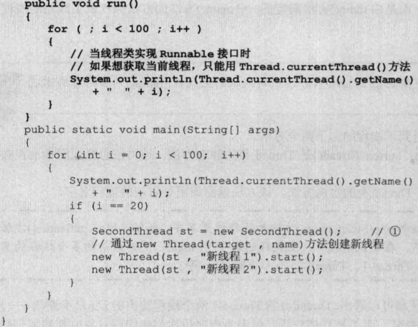
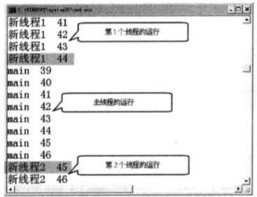
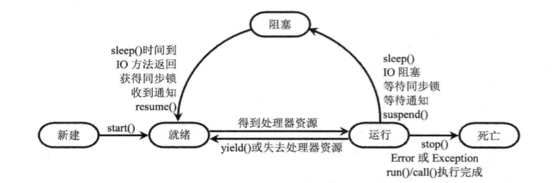
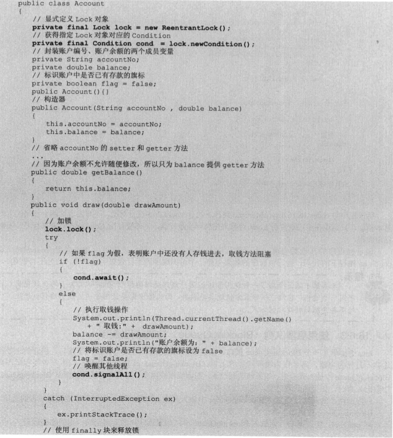
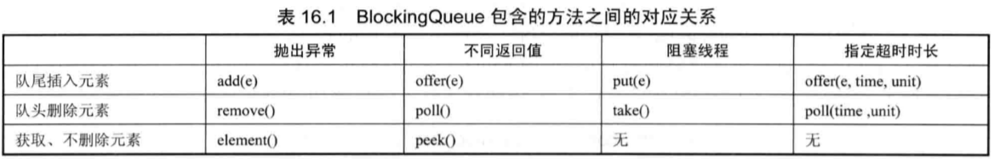
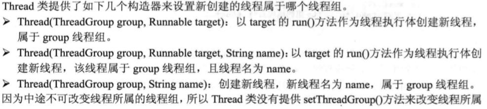
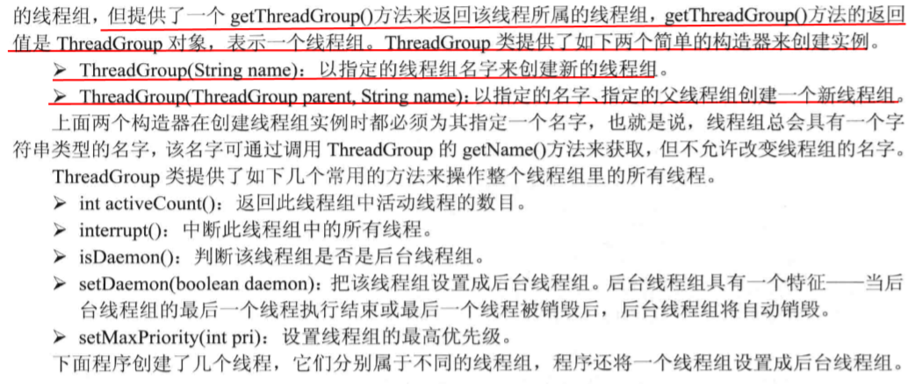
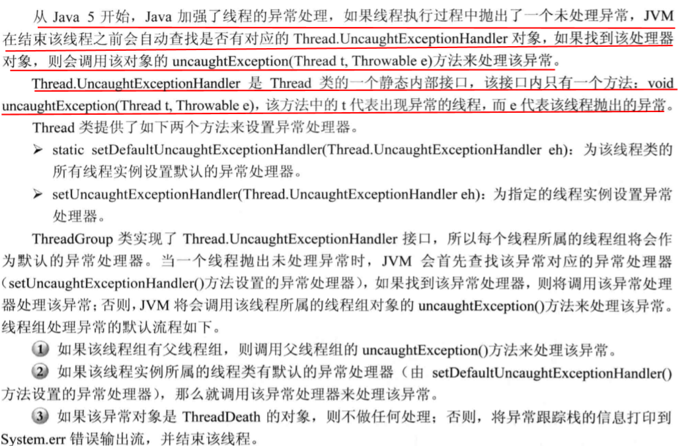
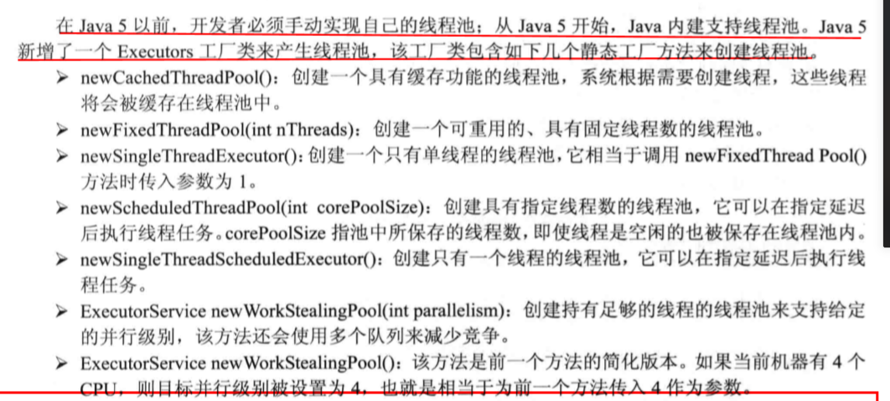

###多线程知识点：
  ####1. 变量共享
   * 继承thread复写方法run() 此方式不能变量共享, 继承Runable类复。使用Thread类,是运行的是target 及 Runable 实例的变量,线程启动方法为start()；
       
       
  ####2. callable 和  future
   *  Callable 的 call() 可以有返回值, 可以生命跑出异常，因为callable不是runable 的子类, Future 来 Callable 接口里的返回值 ，并为接口提供了一个
      FutureTask实现类，该类实现了Future接口，并实现了Runable;
       1. boolean cancel(boolean mayInterruptIfRuning)  取消future关联的callable任务
       2. V get() 返回Callable里面的call() 返回值 组赛事的必须等待子线程执行完成才返回
       3. V get(long timeOut,TimeUnit timeunit) 如果参数时间,没有在参数时间返回将跑出timeout 异常
       4. boolean iscancelled（） 如果任务正常执行完成之前被取消，则返回true
       5. boolea isDone（） 如果正常执行完成则返回true
 ####3. 三种创建线程的比较
   * callable runable 可以继承其他类,这种方式下可以共享一个target的实例的变量；
####4. 线程的状态
   
####5. 线程控制
   * Thread.join() 调用join()后执行线程将被阻塞直到join后线程结束完成为止
   * Thread.join(long time) 等待被join线程的最长时间，如果在最长时间内没有执行将不在等待
   * Thread.join(long time,int nanos) 最长等待时间为毫秒加微妙
   * Thread.sleep()
   * Thread.sleep(long time)  
   * Thread.sleep(long time,int nanos)  线程进入阻塞等待
   * Thread.yield() 类似于sleep() 不同的是线程的重启调度让系统调度，有可能刚刚yield了下一个马上就恢复
   * Thread.suspend() 线程挂起
   * Thread.resum() 恢复线程
####6. 线程的优先等级
   * 线程的有先等级，1-10 ，有限等级高的，并不是先执行，实在系统唤醒线程的时候有更多的机会被唤醒
####7. 线程通信  
   Object：   
   * wait() 导致当前线程等待，只带其他线程notify() 或者 notifyAll() 唤醒当前线程
   * notify()唤醒在此同步监视器(synchronized)的单个线程,任意的
   * notifyAll(),这唤醒在此同步监视器(synchronized)的所有线程，只有在当前线程放弃当前监视器的锁定时蔡能使用此方法
   * 如果不使用 同步监视器(synchronized) 而是直接使用LOCK对象来锁是就不用用以上三个方法进行线程通信
   * Condition类将（await()，notify(),notifyAll()）分成截然不同的对象,并且被绑定到一个LOCK上面为每个对象提供多个等待集(wait-set)
     替代了同步代码块：
     
   * java 提供一个BlockingQueue 接口来控制线程通信,它是Queue的子接口,但是主要作用不是作为容器
     而是作为线程同步的工具,BlockingQueue有个特征就是当生产者线程试图向线程队列插入时如果线程已满
     则被阻塞,作为消费之线程试图取出元素时如果队列一空则生产者被阻塞。
     
#### 线程组
   * 创建线程组
    
    
   * 线程未处理的异常
      
#### 线程池
   * 创建线程池
     
