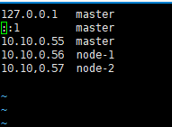

网卡设置
* nmtui
  
给linux 添加用户
* useradd -m hadoop -s /bin/bash  

创建了可以登陆的 hadoop 用户，并使用 /bin/bash 作为shell:
* passwd hadoop
* rpm -qa | grep ssh 查看安装的程序

免密码登陆
* ssh-keygen -t rsa -P '' -f ~/.ssh/id_rsa         #生成公共秘钥
* ssh-copy-id -i  ~/.ssh/id_rsa.pub root@192.168.168.202  #复制201的公钥到202机器上，这样就可以使用在201机器上免密码登录202机器了。

复制远程服务器的文件或文件夹到当前服务器的文件夹。
* scp -r hadoop@10.10.0.55:/usr/local/hadoop /usr/local/

刚修改的文件，系统马上生效
* source <文件名>  &nbsp;&nbsp;列:source profile
centos7修改主机名
* vim /etc/hosts 

给所有的用户赋读写执行权限
* chmod  -R a+w /usr/local/hadoop 

linux创服务
 * ln  -s /usr/local/kafaka/bin/xxxxx.jar  /etc/init.d/xxx 创建软连接倒init.d
 * chmod 777 xxx 修改文件权限
 * systemctl enable xxx 添加软连接倒服务
 
后台启动服务

  nohup 
  
  your_command > /dev/null 2>&1 &
  
  1. nohup：表示所属终端关闭后，进程不会死掉； 
  2.  /dev/null ：标准输出重定向到 /dev/null (a dummy device that does not record any output). 
  3. 2>&1 ：标准出错重定向到标准输出，也到/dev/null 
  4. 最后的& ：后台任务 

查看系统时间
 * timedatectl status
 设置时间
 
 * timedatectl set-time "YYYY-MM-DD HH:MM:SS"
列出所有时区
 * timedatectl list-timezones
 
设置时区
 * timedatectl set-timezone Asia/Shanghai 
 
是否NTP服务器同步 
 *  timedatectl set-ntp yes /no
 
将硬件时钟调整为与本地时钟一致
* timedatectl set-local-rtc 1
* hwclock --systohc --localtime //与上面命令效果一致 
开启防火墙 
*  systemctl start firewalld

开放指定端口
* firewall-cmd --zone=public --add-port=1935/tcp --permanent 
  命令含义：
  1. zone #作用域
  2. add-port=1935/tcp  #添加端口，格式为：端口/通讯协议
  3. permanent  #永久生效，没有此参数重启后失效
  
重启防火墙
* firewall-cmd --reload

查看端口号
* netstat -ntlp   //查看当前所有tcp端口·

linux 部署服务:
* cd /lib/systemd/system(ubuntu ,centos7 查找对应位置)
* vim /lib/systemd/system/xxx.service （创建服务文件）

    [Unit]
    #服务的简单描述
    Description=hadoop的hdfs 启动服务
    [Service]
    # Type= simple（默认值）
    #Type=forking：systemd认为当该服务进程fork，且父进程退出后服务启动成功。对于常规的守护进程（daemon），除非你确定此启动方式无法满足需求，使用此类型启动即可。使用此启动类型应同时指定 PIDFile=，以便systemd能够跟踪服务的主进程。
    #Type=oneshot：这一选项适用于只执行一项任务、随后立即退出的服务。可能需要同时设置 RemainAfterExit=yes 使得 systemd 在服务进程退出之后仍然认为服务处于激活状态
    #Type=notify：与 Type=simple 相同，但约定服务会在就绪后向 systemd 发送一个信号。这一通知的实现由 libsystemd-daemon.so 提供
    #Type=dbus：若以此方式启动，当指定的 BusName 出现在DBus系统总线上时，systemd认为服务就绪
    #Type=idle: systemd会等待所有任务(Jobs)处理完成后，才开始执行idle类型的单元。除此之外，其他行为和Type=simple 类似
    Type=forking
    
    #PIDFile：pid文件路径
    PIDFile=/run/hadoop-all.pid
    
    # ExecStartPre和ExecStartPost节指定在ExecStart之前或者之后用户自定义执行的脚本。Type=oneshot允许指定多个希望顺序执行的用户自定义命令
    # ExecStartPre=/usr/sbin/nginx -t -c /etc/nginx/nginx.conf
    
    #指定启动单元的命令或者脚本
    ExecStart=/usr/local/hadoop/sbin/start-all.sh
    
    #指定启动单元的命令或者脚本
    ExecStop=/usr/local/hadoop/sbin/stop-all.sh
    
    #指定单元停止时执行的命令或者脚本。
    ExecReload=/bin/kill -s HUP $MAINPID
    
    #表示给服务分配独立的临时空间
    #PrivateTmp=True
    
    
    #这个选项如果被允许，服务重启的时候进程会退出，会通过systemctl命令执行清除并重启的操作。
    #Restart=
    
    
    #如果设置这个选择为真，服务会被认为是在激活状态，即使所以的进程已经退出，默认的值为假，这个选项只有在Type=oneshot时需要被配置。
    #RemainAfterExit=true
    
    
    [Install]
    # 为单元提供一个空间分离的附加名字。
    #Alias= hadoop-all
    
    # 单元被允许运行需要的一系列依赖单元，RequiredBy列表从Require获得依赖信息
    #RequiredBy=
    
    #单元被允许运行需要的弱依赖性单元，Wantby从Want列表获得依赖信息
    WantBy= 
    
    #指出和单元一起安装或者被协助的单元。
    Also=
    
    #实例单元的限制，这个选项指定如果单元被允许运行默认的实例
    DefaultInstance=
* chmod +x xxx.service
* 如果需要开机自启动 systemctl enable xxx.service 

* 查看开机自动启动列表 systemctl list-unit-files|grep enabled
