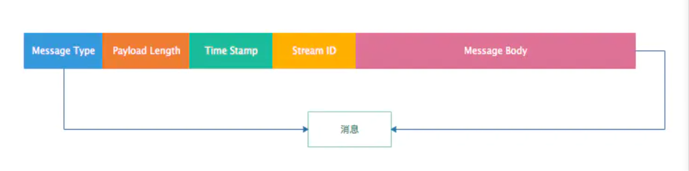
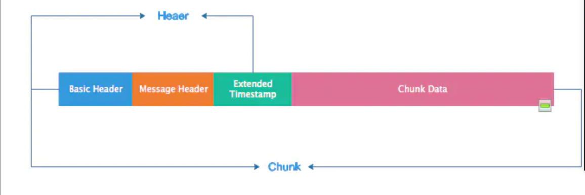
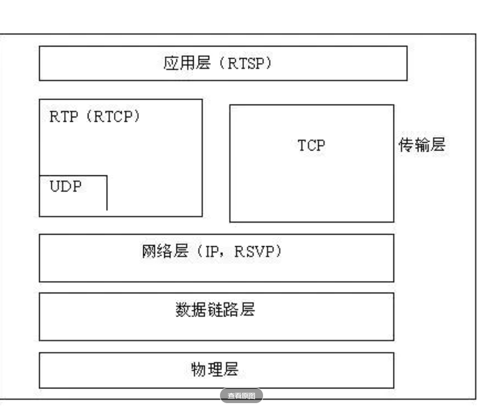
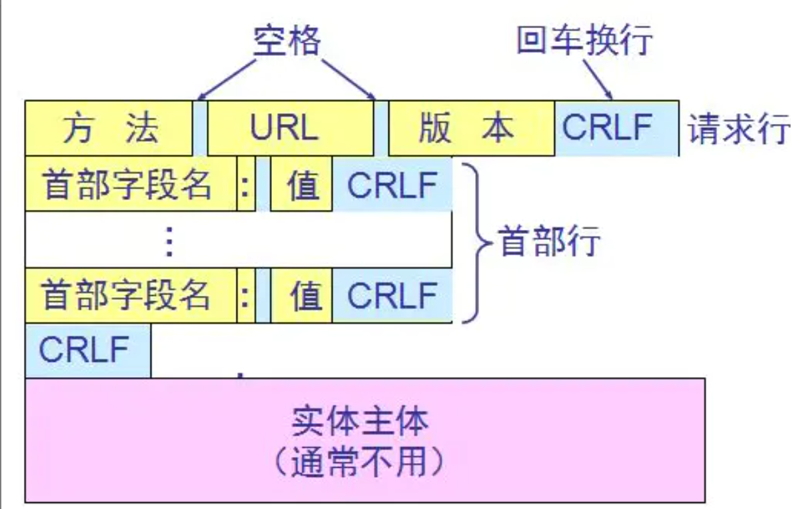
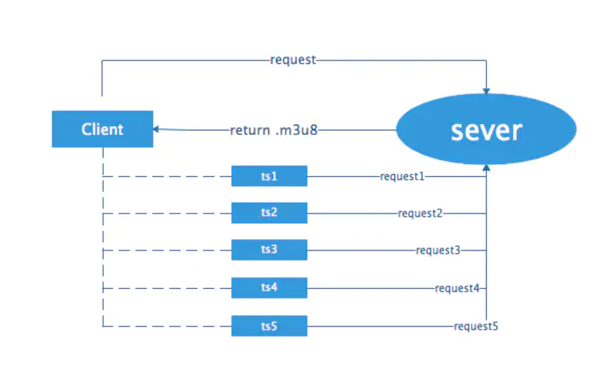
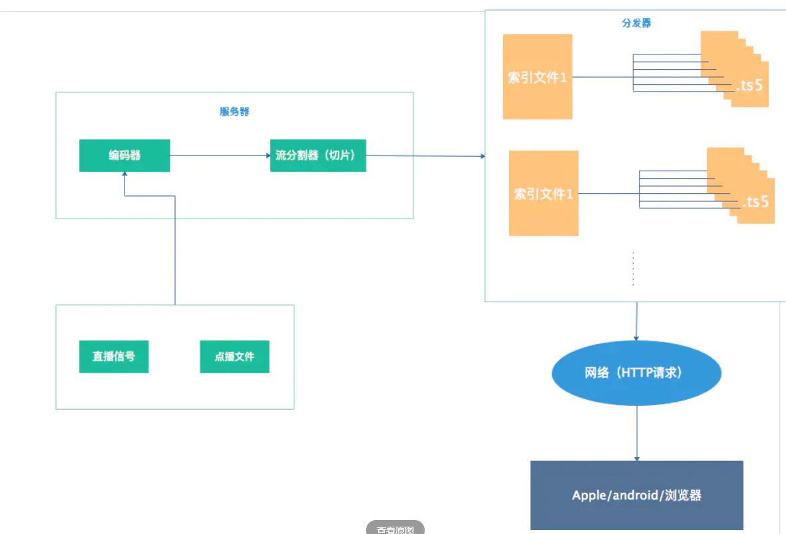

#视频传输协议详解（RTMP、RTSP、HLS）

这两年网络直播特别火，国内很多网络直播平台都做的风生水起，特别是熊猫直播、斗鱼、花椒等。投资人为了把平台做大做强，大把大把烧钱，搞的很多小伙伴们都很心动想跳槽去做直播。作为构建直播平台的基础之一 -—— 传输协议，我们该如何选择呢？那么首先我们就要了解这些协议的原理及特点。
 
##1.  RTMP——Real Time Messaging Protocol（实时消息传输协议）

RTMP是由Adobe公司提出的，在互联网TCP/IP五层体系结构中应用层，RTMP协议是基于TCP协议的，也就是说RTMP实际上是使用TCP作为传输协议。TCP协议在处在传输层，是面向连接的协议，能够为数据的传输提供可靠保障，因此数据在网络上传输不会出现丢包的情况。不过这种可靠的保障也会造成一些问题，也就是说前面的数据包没有交付到目的地，后面的数据也无法进行传输。幸运的是，目前的网络带宽基本上可以满足RTMP协议传输普通质量视频的要求。

RTMP传输的数据的基本单元为Message，但是实际上传输的最小单元是Chunk（消息块），因为RTMP协议为了提升传输速度，在传输数据的时候，会把Message拆分开来，形成更小的块，这些块就是Chunk。
 
 ###1.1 消息（Message）的结构
 
 
Message结构分析 
1. Message Type：它是一个消息类型的ID，通过该ID接收方可以判断接收到的数据的类型，从而做相应的处理。Message Type ID在1-7的消息用于协议控制，这些消息一般是RTMP协议自身管理要使用的消息，用户一般情况下无需操作其中的数据。Message Type ID为8，9的消息分别用于传输音频和视频数据。Message Type ID为15-20的消息用于发送AMF编码的命令，负责用户与服务器之间的交互，比如播放，暂停等。
2. Playload Length： 消息负载的长度，即音视频相关信息的的数据长度，4个字节
3. TimeStamp：时间戳，3个字节。
4. Stream ID：消息的唯一标识。拆分消息成Chunk时添加该ID，从而在还原时根据该ID识别Chunk属于哪个消息。
5. Message Body：消息体，承载了音视频等信息。 
消息块（Chunk）
 
 
通过上图可以看出，消息块在结构上与与消息类似，有Header和Body。
1. Basic Header：基本的头部信息，在头部信息里面包含了chunk stream ID（流通道Id，用来标识指定的通道）和chunk type（chunk的类型）。
2. Message Header：消息的头部信息，包含了要发送的实际信息（可能是完整的，也可能是一部分）的描述信息。Message Header的格式和长度取决于Basic Header的chunk type。
3. Extended TimeStamp：扩展时间戳。
4. Chunk Data：块数据。

RTMP在传输数据的时候，发送端会把需要传输的媒体数据封装成消息，然后把消息拆分成消息块，再一个一个进行传输。接收端收到消息块后，根据Message Stream ID重新将消息块进行组装、组合成消息，再解除该消息的封装处理就可以还原出媒体数据。由此可以看出，RTMP收发数据是以Chunk为单位，而不是以Message为单位。需要注意的是，RTMP发送Chunk必须是一个一个发送，后面的Chunk必须等前面的Chunk发送完成。
 
##2. RTSP——Real Time Streaming Protocol
RTSP（Real Time Streaming Protocol）是TCP/UDP协议体系中的一个应用层协议，由哥伦比亚大学, 网景和RealNetworks公司提交的IETF RFC标准.该协议定义了一对多应用程序如何有效地通过IP网络传输多媒体数据。RTSP在体系结构上位于RTP和RTCP之上，它使用TCP或者RTP完成数据传输，目前市场上大多数采用RTP来传输媒体数据。

RTSP和RTP/RTCP之间是什么关系呢？下面是一个经典的流媒体传输流程图

 
 
一次基本的RTSP操作过程:
1. 首先，客户端连接到流服务器并发送一个RTSP描述命令（DESCRIBE）。
2. 流服务器通过一个SDP描述来进行反馈，反馈信息包括流数量、媒体类型等信息。
3. 客户端再分析该SDP描述，并为会话中的每一个流发送一个RTSP建立命令(SETUP)，RTSP建立命令告诉服务器客户端用于接收媒体数据的端口。流媒体连接建立完成后，
4. 客户端发送一个播放命令(PLAY)，服务器就开始在UDP上传送媒体流（RTP包）到客户端。 在播放过程中客户端还可以向服务器发送命令来控制快进、快退和暂停等。
5. 最后，客户端可发送一个终止命令(TERADOWN)来结束流媒体会话。

由上图可以看出，RTSP处于应用层，而RTP/RTCP处于传输层。RTSP负责建立以及控制会话，RTP负责多媒体数据的传输。而RTCP是一个实时传输控制协议，配合RTP做控制和流量监控。封装发送端及接收端（主要）的统计报表。这些信息包括丢包率，接收抖动等信息。发送端根据接收端的反馈信息做响应的处理。RTP与RTCP相结合虽然保证了实时数据的传输，但也有自己的缺点。最显著的是当有许多用户一起加入会话进程的时候，由于每个参与者都周期发送RTCP信息包，导致RTCP包泛滥(flooding)。
 
RTSP的请求报文结构如下图

 
 
 简单的RTSP消息交互过程: 
 
1. C表示RTSP客户端,S表示RTSP服务端 
    第一步：查询服务器端可用方法 
    C->S OPTION request //询问S有哪些方法可用  
    S->C OPTION response //S回应信息的public头字段中包括提供的所有可用方法  
2. 第二步：得到媒体描述信息 
   C->S DESCRIBE request //要求得到S提供的媒体描述信息 
   S->C DESCRIBE response //S回应媒体描述信息，一般是sdp信息 
 
3. 第三步：建立RTSP会话  
   C->S SETUP request //通过Transport头字段列出可接受的传输选项，请求S建立会话  
   S->C SETUP response //S建立会话，通过Transport头字段返回选择的具体转输选项，并返回建立的Session ID;  
4. 第四步：请求开始传送数据   
   C->S PLAY request //C请求S开始发送数据 
   S->C PLAY response //S回应该请求的信息  
5. 第五步： 数据传送播放中  
   S->C 发送流媒体数据 // 通过RTP协议传送数据  
6. 第六步：关闭会话，退出  
   C->S EARDOWN request //C请求关闭会话  
   S->C TEARDOWN response //S回应该请求  
上述的过程只是标准的、友好的rtsp流程，但实际的需求中并不一定按此过程。 其中第三和第四步是必需的！第一步，只要服务器和客户端约定好有哪些方法可用，则option请求可以不要。第二步，如果我们有其他途径得到媒体初始化描述信息（比如http请求等等），则我们也不需要通过rtsp中的describe请求来完成。
 
##3. HLS —— HTTP Live Streaming
HTTP Live Streaming（缩写是HLS）是一个由苹果公司提出的基于Http协议的的流媒体网络传输协议。是苹果公司QuickTime X和iPhone软件系统的一部分。它的工作原理是把整个流分成一个个小的基于HTTP的文件来下载，每次只下载一些。当媒体流正在播放时，客户端可以选择从许多不同的备用源中以不同的速率下载同样的资源，允许流媒体会话适应不同的数据速率。在开始一个流媒体会话时，客户端会下载一个包含元数据的extended M3U (m3u8)playlist文件，用于寻找可用的媒体流。
 
##3.1 HLS协议的优点：
1. 跨平台性：支持iOS/Android/浏览器，通用性强。
2. 穿墙能力强：由于HLS是基于HTTP协议的，因此HTTP数据能够穿透的防火墙或者代理服务器HLS都可以做到，基本不会遇到被防火墙屏蔽的情况。
3. 切换码率快（清晰度）：自带多码率自适应，客户端可以选择从许多不同的备用源中以不同的速率下载同样的资源，允许流媒体会话适应不同的数据速率。客户端可以很快的选择和切换码率，以适应不同带宽条件下的播放。
4. 负载均衡：HLS基于无状态协议（HTTP），客户端只是按照顺序使用下载存储在服务器的普通TS文件，做负责均衡如同普通的HTTP文件服务器的负载均衡一样简单。
##3.2 HLS的缺点：
1. 实时性差：苹果官方建议是请求到3个片之后才开始播放。所以一般很少用HLS做为互联网直播的传输协议。假设列表里面的包含5个 ts 文件，每个 TS 文件包含5秒的视频内容，那么整体的延迟就是25秒。苹果官方推荐的ts时长时10s，所以这样就会大改有30s（n x 10）的延迟。
2. 文件碎片化严重：对于点播服务来说, 由于 TS 切片通常较小, 海量碎片在文件分发, 一致性缓存, 存储等方面都有较大挑战.

HLS协议由三部分组成：HTTP+M3U8+TS
* HTTP：传输协议 
* M3U8：索引文件 
* TS：音视频媒体信息,视频的编码格式为H.264，音频格式为AAC。
##3.3 HLS的工作原理：
 
 
1. 填入请求m3u8的url，通过http请求。 
2. sever返回一个m3u8的播放列表，该列表包含了5段数据的url。 
3. 客户端解析m3u8播放列表后，按顺序的拿每一段数据的url去获取ts流。
 

