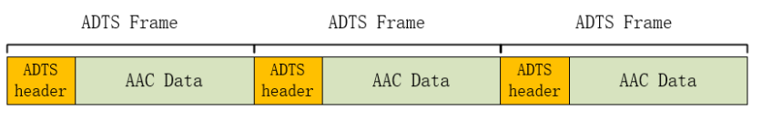
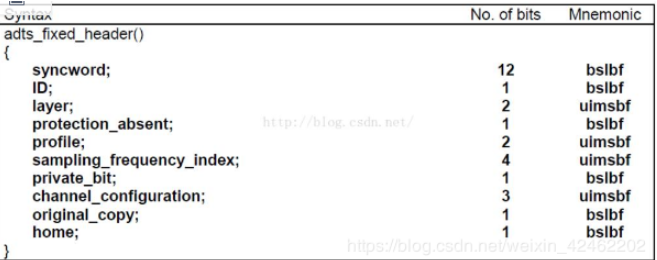
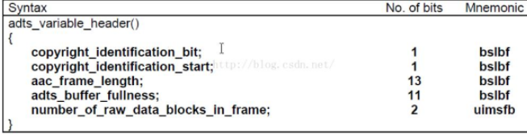
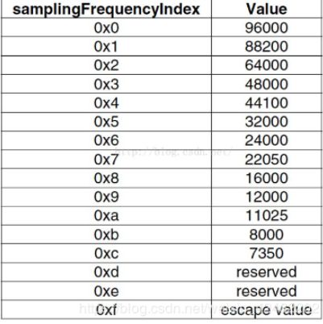
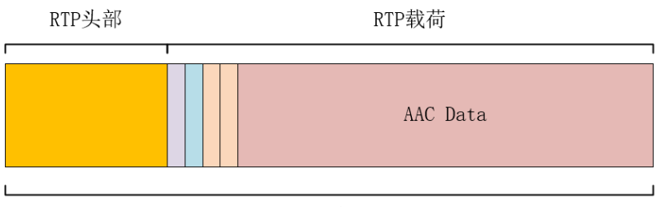
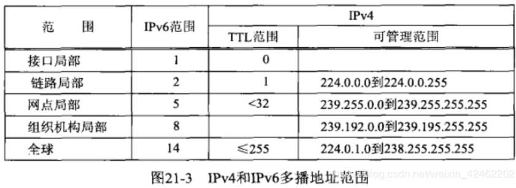

## 从零开始写一个RTSP服务器（一）RTSP协议讲解

* RTSP是一个实时传输流协议，是一个应用层的协议
* 通常说的RTSP包括RTSP协议、RTP协议、RTCP协议
* 对于这些协议的作用简单的理解如下
* RTSP协议：负责服务器与客户端之间的请求与响应
* RTP协议：负责传输媒体数据
* RTCP协议：在RTP传输过程中提供传输信息
* rtsp承载与rtp和rtcp之上，rtsp并不会发送媒体数据，而是使用rtp协议传输
* rtp并没有规定发送方式，可以选择udp发送或者tcp发送 

1. RTSP协议格式与HTTP协议格式类似

    method url vesion\r\n
    CSeq: x\r\n
    xxx\r\n
    ...
    \r\n
    
method：方法，表明这次请求的方法，rtsp定义了很多方法，稍后介绍

url：格式一般为rtsp://ip:port/session，ip表主机ip，port表端口好，如果不写那么就是默认端口，rtsp的默认端口为554，session表明请求哪一个会话

version：表示rtsp的版本，现在为RTSP/1.0

CSeq：序列号，每个RTSP请求和响应都对应一个序列号，序列号是递增的

* RTSP服务端的响应格式
1. 1、 RTSP请求的常用方法
 <table>
     <tr>
       <th>方法</th>
       <th>描述</th>
     </tr>
     <tr>
       <td>OPTIONS</td>
       <td>获取服务端提供的可用方法</td>
    </tr>
    <tr>
       <td>DESCRIBE</td>
       <td>向服务端获取对应会话的媒体描述信息</td>
    </tr>
    <tr>
     <td>SETUP</td>
     <td>向服务端发起建立请求，建立连接会话</td>
    </tr>
    <tr>
      <td>PLAY</td>
      <td>向服务端发起播放请求</td>
    </tr>
    <tr>
      <td>TEARDOWN</td>
      <td>向服务端发起关闭连接会话请求</td>
    </tr>
</table>
2. 2、 RTSP交互过程    

OPTIONS
* C–>S

    OPTIONS rtsp://192.168.31.115:8554/live RTSP/1.0\r\n
    CSeq: 2\r\n
    \r\n
客户端向服务器请求可用方法
    
* S–>C

    DESCRIBE rtsp://192.168.31.115:8554/live RTSP/1.0\r\n
    CSeq: 3\r\n
    Accept: application/sdp\r\n
    \r\n
服务端回复客户端，当前可用方法OPTIONS, DESCRIBE, SETUP, TEARDOWN, PLAY          

DESCRIBE
* C–>S

    DESCRIBE rtsp://192.168.31.115:8554/live RTSP/1.0\r\n
    CSeq: 3\r\n
    Accept: application/sdp\r\n
    \r\n
客户端向服务器请求媒体描述文件，格式为sdp
* S–>C

    RTSP/1.0 200 OK\r\n
    CSeq: 3\r\n
    Content-length: 146\r\n
    Content-type: application/sdp\r\n
    \r\n
    
    v=0\r\n
    o=- 91565340853 1 in IP4 192.168.31.115\r\n
    t=0 0\r\n
    a=contol:*\r\n
    m=video 0 RTP/AVP 96\r\n
    a=rtpmap:96 H264/90000\r\n
    a=framerate:25\r\n
    a=control:track0\r\n 
服务器回复了sdp文件，这个文件告诉客户端当前服务器有哪些音视频流，有什么属性，具体稍后再讲解
这里只需要直到客户端可以根据这些信息得知有哪些音视频流可以发送

SETUP
* C–>S

    SETUP rtsp://192.168.31.115:8554/live/track0 RTSP/1.0\r\n
    CSeq: 4\r\n
    Transport: RTP/AVP;unicast;client_port=54492-54493\r\n
    \r\n
客户端发送建立请求，请求建立连接会话，准备接收音视频数据

解析一下Transport: RTP/AVP;unicast;client_port=54492-54493\r\n

RTP/AVP：表示RTP通过UDP发送，如果是RTP/AVP/TCP则表示RTP通过TCP发送

unicast：表示单播，如果是multicast则表示多播

client_port=54492-54493：由于这里希望采用的是RTP OVER UDP，所以客户端发送了两个用于传输数据的端口，客户端已经将这两个端口绑定到两个udp套接字上，54492表示是RTP端口，54493表示RTCP端口(RTP端口为某个偶数，RTCP端口为RTP端口+1)

* S–>C

    RTSP/1.0 200 OK\r\n
    CSeq: 4\r\n
    Transport: RTP/AVP;unicast;client_port=54492-54493;server_port=56400-56401\r\n
    Session: 66334873\r\n
    \r\n

服务端接收到请求之后，得知客户端要求采用RTP OVER UDP发送数据，单播，客户端用于传输RTP数据的端口为54492，RTCP的端口为54493

服务器也有两个udp套接字，绑定好两个端口，一个用于传输RTP，一个用于传输RTCP，这里的端口号为56400-56401

之后客户端会使用54492-54493这两端口和服务器通过udp传输数据，服务器会使用56400-56401这两端口和这个客户端传输数据
 
PLAY

* C–>S

    PLAY rtsp://192.168.31.115:8554/live RTSP/1.0\r\n
    CSeq: 5\r\n
    Session: 66334873\r\n
    Range: npt=0.000-\r\n
    \r\n
客户端请求播放媒体

* S–>C

    RTSP/1.0 200 OK\r\n
    CSeq: 5\r\n
    Range: npt=0.000-\r\n
    Session: 66334873; timeout=60\r\n
    \r\n
服务器回复之后，会开始使用RTP通过udp向客户端的54492端口发送数据

TEARDOWN
* C–>S

    TEARDOWN rtsp://192.168.31.115:8554/live RTSP/1.0\r\n
    CSeq: 6\r\n
    Session: 66334873\r\n
    \r\n
*  S–>C

    RTSP/1.0 200 OK\r\n
    CSeq: 6\r\n
    \r\n

1. 4 sdp格式

我们上面避开没有讲sdp文件，这里来好好补一补

sdp会话描述由一个会话级描述和多个媒体级描述组成。会话级描述的作用域是整个会话，媒体级描述描述的是一个视频流或者音频流

会话级描述由v=开始到第一个媒体级描述结束

媒体级描述由m=开始到下一个媒体级描述结束

下面是上面示例的sdp文件，我们就来好好分析一下这个sdp文件

    v=0\r\n
    o=- 91565340853 1 in IP4 192.168.31.115\r\n
    t=0 0\r\n
    a=contol:*\r\n
    m=video 0 RTP/AVP 96\r\n
    a=rtpmap:96 H264/90000\r\n
    a=framerate:25\r\n
    a=control:track0\r\n 
这个示例的sdp文件包含一个会话级描述和一个媒体级描述，分别如下

* 会话级描述
    v=0\r\n
    o=- 91565340853 1 IN IP4 192.168.31.115\r\n
    t=0 0\r\n
    a=contol:*\r\n
v=0

表示sdp的版本

o=- 91565340853 1 IN IP4 192.168.31.115

格式为 o=<用户名> <会话id> <会话版本> <网络类型><地址类型> <地址>

用户名：-

会话id：91565340853，表示rtsp://192.168.31.115:8554/live请求中的live这个会话

会话版本：1

网络类型：IN，表示internet

地址类型：IP4，表示ipv4

地址：192.168.31.115，表示服务器的地址
* 媒体级描述

    m=video 0 RTP/AVP 96\r\n
    a=rtpmap:96 H264/90000\r\n
    a=framerate:25\r\n
    a=control:track0\r\n

m=video 0 RTP/AVP 96\r\n

格式为 m=<媒体类型> <端口号> <传输协议> <媒体格式 >
媒体类型：video

端口号：0，为什么是0？因为上面在SETUP过程会告知端口号，所以这里就不需要了

传输协议：RTP/AVP，表示RTP OVER UDP，如果是RTP/AVP/TCP，表示RTP OVER TCP

媒体格式：表示负载类型(payload type)，一般使用96表示H.264

a=rtpmap:96 H264/90000

格式为a=rtpmap:<媒体格式><编码格式>/<时钟频率>

a=framerate:25

表示帧率

a=control:track0 

表示这路视频流在这个会话中的编号

二、RTP协议
<table>
<tr>
    <td>V | P| X| CC | M| PT | 系列号</td>
</tr>
<tr>
    <td>时间戳</td>
</tr>
<tr>
    <td>同步信号源（ssrc）标识符</td>
</tr>
<tr>
    <td>特约信号源（ssrc）标识符</td>
</tr>
</table>
RTP报头

版本号(V)：2Bit，用来标志使用RTP版本

​填充位§：1Bit，如果该位置位，则该RTP包的尾部就包含填充的附加字节

​扩展位(X)：1Bit，如果该位置位，则该RTP包的固定头部后面就跟着一个扩展头部

CSRC技术器(CC)：4Bit，含有固定头部后面跟着的CSRC的数据

标记位(M)：1Bit，该位的解释由配置文档来承担

载荷类型(PT)：7Bit，标识了RTP载荷的类型

序列号(SN)：16Bit，发送方在每发送完一个RTP包后就将该域的值增加1，可以由该域检测包的丢失及恢复

包的序列。序列号的初始值是随机的

时间戳：32比特，记录了该包中数据的第一个字节的采样时刻

同步源标识符(SSRC)：32比特，同步源就是RTP包源的来源。在同一个RTP会话中不能有两个相同的SSRC值

贡献源列表(CSRC List)：0-15项，每项32比特，这个不常用

rtp荷载

* rtp载荷为音频或者视频数据 

3.2 RTP OVER TCP

RTP默认是采用UDP发送的，格式为RTP头+RTP载荷，如果是使用TCP，那么需要在RTP头之前再加上四个字节

第一个字节：$，辨识符

第二个字节：通道，在SETUP的过程中获取

第三第四个字节： RTP包的大小，最多只能12位，第三个字节保存高4位，第四个字节保存低8位

##从零开始写一个RTSP服务器（二）RTSP协议的实现

###一、 创建套接字

想一下我们在vlc输入rtsp://127.0.0.1:8554后发生了什么事？
在这种情况下，vlc其实是一个rtsp客户端，当输入这个url后，vlc知道目的IP为127.0.0.1，目的端口号为8854，这时vlc会发起一个tcp连接取连接服务器，连接成功后就开始发送请求，服务端响应

所以我们要写一个rtsp服务器，第一步肯定是创建tcp服务器

首先创建tcp套接字，绑定端口，监听

* 创建套接字

    serverSockfd = socket(AF_INET, SOCK_STREAM, 0);
    setsockopt(serverSockfd, SOL_SOCKET, SO_REUSEADDR, (const char*)&on, sizeof(on));

* 绑定地址和端口号

    bind(serverSockfd, (struct sockaddr *)&addr, sizeof(struct sockaddr)
这个示例绑定的地址是INADDR_ANY，端口号为8554

* 开始监听

 
    listen(serverSockfd, 10);

* 创建套接字
    
    
    serverRtpSockfd = createUdpSocket();
    serverRtcpSockfd = createUdpSocket();

*  绑定端口号

    
    bindSocketAddr(serverRtpSockfd, "0.0.0.0", SERVER_RTP_PORT);
    bindSocketAddr(serverRtcpSockfd, "0.0.0.0", SERVER_RTCP_PORT);
当创建好套接字还有绑定号端口后，就可以接收客户端请求了

* 开始accept等待客户端连接

    clientfd = accept(serverSockfd, (struct sockaddr *)&addr, &len);

###二、解析请求

当rtsp客户端连接成功后就会开始发送请求，服务器这是需要接收客户端请求并开始解析，再采取相应得操作

请求的格式为（详细参考上一篇从零开始写一个RTSP服务器（一）不一样的RTSP协议讲解）

OPTIONS
    
    OPTIONS rtsp://127.0.0.1:8554/live RTSP/1.0\r\n
    CSeq: 2\r\n
    \r\n
DESCRIBE

    DESCRIBE rtsp://127.0.0.1:8554/live RTSP/1.0\r\n
    CSeq: 3\r\n
    Accept: application/sdp\r\n
    \r\n
SETUP 

    SETUP rtsp://127.0.0.1:8554/live/track0 RTSP/1.0\r\n
    CSeq: 4\r\n
    Transport: RTP/AVP;unicast;client_port=54492-54493\r\n
    \r\n
PLAY 

    PLAY rtsp://127.0.0.1:8554/live RTSP/1.0\r\n
    CSeq: 5\r\n
    Session: 66334873\r\n
    Range: npt=0.000-\r\n
    \r\n
这里我们做得最简单，首先解析第一行得到方法，对于OPTIONS、DESCRIBE、PLAY、TEARDOWN我们只解析CSeq。对于SETUP，我们讲client_port解析出来

所以我们要做的第一步就是解析请求中的信息

* 接收客户端数据

    recvLen = recv(clientSockfd, rBuf, BUF_MAX_SIZE, 0)

* 其次解析CSeq

    sscanf(line, "CSeq: %d\r\n", &cseq)
* 如果方法是SETUP则再解析client_port

    if(!strcmp(method, "SETUP"))
    {
        sscanf(line, "Transport: RTP/AVP;unicast;client_port=%d-%d\r\n",
            &clientRtpPort, &clientRtcpPort);
    }
解析完请求命令后，接下来就是更具不同得方法做不同的响应了，如下

    if(!strcmp(method, "OPTIONS"))
    {
        handleCmd_OPTIONS();
    }
    else if(!strcmp(method, "DESCRIBE"))
    {
        handleCmd_DESCRIBE();
    }
    else if(!strcmp(method, "SETUP"))
    {
        handleCmd_SETUP();
    }
    else if(!strcmp(method, "PLAY"))
    {
        handleCmd_PLAY();
    }
    else if(!strcmp(method, "TEARDOWN"))
    {
        handleCmd_TEARDOWN();
    } 

###四、DESCRIBE响应
DESCRIBE是客户端向服务器请求媒体信息，这是服务器需要回复sdp描述文件，这个例子中的媒体是H.264

* sdp文件生成

    sprintf(sdp, "v=0\r\n"
                "o=- 9%ld 1 IN IP4 %s\r\n"
                "t=0 0\r\n"
                "a=control:*\r\n"
                "m=video 0 RTP/AVP 96\r\n"
                "a=rtpmap:96 H264/90000\r\n"
                "a=control:track0\r\n",
                time(NULL), localIp); 

* 回复
    
    
    sprintf(sBuf, "RTSP/1.0 200 OK\r\n"
            "CSeq: %d\r\n"
            "Content-Base: %s\r\n"
            "Content-type: application/sdp\r\n"
            "Content-length: %d\r\n\r\n"
            "%s",
            cseq,
            url,
            strlen(sdp),
            sdp);
            
    send(clientSockfd, sBuf, strlen(sBuf)); 
###五、SETUP响应

SETUP是客户端请求建立会话连接，并发送了客户端的RTP端口和RTCP端口，那么此时服务端需要回复服务端的RTP端口和RTCP端口
* 回复

    sprintf(result, "RTSP/1.0 200 OK\r\n"
                "CSeq: %d\r\n"
                "Transport: RTP/AVP;unicast;client_port=%d-%d;server_port=%d-%d\r\n"
                "Session: 66334873\r\n"
                "\r\n",
                cseq,
                clientRtpPort,
                clientRtpPort+1,
                SERVER_RTP_PORT,
                SERVER_RTCP_PORT);
    
    send(clientSockfd, sBuf, strlen(sBuf)); 

其中session id是随便写的，只要保证在多个会话连接时唯一的就行

play响应之后就可以向客户端的RTP端口发送RTP包了

### 六、PLAY响应
PLAY时客户端向服务器请求播放，这时服务端回复完请求后就开始通过setup过程中创建的udp套接字发送RTP包
* 回复
    
    
    sprintf(result, "RTSP/1.0 200 OK\r\n"
                    "CSeq: %d\r\n"
                    "Range: npt=0.000-\r\n"
                    "Session: 66334873; timeout=60\r\n\r\n",
                    cseq);
    
    send(clientSockfd, sBuf, strlen(sBuf)); 
* 开始发送数据

  回复之后，就开始向客户端指定的RTP端口发送RTP包，如何发送RTP包，下篇文章再介绍
###七、源码

    
    #include <stdio.h>
    #include <stdlib.h>
    #include <stdint.h>
    #include <string.h>
    #include <sys/types.h>
    #include <sys/socket.h>
    #include <sys/socket.h>
    #include <netinet/in.h>
    #include <arpa/inet.h>
    #include <time.h>
    
    #define SERVER_PORT     8554
    #define SERVER_RTP_PORT  55532
    #define SERVER_RTCP_PORT 55533
    #define BUF_MAX_SIZE    (1024*1024)
    
    static int createTcpSocket()
    {
        int sockfd;
        int on = 1;
    
        sockfd = socket(AF_INET, SOCK_STREAM, 0);
        if(sockfd < 0)
            return -1;
    
        setsockopt(sockfd, SOL_SOCKET, SO_REUSEADDR, (const char*)&on, sizeof(on));
    
        return sockfd;
    }
    
    static int createUdpSocket()
    {
        int sockfd;
        int on = 1;
    
        sockfd = socket(AF_INET, SOCK_DGRAM, 0);
        if(sockfd < 0)
            return -1;
    
        setsockopt(sockfd, SOL_SOCKET, SO_REUSEADDR, (const char*)&on, sizeof(on));
    
        return sockfd;
    }
    
    static int bindSocketAddr(int sockfd, const char* ip, int port)
    {
        struct sockaddr_in addr;
    
        addr.sin_family = AF_INET;
        addr.sin_port = htons(port);
        addr.sin_addr.s_addr = inet_addr(ip);
    
        if(bind(sockfd, (struct sockaddr *)&addr, sizeof(struct sockaddr)) < 0)
            return -1;
    
        return 0;
    }
    
    static int acceptClient(int sockfd, char* ip, int* port)
    {
        int clientfd;
        socklen_t len = 0;
        struct sockaddr_in addr;
    
        memset(&addr, 0, sizeof(addr));
        len = sizeof(addr);
    
        clientfd = accept(sockfd, (struct sockaddr *)&addr, &len);
        if(clientfd < 0)
            return -1;
        
        strcpy(ip, inet_ntoa(addr.sin_addr));
        *port = ntohs(addr.sin_port);
    
        return clientfd;
    }
    
    static char* getLineFromBuf(char* buf, char* line)
    {
        while(*buf != '\n')
        {
            *line = *buf;
            line++;
            buf++;
        }
    
        *line = '\n';
        ++line;
        *line = '\0';
    
        ++buf;
        return buf; 
    }
    
    static int handleCmd_OPTIONS(char* result, int cseq)
    {
        sprintf(result, "RTSP/1.0 200 OK\r\n"
                        "CSeq: %d\r\n"
                        "Public: OPTIONS, DESCRIBE, SETUP, PLAY\r\n"
                        "\r\n",
                        cseq);
                    
        return 0;
    }
    
    static int handleCmd_DESCRIBE(char* result, int cseq, char* url)
    {
        char sdp[500];
        char localIp[100];
    
        sscanf(url, "rtsp://%[^:]:", localIp);
    
        sprintf(sdp, "v=0\r\n"
                     "o=- 9%ld 1 IN IP4 %s\r\n"
                     "t=0 0\r\n"
                     "a=control:*\r\n"
                     "m=video 0 RTP/AVP 96\r\n"
                     "a=rtpmap:96 H264/90000\r\n"
                     "a=control:track0\r\n",
                     time(NULL), localIp);
        
        sprintf(result, "RTSP/1.0 200 OK\r\nCSeq: %d\r\n"
                        "Content-Base: %s\r\n"
                        "Content-type: application/sdp\r\n"
                        "Content-length: %d\r\n\r\n"
                        "%s",
                        cseq,
                        url,
                        strlen(sdp),
                        sdp);
        
        return 0;
    }
    
    static int handleCmd_SETUP(char* result, int cseq, int clientRtpPort)
    {
        sprintf(result, "RTSP/1.0 200 OK\r\n"
                        "CSeq: %d\r\n"
                        "Transport: RTP/AVP;unicast;client_port=%d-%d;server_port=%d-%d\r\n"
                        "Session: 66334873\r\n"
                        "\r\n",
                        cseq,
                        clientRtpPort,
                        clientRtpPort+1,
                        SERVER_RTP_PORT,
                        SERVER_RTCP_PORT);
        
        return 0;
    }
    
    static int handleCmd_PLAY(char* result, int cseq)
    {
        sprintf(result, "RTSP/1.0 200 OK\r\n"
                        "CSeq: %d\r\n"
                        "Range: npt=0.000-\r\n"
                        "Session: 66334873; timeout=60\r\n\r\n",
                        cseq);
        
        return 0;
    }
    
    static void doClient(int clientSockfd, const char* clientIP, int clientPort,
                            int serverRtpSockfd, int serverRtcpSockfd)
    {
        char method[40];
        char url[100];
        char version[40];
        int cseq;
        int clientRtpPort, clientRtcpPort;
        char *bufPtr;
        char* rBuf = malloc(BUF_MAX_SIZE);
        char* sBuf = malloc(BUF_MAX_SIZE);
        char line[400];
    
        while(1)
        {
            int recvLen;
    
            recvLen = recv(clientSockfd, rBuf, BUF_MAX_SIZE, 0);
            if(recvLen <= 0)
                goto out;
    
            rBuf[recvLen] = '\0';
            printf("---------------C->S--------------\n");
            printf("%s", rBuf);
    
            /* 解析方法 */
            bufPtr = getLineFromBuf(rBuf, line);
            if(sscanf(line, "%s %s %s\r\n", method, url, version) != 3)
            {
                printf("parse err\n");
                goto out;
            }
    
            /* 解析序列号 */
            bufPtr = getLineFromBuf(bufPtr, line);
            if(sscanf(line, "CSeq: %d\r\n", &cseq) != 1)
            {
                printf("parse err\n");
                goto out;
            }
    
            /* 如果是SETUP，那么就再解析client_port */
            if(!strcmp(method, "SETUP"))
            {
                while(1)
                {
                    bufPtr = getLineFromBuf(bufPtr, line);
                    if(!strncmp(line, "Transport:", strlen("Transport:")))
                    {
                        sscanf(line, "Transport: RTP/AVP;unicast;client_port=%d-%d\r\n",
                                        &clientRtpPort, &clientRtcpPort);
                        break;
                    }
                }
            }
    
            if(!strcmp(method, "OPTIONS"))
            {
                if(handleCmd_OPTIONS(sBuf, cseq))
                {
                    printf("failed to handle options\n");
                    goto out;
                }
            }
            else if(!strcmp(method, "DESCRIBE"))
            {
                if(handleCmd_DESCRIBE(sBuf, cseq, url))
                {
                    printf("failed to handle describe\n");
                    goto out;
                }
            }
            else if(!strcmp(method, "SETUP"))
            {
                if(handleCmd_SETUP(sBuf, cseq, clientRtpPort))
                {
                    printf("failed to handle setup\n");
                    goto out;
                }
            }
            else if(!strcmp(method, "PLAY"))
            {
                if(handleCmd_PLAY(sBuf, cseq))
                {
                    printf("failed to handle play\n");
                    goto out;
                }
            }
            else
            {
                goto out;
            }
    
            printf("---------------S->C--------------\n");
            printf("%s", sBuf);
            send(clientSockfd, sBuf, strlen(sBuf), 0);
        }
    out:
        close(clientSockfd);
        free(rBuf);
        free(sBuf);
    }
    
    int main(int argc, char* argv[])
    {
        int serverSockfd;
        int serverRtpSockfd, serverRtcpSockfd;
        int ret;
    
        serverSockfd = createTcpSocket();
        if(serverSockfd < 0)
        {
            printf("failed to create tcp socket\n");
            return -1;
        }
    
        ret = bindSocketAddr(serverSockfd, "0.0.0.0", SERVER_PORT);
        if(ret < 0)
        {
            printf("failed to bind addr\n");
            return -1;
        }
    
        ret = listen(serverSockfd, 10);
        if(ret < 0)
        {
            printf("failed to listen\n");
            return -1;
        }
    
        serverRtpSockfd = createUdpSocket();
        serverRtcpSockfd = createUdpSocket();
        if(serverRtpSockfd < 0 || serverRtcpSockfd < 0)
        {
            printf("failed to create udp socket\n");
            return -1;
        }
    
        if(bindSocketAddr(serverRtpSockfd, "0.0.0.0", SERVER_RTP_PORT) < 0 ||
            bindSocketAddr(serverRtcpSockfd, "0.0.0.0", SERVER_RTCP_PORT) < 0)
        {
            printf("failed to bind addr\n");
            return -1;
        }
    
        printf("rtsp://127.0.0.1:%d\n", SERVER_PORT);
    
        while(1)
        {
            int clientSockfd;
            char clientIp[40];
            int clientPort;
    
            clientSockfd = acceptClient(serverSockfd, clientIp, &clientPort);
            if(clientSockfd < 0)
            {
                printf("failed to accept client\n");
                return -1;
            }
    
            printf("accept client;client ip:%s,client port:%d\n", clientIp, clientPort);
    
            doClient(clientSockfd, clientIp, clientPort, serverRtpSockfd, serverRtcpSockfd);
        }
    
        return 0;
    } 
## 从零开始写一个RTSP服务器（三）RTP传输H.264

###一、RTP封装
1. 1 RTP数据结构

RTP包格式前面已经比较详细的介绍过，参考从零开始写一个RTSP服务器（一）不一样的RTSP协议讲解
看一张RTP头的格式图回忆一下
<table>
<tr>
    <td>V | P| X| CC | M| PT | 系列号</td>
</tr>
<tr>
    <td>时间戳</td>
</tr>
<tr>
    <td>同步信号源（ssrc）标识符</td>
</tr>
<tr>
    <td>特约信号源（ssrc）标识符</td>
</tr>
</table>
RTP报头

每个RTP包都包含这样一个RTP头部和RTP数据，为了方便，我将这个头部封装成一个结构体，还有发送包封装成一个函数，下面来看一看
* RTP头结构体

    struct RtpHeader
     {
         /* byte 0 */
         uint8_t csrcLen:4;
         uint8_t extension:1;
         uint8_t padding:1;
         uint8_t version:2;
     
         /* byte 1 */
         uint8_t payloadType:7;
         uint8_t marker:1;
         
         /* bytes 2,3 */
         uint16_t seq;
         
         /* bytes 4-7 */
         uint32_t timestamp;
         
         /* bytes 8-11 */
         uint32_t ssrc;
     };
     
其中的:n是一种位表示法，这个结构体跟RTP的头部一一对应

* RTP的发包函数

RTP包

    struct RtpPacket
    {
        struct RtpHeader rtpHeader;
        uint8_t payload[0];
    };
这是我封装的一个RTP包，包含一个RTP头部和RTP载荷，uint8_t payload[0]并不占用空间，它表示rtp头部接下来紧跟着的地址

RTP的发包函数

    /*
     * 函数功能：发送RTP包
     * 参数 socket：表示本机的udp套接字
     * 参数 ip：表示目的ip地址
     * 参数 port：表示目的的端口号
     * 参数 rtpPacket：表示rtp包
     * 参数 dataSize：表示rtp包中载荷的大小
     * 放回值：发送字节数
     */
    int rtpSendPacket(int socket, char* ip, int16_t port, struct RtpPacket* rtpPacket, uint32_t dataSize)
    {
        struct sockaddr_in addr;
        int ret;
    
        addr.sin_family = AF_INET;
        addr.sin_port = htons(port);
        addr.sin_addr.s_addr = inet_addr(ip);
    
        rtpPacket->rtpHeader.seq = htons(rtpPacket->rtpHeader.seq);
        rtpPacket->rtpHeader.timestamp = htonl(rtpPacket->rtpHeader.timestamp);
        rtpPacket->rtpHeader.ssrc = htonl(rtpPacket->rtpHeader.ssrc);
    
        ret = sendto(socket, (void*)rtpPacket, dataSize+RTP_HEADER_SIZE, 0,
                        (struct sockaddr*)&addr, sizeof(addr));
    
        rtpPacket->rtpHeader.seq = ntohs(rtpPacket->rtpHeader.seq);
        rtpPacket->rtpHeader.timestamp = ntohl(rtpPacket->rtpHeader.timestamp);
        rtpPacket->rtpHeader.ssrc = ntohl(rtpPacket->rtpHeader.ssrc);
    
        return ret; 

仔细看这个函数你应该可以看懂

我们设置好一个包之后，就会调用这个函数发送指定目标

这个函数中多处使用htons等函数，是因为RTP是采用网络字节序（大端模式），所以要将主机字节字节序转换为网络字节序

下面给出源码，rtp.h和rtp.c，这两个文件在后面讲经常使用

1. 2 源码

rtp.h

    #ifndef _RTP_H_
    #define _RTP_H_
    #include <stdint.h>
    
    #define RTP_VESION              2
    
    #define RTP_PAYLOAD_TYPE_H264   96
    #define RTP_PAYLOAD_TYPE_AAC    97
    
    #define RTP_HEADER_SIZE         12
    #define RTP_MAX_PKT_SIZE        1400
    
    /*
     *
     *    0                   1                   2                   3
     *    7 6 5 4 3 2 1 0|7 6 5 4 3 2 1 0|7 6 5 4 3 2 1 0|7 6 5 4 3 2 1 0
     *   +-+-+-+-+-+-+-+-+-+-+-+-+-+-+-+-+-+-+-+-+-+-+-+-+-+-+-+-+-+-+-+-+
     *   |V=2|P|X|  CC   |M|     PT      |       sequence number         |
     *   +-+-+-+-+-+-+-+-+-+-+-+-+-+-+-+-+-+-+-+-+-+-+-+-+-+-+-+-+-+-+-+-+
     *   |                           timestamp                           |
     *   +-+-+-+-+-+-+-+-+-+-+-+-+-+-+-+-+-+-+-+-+-+-+-+-+-+-+-+-+-+-+-+-+
     *   |           synchronization source (SSRC) identifier            |
     *   +=+=+=+=+=+=+=+=+=+=+=+=+=+=+=+=+=+=+=+=+=+=+=+=+=+=+=+=+=+=+=+=+
     *   |            contributing source (CSRC) identifiers             |
     *   :                             ....                              :
     *   +-+-+-+-+-+-+-+-+-+-+-+-+-+-+-+-+-+-+-+-+-+-+-+-+-+-+-+-+-+-+-+-+
     *
     */
    struct RtpHeader
    {
        /* byte 0 */
        uint8_t csrcLen:4;
        uint8_t extension:1;
        uint8_t padding:1;
        uint8_t version:2;
    
        /* byte 1 */
        uint8_t payloadType:7;
        uint8_t marker:1;
        
        /* bytes 2,3 */
        uint16_t seq;
        
        /* bytes 4-7 */
        uint32_t timestamp;
        
        /* bytes 8-11 */
        uint32_t ssrc;
    };
    
    struct RtpPacket
    {
        struct RtpHeader rtpHeader;
        uint8_t payload[0];
    };
    
    void rtpHeaderInit(struct RtpPacket* rtpPacket, uint8_t csrcLen, uint8_t extension,
                        uint8_t padding, uint8_t version, uint8_t payloadType, uint8_t marker,
                       uint16_t seq, uint32_t timestamp, uint32_t ssrc);
    int rtpSendPacket(int socket, char* ip, int16_t port, struct RtpPacket* rtpPacket, uint32_t dataSize);
    
    #endif //_RTP_H_ 

rtp.c
    
    #include <sys/types.h>
    #include <sys/socket.h>
    #include <arpa/inet.h>
    #include <netinet/in.h>
    #include <arpa/inet.h>
    
    #include "rtp.h"
    
    void rtpHeaderInit(struct RtpPacket* rtpPacket, uint8_t csrcLen, uint8_t extension,
                        uint8_t padding, uint8_t version, uint8_t payloadType, uint8_t marker,
                       uint16_t seq, uint32_t timestamp, uint32_t ssrc)
    {
        rtpPacket->rtpHeader.csrcLen = csrcLen;
        rtpPacket->rtpHeader.extension = extension;
        rtpPacket->rtpHeader.padding = padding;
        rtpPacket->rtpHeader.version = version;
        rtpPacket->rtpHeader.payloadType =  payloadType;
        rtpPacket->rtpHeader.marker = marker;
        rtpPacket->rtpHeader.seq = seq;
        rtpPacket->rtpHeader.timestamp = timestamp;
        rtpPacket->rtpHeader.ssrc = ssrc;
    }
    
    int rtpSendPacket(int socket, char* ip, int16_t port, struct RtpPacket* rtpPacket, uint32_t dataSize)
    {
        struct sockaddr_in addr;
        int ret;
    
        addr.sin_family = AF_INET;
        addr.sin_port = htons(port);
        addr.sin_addr.s_addr = inet_addr(ip);
    
        rtpPacket->rtpHeader.seq = htons(rtpPacket->rtpHeader.seq);
        rtpPacket->rtpHeader.timestamp = htonl(rtpPacket->rtpHeader.timestamp);
        rtpPacket->rtpHeader.ssrc = htonl(rtpPacket->rtpHeader.ssrc);
    
        ret = sendto(socket, (void*)rtpPacket, dataSize+RTP_HEADER_SIZE, 0,
                        (struct sockaddr*)&addr, sizeof(addr));
    
        rtpPacket->rtpHeader.seq = ntohs(rtpPacket->rtpHeader.seq);
        rtpPacket->rtpHeader.timestamp = ntohl(rtpPacket->rtpHeader.timestamp);
        rtpPacket->rtpHeader.ssrc = ntohl(rtpPacket->rtpHeader.ssrc);
    
        return ret; 
    }

###二、H.264的RTP打包

2.1  H.264格式

H.264由一个一个的NALU组成，每个NALU之间使用00 00 00 01或00 00 01分隔开
每个NALU的第一次字节都有特殊的含义，其内容如下
<table>
     <tr>
       <th>位</th>
       <th>描述</th>
     </tr>
     <tr>
       <td>bit[7]</td>
       <td>必须为0</td>
    </tr>
    <tr>
       <td>bit[5-6]</td>
       <td>标记该NALU的重要性</td>
    </tr>
    <tr>
     <td>bit[0-4]</td>
     <td>NALU单元的类型</td>
    </tr>
</table>
好，对于H.264格式了解这么多就够了，我们的目的是想从一个H.264的文件中将一个一个的NALU提取出来，然后封装成RTP包，下面介绍如何将NALU封装成RTP包

2.2 H.264的RTP打包方式

H.264可以由三种RTP打包方式
* 单NALU打包：一个RTP包包含一个完整的NALU
* 聚合打包：对于较小的NALU，一个RTP包可包含多个完整的NALU
* 分片打包对于较大的NALU，一个NALU可以分为多个RTP包发送

注意：这里要区分好概念，每一个RTP包都包含一个RTP头部和RTP荷载，这是固定的。而H.264发送数据可支持三种RTP打包方式

比较常用的是单NALU打包和分片打包，本文也只介绍这两种

####单NALU打包
所谓单NALU打包就是将一整个NALU的数据放入RTP包的载荷中

这是最简单的一种方式，无需过多的讲解
#### 分片打包
每个RTP包都有大小限制的，因为RTP一般都是使用UDP发送，UDP没有流量控制，所以要限制每一次发送的大小，所以如果一个NALU的太大，就需要分成多个RTP包发送，如何分成多个RTP包，下面来好好讲一讲

首先要明确，RTP包的格式是绝不会变的，永远多是RTP头+RTP载荷
<table>
     <tr>
       <th>RTP头</th>
       <th>RTP负荷</th>
     </tr>
</table>
RTP头部是固定的，那么只能在RTP载荷中去添加额外信息来说明这个RTP包是表示同一个NALU

如果是分片打包的话，那么在RTP载荷开始有两个字节的信息，然后再是NALU的内容
<table>
     <tr>
       <th>RTP头</th>
       <th>1</th>
       <th>2</th>
       <th>RTP负荷</th>
     </tr>
</table>
* 第一个字节位FU Indicator，其格式如下

    0  1  2  3  4  5  6  7
    +- +- +- +- +- +- +- +-
    F | NRI| Type        |
    +- +- +- +- +- +- +- +-
高三位：与NALU第一个字节的高三位相同
Type：28，表示该RTP包一个分片，为什么是28？因为H.264的规范中定义的，此外还有许多其他Type，这里不详讲
* 第二个字节位FU Header，其格式如下

    0  1  2  3  4  5  6  7
    +- +- +- +- +- +- +- +-
    S |E |R| Type
    +- +- +- +- +- +- +- +-
S：标记该分片打包的第一个RTP包

E：比较该分片打包的最后一个RTP包

Type：NALU的Type

2.3 H.264 RTP包的时间戳计算
RTP包的时间戳起始值是随机的

RTP包的时间戳增量怎么计算？

假设时钟频率为90000，帧率为25

频率为90000表示一秒用90000点来表示

帧率为25，那么一帧就是1/25秒

所以一帧有90000*(1/25)=3600个点来表示

因此每一帧数据的时间增量为3600

2.4 源码

rtp_h264.c

这里给出rtp发送H.264的源码

    #include <stdio.h>
    #include <stdlib.h>
    #include <sys/types.h>
    #include <sys/socket.h>
    #include <sys/stat.h>
    #include <fcntl.h>
    #include <unistd.h>
    #include <string.h>
    
    #include "rtp.h"
    
    #define H264_FILE_NAME  "test.h264"
    #define CLIENT_IP       "127.0.0.1"
    #define CLIENT_PORT     9832
    
    #define FPS             25
    
    static inline int startCode3(char* buf)
    {
        if(buf[0] == 0 && buf[1] == 0 && buf[2] == 1)
            return 1;
        else
            return 0;
    }
    
    static inline int startCode4(char* buf)
    {
        if(buf[0] == 0 && buf[1] == 0 && buf[2] == 0 && buf[3] == 1)
            return 1;
        else
            return 0;
    }
    
    static char* findNextStartCode(char* buf, int len)
    {
        int i;
    
        if(len < 3)
            return NULL;
    
        for(i = 0; i < len-3; ++i)
        {
            if(startCode3(buf) || startCode4(buf))
                return buf;
            
            ++buf;
        }
    
        if(startCode3(buf))
            return buf;
    
        return NULL;
    }
    
    static int getFrameFromH264File(int fd, char* frame, int size)
    {
        int rSize, frameSize;
        char* nextStartCode;
    
        if(fd < 0)
            return fd;
    
        rSize = read(fd, frame, size);
        if(!startCode3(frame) && !startCode4(frame))
            return -1;
        
        nextStartCode = findNextStartCode(frame+3, rSize-3);
        if(!nextStartCode)
        {
            lseek(fd, 0, SEEK_SET);
            frameSize = rSize;
        }
        else
        {
            frameSize = (nextStartCode-frame);
            lseek(fd, frameSize-rSize, SEEK_CUR);
        }
    
        return frameSize;
    }
    
    static int createUdpSocket()
    {
        int fd;
        int on = 1;
    
        fd = socket(AF_INET, SOCK_DGRAM, 0);
        if(fd < 0)
            return -1;
    
        setsockopt(fd, SOL_SOCKET, SO_REUSEADDR, (const char*)&on, sizeof(on));
    
        return fd;
    }
    
    static int rtpSendH264Frame(int socket, char* ip, int16_t port,
                                struct RtpPacket* rtpPacket, uint8_t* frame, uint32_t frameSize)
    {
        uint8_t naluType; // nalu第一个字节
        int sendBytes = 0;
        int ret;
    
        naluType = frame[0];
    
        if (frameSize <= RTP_MAX_PKT_SIZE) // nalu长度小于最大包场：单一NALU单元模式
        {
            /*
             *   0 1 2 3 4 5 6 7 8 9
             *  +-+-+-+-+-+-+-+-+-+-+-+-+-+-+-+-+-+-+-+-+
             *  |F|NRI|  Type   | a single NAL unit ... |
             *  +-+-+-+-+-+-+-+-+-+-+-+-+-+-+-+-+-+-+-+-+
             */
            memcpy(rtpPacket->payload, frame, frameSize);
            ret = rtpSendPacket(socket, ip, port, rtpPacket, frameSize);
            if(ret < 0)
                return -1;
    
            rtpPacket->rtpHeader.seq++;
            sendBytes += ret;
            if ((naluType & 0x1F) == 7 || (naluType & 0x1F) == 8) // 如果是SPS、PPS就不需要加时间戳
                goto out;
        }
        else // nalu长度小于最大包场：分片模式
        {
            /*
             *  0                   1                   2
             *  0 1 2 3 4 5 6 7 8 9 0 1 2 3 4 5 6 7 8 9 0 1 2 3
             * +-+-+-+-+-+-+-+-+-+-+-+-+-+-+-+-+-+-+-+-+-+-+-+-+-+-+-+
             * | FU indicator  |   FU header   |   FU payload   ...  |
             * +-+-+-+-+-+-+-+-+-+-+-+-+-+-+-+-+-+-+-+-+-+-+-+-+-+-+-+
             */
    
            /*
             *     FU Indicator
             *    0 1 2 3 4 5 6 7
             *   +-+-+-+-+-+-+-+-+
             *   |F|NRI|  Type   |
             *   +---------------+
             */
    
            /*
             *      FU Header
             *    0 1 2 3 4 5 6 7
             *   +-+-+-+-+-+-+-+-+
             *   |S|E|R|  Type   |
             *   +---------------+
             */
    
            int pktNum = frameSize / RTP_MAX_PKT_SIZE;       // 有几个完整的包
            int remainPktSize = frameSize % RTP_MAX_PKT_SIZE; // 剩余不完整包的大小
            int i, pos = 1;
    
            /* 发送完整的包 */
            for (i = 0; i < pktNum; i++)
            {
                rtpPacket->payload[0] = (naluType & 0x60) | 28;
                rtpPacket->payload[1] = naluType & 0x1F;
                
                if (i == 0) //第一包数据
                    rtpPacket->payload[1] |= 0x80; // start
                else if (remainPktSize == 0 && i == pktNum - 1) //最后一包数据
                    rtpPacket->payload[1] |= 0x40; // end
    
                memcpy(rtpPacket->payload+2, frame+pos, RTP_MAX_PKT_SIZE);
                ret = rtpSendPacket(socket, ip, port, rtpPacket, RTP_MAX_PKT_SIZE+2);
                if(ret < 0)
                    return -1;
    
                rtpPacket->rtpHeader.seq++;
                sendBytes += ret;
                pos += RTP_MAX_PKT_SIZE;
            }
    
            /* 发送剩余的数据 */
            if (remainPktSize > 0)
            {
                rtpPacket->payload[0] = (naluType & 0x60) | 28;
                rtpPacket->payload[1] = naluType & 0x1F;
                rtpPacket->payload[1] |= 0x40; //end
    
                memcpy(rtpPacket->payload+2, frame+pos, remainPktSize+2);
                ret = rtpSendPacket(socket, ip, port, rtpPacket, remainPktSize+2);
                if(ret < 0)
                    return -1;
    
                rtpPacket->rtpHeader.seq++;
                sendBytes += ret;
            }
        }
    
    out:
    
        return sendBytes;
    }
    
    int main(int argc, char* argv[])
    {
        int socket;
        int fd;
        int fps = 25;
        int startCode;
        struct RtpPacket* rtpPacket;
        uint8_t* frame;
        uint32_t frameSize;
    
        fd = open(H264_FILE_NAME, O_RDONLY);
        if(fd < 0)
        {
            printf("failed to open %s\n", H264_FILE_NAME);
            return -1;
        }
    
        socket = createUdpSocket();
        if(socket < 0)
        {
            printf("failed to create socket\n");
            return -1;
        }
    
        rtpPacket = (struct RtpPacket*)malloc(500000);
        frame = (uint8_t*)malloc(500000);
    
        rtpHeaderInit(rtpPacket, 0, 0, 0, RTP_VESION, RTP_PAYLOAD_TYPE_H264, 0,
                        0, 0, 0x88923423);
    
        while(1)
        {
            frameSize = getFrameFromH264File(fd, frame, 500000);
            if(frameSize < 0)
            {
                printf("read err\n");
                continue;
            }
    
            if(startCode3(frame))
                startCode = 3;
            else
                startCode = 4;
    
            frameSize -= startCode;
            rtpSendH264Frame(socket, CLIENT_IP, CLIENT_PORT,
                                rtpPacket, frame+startCode, frameSize);
            rtpPacket->rtpHeader.timestamp += 90000/FPS;
    
            usleep(1000*1000/fps);
        }
    
        free(rtpPacket);
        free(frame);
    
        return 0;
    } 
    
###三、H.264 RTP打包的sdp描述    
    
sdp文件有什么用？

sdp描述着媒体信息，当使用vlc打开这个sdp文件后，会根据这些信息做相应的操作（创建套接字…）,然后等待接收RTP包

这里给出RTP打包H.264的sdp文件，并描述每一行是什么意思

    m=video 9832 RTP/AVP 96 
    a=rtpmap:96 H264/90000
    a=framerate:25
    c=IN IP4 127.0.0.1
* m=video 9832 RTP/AVP 96

格式为 m=<媒体类型> <端口号> <传输协议> <媒体格式 >
媒体类型：video，表示这是一个视频流

端口号：9832，表示UDP发送的目的端口为9832

传输协议：RTP/AVP，表示RTP OVER UDP，通过UDP发送RTP包

媒体格式：表示负载类型(payload type)，一般使用96表示H.264

* a=rtpmap:96 H264/90000

格式为a=rtpmap:<媒体格式><编码格式>/<时钟频率>

* a=framerate:25

表示帧率

* c=IN IP4 127.0.0.1

IN：表示internet

IP4：表示IPV4

127.0.0.1：表示UDP发送的目的地址为127.0.0.1

特别注意：这段sdp文件描述的udp发送的目的IP为127.0.0.1，目的端口为9832 
##从零开始写一个RTSP服务器（五）RTP传输AAC
### 一、RTP封装
这一部分在前面的文章已经介绍过，放到这里只是怕你没有看前面的文章

1.1 RTP数据结构
RTP包格式前面已经比较详细的介绍过，参考从零开始写一个RTSP服务器（一）不一样的RTSP协议讲解

看一张RTP头的格式图回忆一下
<table>
<tr>
    <td>V | P| X| CC | M| PT | 系列号</td>
</tr>
<tr>
    <td>时间戳</td>
</tr>
<tr>
    <td>同步信号源（ssrc）标识符</td>
</tr>
<tr>
    <td>特约信号源（ssrc）标识符</td>
</tr>
</table>
RTP报头

每个RTP包都包含这样一个RTP头部和RTP载荷，为了方便，我将这个头部封装成一个结构体，还有发送包封装成一个函数，下面来看一看

RTP头结构体

    struct RtpHeader
      {
          /* byte 0 */
          uint8_t csrcLen:4;
          uint8_t extension:1;
          uint8_t padding:1;
          uint8_t version:2;
      
          /* byte 1 */
          uint8_t payloadType:7;
          uint8_t marker:1;
          
          /* bytes 2,3 */
          uint16_t seq;
          
          /* bytes 4-7 */
          uint32_t timestamp;
          
          /* bytes 8-11 */
          uint32_t ssrc;
      }; 

其中的:n是一种位表示法，这个结构体跟RTP的头部一一对应

RTP的发包函数

        struct RtpPacket
        {
            struct RtpHeader rtpHeader;
            uint8_t payload[0];
        };
这是我封装的一个RTP包，包含一个RTP头部和RTP载荷，uint8_t payload[0]并不占用空间，它表示rtp头部接下来紧跟着的地址

RTP的发包函数

    /*
       * 函数功能：发送RTP包
       * 参数 socket：表示本机的udp套接字
       * 参数 ip：表示目的ip地址
       * 参数 port：表示目的的端口号
       * 参数 rtpPacket：表示rtp包
       * 参数 dataSize：表示rtp包中载荷的大小
       * 放回值：发送字节数
       */
      int rtpSendPacket(int socket, char* ip, int16_t port, struct RtpPacket* rtpPacket, uint32_t dataSize)
      {
          struct sockaddr_in addr;
          int ret;
      
          addr.sin_family = AF_INET;
          addr.sin_port = htons(port);
          addr.sin_addr.s_addr = inet_addr(ip);
      
          rtpPacket->rtpHeader.seq = htons(rtpPacket->rtpHeader.seq);
          rtpPacket->rtpHeader.timestamp = htonl(rtpPacket->rtpHeader.timestamp);
          rtpPacket->rtpHeader.ssrc = htonl(rtpPacket->rtpHeader.ssrc);
      
          ret = sendto(socket, (void*)rtpPacket, dataSize+RTP_HEADER_SIZE, 0,
                          (struct sockaddr*)&addr, sizeof(addr));
      
          rtpPacket->rtpHeader.seq = ntohs(rtpPacket->rtpHeader.seq);
          rtpPacket->rtpHeader.timestamp = ntohl(rtpPacket->rtpHeader.timestamp);
          rtpPacket->rtpHeader.ssrc = ntohl(rtpPacket->rtpHeader.ssrc);
      
          return ret;
      }
仔细看这个函数你应该可以看懂

我们设置好一个包之后，就会调用这个函数发送指定目标

这个函数中多处使用htons等函数，是因为RTP是采用网络字节序（大端模式），所以要将主机字节字节序转换为网络字节序

下面给出源码，rtp.h和rtp.c，这两个文件在后面讲经常使用   

1. 2 源码

rtp.h
    
    #ifndef _RTP_H_
    #define _RTP_H_
    #include <stdint.h>
    
    #define RTP_VESION              2
    
    #define RTP_PAYLOAD_TYPE_H264   96
    #define RTP_PAYLOAD_TYPE_AAC    97
    
    #define RTP_HEADER_SIZE         12
    #define RTP_MAX_PKT_SIZE        1400
    
    /*
     *
     *    0                   1                   2                   3
     *    7 6 5 4 3 2 1 0|7 6 5 4 3 2 1 0|7 6 5 4 3 2 1 0|7 6 5 4 3 2 1 0
     *   +-+-+-+-+-+-+-+-+-+-+-+-+-+-+-+-+-+-+-+-+-+-+-+-+-+-+-+-+-+-+-+-+
     *   |V=2|P|X|  CC   |M|     PT      |       sequence number         |
     *   +-+-+-+-+-+-+-+-+-+-+-+-+-+-+-+-+-+-+-+-+-+-+-+-+-+-+-+-+-+-+-+-+
     *   |                           timestamp                           |
     *   +-+-+-+-+-+-+-+-+-+-+-+-+-+-+-+-+-+-+-+-+-+-+-+-+-+-+-+-+-+-+-+-+
     *   |           synchronization source (SSRC) identifier            |
     *   +=+=+=+=+=+=+=+=+=+=+=+=+=+=+=+=+=+=+=+=+=+=+=+=+=+=+=+=+=+=+=+=+
     *   |            contributing source (CSRC) identifiers             |
     *   :                             ....                              :
     *   +-+-+-+-+-+-+-+-+-+-+-+-+-+-+-+-+-+-+-+-+-+-+-+-+-+-+-+-+-+-+-+-+
     *
     */
    struct RtpHeader
    {
        /* byte 0 */
        uint8_t csrcLen:4;
        uint8_t extension:1;
        uint8_t padding:1;
        uint8_t version:2;
    
        /* byte 1 */
        uint8_t payloadType:7;
        uint8_t marker:1;
        
        /* bytes 2,3 */
        uint16_t seq;
        
        /* bytes 4-7 */
        uint32_t timestamp;
        
        /* bytes 8-11 */
        uint32_t ssrc;
    };
    
    struct RtpPacket
    {
        struct RtpHeader rtpHeader;
        uint8_t payload[0];
    };
    
    void rtpHeaderInit(struct RtpPacket* rtpPacket, uint8_t csrcLen, uint8_t extension,
                        uint8_t padding, uint8_t version, uint8_t payloadType, uint8_t marker,
                       uint16_t seq, uint32_t timestamp, uint32_t ssrc);
    int rtpSendPacket(int socket, char* ip, int16_t port, struct RtpPacket* rtpPacket, uint32_t dataSize);
    
    #endif //_RTP_H_ 
    
rtp.c   
    
        
    #include <sys/types.h>
    #include <sys/socket.h>
    #include <arpa/inet.h>
    #include <netinet/in.h>
    #include <arpa/inet.h>
    
    #include "rtp.h"
    
    void rtpHeaderInit(struct RtpPacket* rtpPacket, uint8_t csrcLen, uint8_t extension,
                        uint8_t padding, uint8_t version, uint8_t payloadType, uint8_t marker,
                       uint16_t seq, uint32_t timestamp, uint32_t ssrc)
    {
        rtpPacket->rtpHeader.csrcLen = csrcLen;
        rtpPacket->rtpHeader.extension = extension;
        rtpPacket->rtpHeader.padding = padding;
        rtpPacket->rtpHeader.version = version;
        rtpPacket->rtpHeader.payloadType =  payloadType;
        rtpPacket->rtpHeader.marker = marker;
        rtpPacket->rtpHeader.seq = seq;
        rtpPacket->rtpHeader.timestamp = timestamp;
        rtpPacket->rtpHeader.ssrc = ssrc;
    }
    
    int rtpSendPacket(int socket, char* ip, int16_t port, struct RtpPacket* rtpPacket, uint32_t dataSize)
    {
        struct sockaddr_in addr;
        int ret;
    
        addr.sin_family = AF_INET;
        addr.sin_port = htons(port);
        addr.sin_addr.s_addr = inet_addr(ip);
    
        rtpPacket->rtpHeader.seq = htons(rtpPacket->rtpHeader.seq);
        rtpPacket->rtpHeader.timestamp = htonl(rtpPacket->rtpHeader.timestamp);
        rtpPacket->rtpHeader.ssrc = htonl(rtpPacket->rtpHeader.ssrc);
    
        ret = sendto(socket, (void*)rtpPacket, dataSize+RTP_HEADER_SIZE, 0,
                        (struct sockaddr*)&addr, sizeof(addr));
    
        rtpPacket->rtpHeader.seq = ntohs(rtpPacket->rtpHeader.seq);
        rtpPacket->rtpHeader.timestamp = ntohl(rtpPacket->rtpHeader.timestamp);
        rtpPacket->rtpHeader.ssrc = ntohl(rtpPacket->rtpHeader.ssrc);
    
        return ret;
    } 
    
###二、AAC的RTP打包    
2. 1 AAC格式    

AAC音频文件有一帧一帧的ADTS帧组成，每个ADTS帧包含ADTS头部和AAC数据，如下所示

ADTS头部的大小通常为7个字节，包含着这一帧数据的信息，内容如下

各字段的意思如下

* syncword

总是0xFFF, 代表一个ADTS帧的开始, 用于同步.

* ID

MPEG Version: 0 for MPEG-4，1 for MPEG-2

* Layer

always: ‘00’

* protection_absent

Warning, set to 1 if there is no CRC and 0 if there is CRC

* profile

表示使用哪个级别的AAC，如01 Low Complexity(LC) – AAC LC

* sampling_frequency_index

采样率的下标

* aac_frame_length

一个ADTS帧的长度包括ADTS头和AAC原始流

* adts_buffer_fullness

0x7FF 说明是码率可变的码流

* number_of_raw_data_blocks_in_frame

表示ADTS帧中有number_of_raw_data_blocks_in_frame + 1个AAC原始帧

这里主要记住ADTS头部通常为7个字节，并且头部包含aac_frame_length，表示ADTS帧的大小

2. 2 AAC的RTP打包方式

AAC的RTP打包方式并没有向H.264那样丰富，我知道的只有一种方式，原因主要是AAC一帧数据大小都是几百个字节，不会向H.264那么少则几个字节，多则几千

AAC的RTP打包方式就是将ADTS帧取出ADTS头部，取出AAC数据，每帧数据封装成一个RTP包

需要注意的是，并不是将AAC数据直接拷贝到RTP的载荷中。AAC封装成RTP包，在RTP载荷中的前四个字节是有特殊含义的，然后再是AAC数据，如下图所示

其中RTP载荷的一个字节为0x00，第二个字节为0x10

第三个字节和第四个字节保存AAC Data的大小，最多只能保存13bit，第三个字节保存数据大小的高八位，第四个字节的高5位保存数据大小的低5位

2. 3 AAC RTP包的时间戳计算

假设音频的采样率位44100，即每秒钟采样44100次

AAC一般将1024次采样编码成一帧，所以一秒就有44100/1024=43帧

RTP包发送的每一帧数据的时间增量为44100/43=1025

每一帧数据的时间间隔为1000/43=23ms

2. 4 源码

下面给出rtp发送aac文件的源码，该程序从aac文件中提取每一帧的AAC数据，然后RTP打包发送到目的

如何获取AAC Data？

这个示例是先读取7字节的ADTS头部，然后获得该帧大小，进而读取出AAC Data

rtp_aac.c
    
    #include <stdio.h>
    #include <stdlib.h>
    #include <sys/types.h>
    #include <sys/socket.h>
    #include <sys/stat.h>
    #include <fcntl.h>
    #include <unistd.h>
    #include <string.h>
    
    #include "rtp.h"
    
    #define AAC_FILE    "test.aac"
    #define CLIENT_PORT 9832
    
    struct AdtsHeader
    {
        unsigned int syncword;  //12 bit 同步字 '1111 1111 1111'，说明一个ADTS帧的开始
        unsigned int id;        //1 bit MPEG 标示符， 0 for MPEG-4，1 for MPEG-2
        unsigned int layer;     //2 bit 总是'00'
        unsigned int protectionAbsent;  //1 bit 1表示没有crc，0表示有crc
        unsigned int profile;           //1 bit 表示使用哪个级别的AAC
        unsigned int samplingFreqIndex; //4 bit 表示使用的采样频率
        unsigned int privateBit;        //1 bit
        unsigned int channelCfg; //3 bit 表示声道数
        unsigned int originalCopy;         //1 bit 
        unsigned int home;                  //1 bit 
    
        /*下面的为改变的参数即每一帧都不同*/
        unsigned int copyrightIdentificationBit;   //1 bit
        unsigned int copyrightIdentificationStart; //1 bit
        unsigned int aacFrameLength;               //13 bit 一个ADTS帧的长度包括ADTS头和AAC原始流
        unsigned int adtsBufferFullness;           //11 bit 0x7FF 说明是码率可变的码流
    
        /* number_of_raw_data_blocks_in_frame
         * 表示ADTS帧中有number_of_raw_data_blocks_in_frame + 1个AAC原始帧
         * 所以说number_of_raw_data_blocks_in_frame == 0 
         * 表示说ADTS帧中有一个AAC数据块并不是说没有。(一个AAC原始帧包含一段时间内1024个采样及相关数据)
         */
        unsigned int numberOfRawDataBlockInFrame; //2 bit
    };
    
    static int parseAdtsHeader(uint8_t* in, struct AdtsHeader* res)
    {
        static int frame_number = 0;
        memset(res,0,sizeof(*res));
    
        if ((in[0] == 0xFF)&&((in[1] & 0xF0) == 0xF0))
        {
            res->id = ((unsigned int) in[1] & 0x08) >> 3;
            printf("adts:id  %d\n", res->id);
            res->layer = ((unsigned int) in[1] & 0x06) >> 1;
            printf( "adts:layer  %d\n", res->layer);
            res->protectionAbsent = (unsigned int) in[1] & 0x01;
            printf( "adts:protection_absent  %d\n", res->protectionAbsent);
            res->profile = ((unsigned int) in[2] & 0xc0) >> 6;
            printf( "adts:profile  %d\n", res->profile);
            res->samplingFreqIndex = ((unsigned int) in[2] & 0x3c) >> 2;
            printf( "adts:sf_index  %d\n", res->samplingFreqIndex);
            res->privateBit = ((unsigned int) in[2] & 0x02) >> 1;
            printf( "adts:pritvate_bit  %d\n", res->privateBit);
            res->channelCfg = ((((unsigned int) in[2] & 0x01) << 2) | (((unsigned int) in[3] & 0xc0) >> 6));
            printf( "adts:channel_configuration  %d\n", res->channelCfg);
            res->originalCopy = ((unsigned int) in[3] & 0x20) >> 5;
            printf( "adts:original  %d\n", res->originalCopy);
            res->home = ((unsigned int) in[3] & 0x10) >> 4;
            printf( "adts:home  %d\n", res->home);
            res->copyrightIdentificationBit = ((unsigned int) in[3] & 0x08) >> 3;
            printf( "adts:copyright_identification_bit  %d\n", res->copyrightIdentificationBit);
            res->copyrightIdentificationStart = (unsigned int) in[3] & 0x04 >> 2;
            printf( "adts:copyright_identification_start  %d\n", res->copyrightIdentificationStart);
            res->aacFrameLength = (((((unsigned int) in[3]) & 0x03) << 11) |
                                    (((unsigned int)in[4] & 0xFF) << 3) |
                                        ((unsigned int)in[5] & 0xE0) >> 5) ;
            printf( "adts:aac_frame_length  %d\n", res->aacFrameLength);
            res->adtsBufferFullness = (((unsigned int) in[5] & 0x1f) << 6 |
                                            ((unsigned int) in[6] & 0xfc) >> 2);
            printf( "adts:adts_buffer_fullness  %d\n", res->adtsBufferFullness);
            res->numberOfRawDataBlockInFrame = ((unsigned int) in[6] & 0x03);
            printf( "adts:no_raw_data_blocks_in_frame  %d\n", res->numberOfRawDataBlockInFrame);
    
            return 0;
        }
        else
        {
            printf("failed to parse adts header\n");
            return -1;
        }
    }
    
    static int createUdpSocket()
    {
        int fd;
        int on = 1;
    
        fd = socket(AF_INET, SOCK_DGRAM, 0);
        if(fd < 0)
            return -1;
    
        setsockopt(fd, SOL_SOCKET, SO_REUSEADDR, (const char*)&on, sizeof(on));
    
        return fd;
    }
    
    static int rtpSendAACFrame(int socket, char* ip, int16_t port,
                                struct RtpPacket* rtpPacket, uint8_t* frame, uint32_t frameSize)
    {
        int ret;
    
        rtpPacket->payload[0] = 0x00;
        rtpPacket->payload[1] = 0x10;
        rtpPacket->payload[2] = (frameSize & 0x1FE0) >> 5; //高8位
        rtpPacket->payload[3] = (frameSize & 0x1F) << 3; //低5位
    
        memcpy(rtpPacket->payload+4, frame, frameSize);
    
        ret = rtpSendPacket(socket, ip, port, rtpPacket, frameSize+4);
        if(ret < 0)
        {
            printf("failed to send rtp packet\n");
            return -1;
        }
    
        rtpPacket->rtpHeader.seq++;
    
        /*
         * 如果采样频率是44100
         * 一般AAC每个1024个采样为一帧
         * 所以一秒就有 44100 / 1024 = 43帧
         * 时间增量就是 44100 / 43 = 1025
         * 一帧的时间为 1 / 43 = 23ms
         */
        rtpPacket->rtpHeader.timestamp += 1025;
    
        return 0;
    }
    
    int main(int argc, char* argv[])
    {
        int fd;
        int ret;
        int socket;
        uint8_t* frame;
        struct AdtsHeader adtsHeader;
        struct RtpPacket* rtpPacket;
    
        if(argc != 2)
        {
            printf("Usage: %s <dest ip>\n", argv[0]);
            return -1;
        }
    
        fd = open(AAC_FILE, O_RDONLY);
        if(fd < 0)
        {
            printf("failed to open %s\n", AAC_FILE);
            return -1;
        }    
    
        socket = createUdpSocket();
        if(socket < 0)
        {
            printf("failed to create udp socket\n");
            return -1;
        }
    
        frame = (uint8_t*)malloc(5000);
        rtpPacket = malloc(5000);
    
        rtpHeaderInit(rtpPacket, 0, 0, 0, RTP_VESION, RTP_PAYLOAD_TYPE_AAC, 1, 0, 0, 0x32411);
    
        while(1)
        {
            printf("--------------------------------\n");
    
            ret = read(fd, frame, 7);
            if(ret <= 0)
            {
                lseek(fd, 0, SEEK_SET);
                continue;            
            }
    
            if(parseAdtsHeader(frame, &adtsHeader) < 0)
            {
                printf("parse err\n");
                break;
            }
    
            ret = read(fd, frame, adtsHeader.aacFrameLength-7);
            if(ret < 0)
            {
                printf("read err\n");
                break;
            }
    
            rtpSendAACFrame(socket, argv[1], CLIENT_PORT,
                            rtpPacket, frame, adtsHeader.aacFrameLength-7);
    
            usleep(23000);
        }
    
        close(fd);
        close(socket);
    
        free(frame);
        free(rtpPacket);
    
        return 0;
    }

### 三、AAC的sdp媒体描述

下面给出AAC的媒体描述信息

    m=audio 9832 RTP/AVP 97
    a=rtpmap:97 mpeg4-generic/44100/2
    a=fmtp:97 SizeLength=13;
    c=IN IP4 127.0.0.1
    
 * m=audio 9832 RTP/AVP 97 **
 
 格式为 m=<媒体类型> <端口号> <传输协议> <媒体格式 >
 
 媒体类型：audio，表示这是一个音频流
 
 端口号：9832，表示UDP发送的目的端口为9832
 
 传输协议：RTP/AVP，表示RTP OVER UDP，通过UDP发送RTP包
 
 媒体格式：表示负载类型(payload type)，一般使用97表示AAC
 
 * a=rtpmap:97 mpeg4-generic/44100/2
 
 格式为a=rtpmap:<媒体格式><编码格式>/<时钟频率> /[channel]
 
 mpeg4-generic表示编码，44100表示时钟频率，2表示双通道
 
*  c=IN IP4 127.0.0.1
 
 IN：表示internet
 
 IP4：表示IPV4
 
 127.0.0.1：表示UDP发送的目的地址为127.0.0.1
 
 特别注意：这段sdp文件描述的udp发送的目的IP为127.0.0.1，目的端口为9832
 
### 四、测试

    将上面给出的源码rtp.c、rtp.h、rtp_h264.c保存下来，sdp文件保存为rtp_aac.sdp
    
    注意：该程序默认打开的是test.aac，如果你没有音频源，可以从RtspServer的example目录下获取
    
    编译运行
    
    # gcc rtp.c rtp_aac.c
    # ./a.out 127.0.0.1
    1
    2
    这里的ip地址必须跟sdp里描述的目标地址一致
    
    使用vlc打开sdp文件
    
    # vlc rtp_aac.sdp
    1
    到这里就可以听到音频了，下一篇文章讲解如何写一个发送AAC的RTSP服务器
    
    
    
 ##从零开始写一个RTSP服务器（六）一个传输AAC的RTSP服务器   
    
###一、建立套接字    

一开始进入main函数后，就监听服务器tcp套接字，绑定端口号，然后开始监听

然后再分别建立用于RTP和RTCP的udp套接字，绑定好端口

然后进入循环中开始服务

    main()
    {
        /* 创建服务器tcp套接字，绑定端口，监听 */
        serverSockfd = createTcpSocket();
        bindSocketAddr(serverSockfd, "0.0.0.0", SERVER_PORT);
        listen(serverSockfd, 10);
        
        /* 建立用于RTP和RTCP的udp套接字，绑定好端口 */
        serverRtpSockfd = createUdpSocket();
        serverRtcpSockfd = createUdpSocket();
        bindSocketAddr(serverRtpSockfd, "0.0.0.0", SERVER_RTP_PORT);
        bindSocketAddr(serverRtcpSockfd, "0.0.0.0", SERVER_RTCP_PORT);
        
        while(1)
        {
            ...
        }
    }
    
### 二、接收客户端连接    
    
    
    main()
    {
        ...
        while(1)
    	{
            clientSockfd = acceptClient(serverSockfd, clientIp, &clientPort);
            doClient(clientSockfd, clientIp, clientPort, serverRtpSockfd, serverRtcpSockfd);
    	}
    }
上面其实就是一个TCP服务器的基本步骤，没有什么特别的

下面来看一看doClient函数    
### 三、解析命令    
doClient就是一个while循环（这是一个同时只能服务一个客户的服务器），不断地接收命令解析命令，然后调用相应地操作    
    
    doClient()
    {
    	while(1)
    	{
         	recv(clientSockfd, rBuf, BUF_MAX_SIZE, 0);   
            ...
            sscanf(line, "%s %s %s\r\n", method, url, version);
            ...
            sscanf(line, "CSeq: %d\r\n", &cseq)
            ...
    	}
    }
###四、处理请求    
    
在解析完客户端命令后，会调用相应的请求，处理完之后讲接收打印到sBuf中，然后发送给客户端    
    
    doClient()
    {
        while(1)
        {
            ...
             /* 处理请求 */
             if(!strcmp(method, "OPTIONS"))
                 handleCmd_OPTIONS(sBuf, cseq);
            else if(!strcmp(method, "DESCRIBE"))
                handleCmd_DESCRIBE(sBuf, cseq, url);
            else if(!strcmp(method, "SETUP"))
                handleCmd_SETUP(sBuf, cseq, clientRtpPort);
            else if(!strcmp(method, "PLAY"))
                handleCmd_PLAY(sBuf, cseq);
            
            /* 放回结果 */
            send(clientSockfd, sBuf, strlen(sBuf), 0);
        }
    }
下面来看看各个请求的行动
 
 4.1 OPTIONS   
 
返回可用方法
    
    static int handleCmd_OPTIONS(char* result, int cseq)
    {
        sprintf(result, "RTSP/1.0 200 OK\r\n"
                        "CSeq: %d\r\n"
                        "Public: OPTIONS, DESCRIBE, SETUP, PLAY\r\n"
                        "\r\n",
                        cseq);
                    
        return 0;
    }
4.2 DESCRIBE

返回sdp文件信息，注意这个示例的sdp文件和从零开始写一个RTSP服务器（四）一个传输H.264的RTSP服务器中的sdp文件是不一样的，这是很重要的

    static int handleCmd_DESCRIBE(char* result, int cseq, char* url)
    {
        char sdp[500];
        char localIp[100];
    
        sscanf(url, "rtsp://%[^:]:", localIp);
    
        sprintf(sdp, "v=0\r\n"
                     "o=- 9%ld 1 IN IP4 %s\r\n"
                     "t=0 0\r\n"
                     "a=control:*\r\n"
                     "m=audio 0 RTP/AVP 97\r\n"
                     "a=rtpmap:97 mpeg4-generic/44100/2\r\n"
                     "a=fmtp:97 SizeLength=13;\r\n"
                     "a=control:track0\r\n",
                     time(NULL), localIp);
        
        sprintf(result, "RTSP/1.0 200 OK\r\nCSeq: %d\r\n"
                        "Content-Base: %s\r\n"
                        "Content-type: application/sdp\r\n"
                        "Content-length: %d\r\n\r\n"
                        "%s",
                        cseq,
                        url,
                        strlen(sdp),
                        sdp);
        
        return 0;
    }
    
4.3 SETUP

SETUP过程发送服务端RTP端口和RTCP端口
    
    static int handleCmd_SETUP(char* result, int cseq, int clientRtpPort)
    {
        sprintf(result, "RTSP/1.0 200 OK\r\n"
                        "CSeq: %d\r\n"
                        "Transport: RTP/AVP;unicast;client_port=%d-%d;server_port=%d-%d\r\n"
                        "Session: 66334873\r\n"
                        "\r\n",
                        cseq,
                        clientRtpPort,
                        clientRtpPort+1,
                        SERVER_RTP_PORT,
                        SERVER_RTCP_PORT);
        
        return 0;
    }
4.4 PLAY

PLAY操作回复后，会开始发送RTP包

    static int handleCmd_PLAY(char* result, int cseq)
    {
        sprintf(result, "RTSP/1.0 200 OK\r\n"
                        "CSeq: %d\r\n"
                        "Range: npt=0.000-\r\n"
                        "Session: 66334873; timeout=60\r\n\r\n",
                        cseq);
        
        return 0;
    }
    
###五、AAC RTP打包发送
先读取ADTS头，得到一帧的大小，然后再读取AAC Data，再通过RTP打包传输

    
    doClient()
    {
    	while(1)
    	{
    		...
    
             send(clientSockfd, sBuf, strlen(sBuf), 0);
            
    		if(!strcmp(method, "PLAY"))
    		{
                while(1)
                {
                    /* 读取ADTS头部 */
                	read(fd, frame, 7);
                    
                    /* 解析头部 */
                    parseAdtsHeader(frame, &adtsHeader);
                    
                    /* 读取一帧 */
                    read(fd, frame, adtsHeader.aacFrameLength-7);
                    
                    /* RTP打包发送 */
                    rtpSendAACFrame(localRtpSockfd, clientIP, clientRtpPort,
                                    rtpPacket, frame, adtsHeader.aacFrameLength-7);
    		
                }
            }
    
        }
    }
看一看AAC的RTP打包发送过程

先填充RTP载荷前4个字节，然后发送RTP包

发送后序列号增加，时间戳增加    
    
    static int rtpSendAACFrame(int socket, const char* ip, int16_t port,
                                struct RtpPacket* rtpPacket, uint8_t* frame, uint32_t frameSize)
    {
        /* 填充前4个字节 */
        rtpPacket->payload[0] = 0x00;
        rtpPacket->payload[1] = 0x10;
        rtpPacket->payload[2] = (frameSize & 0x1FE0) >> 5; //高8位
        rtpPacket->payload[3] = (frameSize & 0x1F) << 3; //低5位
        
        /* 发送RTP包 */
        memcpy(rtpPacket->payload+4, frame, frameSize);
        rtpSendPacket(socket, ip, port, rtpPacket, frameSize+4);
        
        /* 增加序列号和时间戳 */
        rtpPacket->rtpHeader.seq++;
        rtpPacket->rtpHeader.timestamp += 1025;
    }
###六、源码    
总共由三个文件aac_rtsp_server.c、rtp.h、rtp.c    
    
aac_rtsp_server.c    
    
    
    
    #include <stdio.h>
    #include <stdlib.h>
    #include <stdint.h>
    #include <string.h>
    #include <sys/types.h>
    #include <sys/socket.h>
    #include <sys/socket.h>
    #include <netinet/in.h>
    #include <arpa/inet.h>
    #include <time.h>
    #include <sys/types.h>
    #include <sys/stat.h>
    #include <fcntl.h>
    
    #include "rtp.h"
    
    #define SERVER_PORT     8554
    #define SERVER_RTP_PORT  55532
    #define SERVER_RTCP_PORT 55533
    #define BUF_MAX_SIZE    (1024*1024)
    #define AAC_FILE_NAME   "test.aac"
    
    static int createTcpSocket()
    {
        int sockfd;
        int on = 1;
    
        sockfd = socket(AF_INET, SOCK_STREAM, 0);
        if(sockfd < 0)
            return -1;
    
        setsockopt(sockfd, SOL_SOCKET, SO_REUSEADDR, (const char*)&on, sizeof(on));
    
        return sockfd;
    }
    
    static int createUdpSocket()
    {
        int sockfd;
        int on = 1;
    
        sockfd = socket(AF_INET, SOCK_DGRAM, 0);
        if(sockfd < 0)
            return -1;
    
        setsockopt(sockfd, SOL_SOCKET, SO_REUSEADDR, (const char*)&on, sizeof(on));
    
        return sockfd;
    }
    
    static int bindSocketAddr(int sockfd, const char* ip, int port)
    {
        struct sockaddr_in addr;
    
        addr.sin_family = AF_INET;
        addr.sin_port = htons(port);
        addr.sin_addr.s_addr = inet_addr(ip);
    
        if(bind(sockfd, (struct sockaddr *)&addr, sizeof(struct sockaddr)) < 0)
            return -1;
    
        return 0;
    }
    
    struct AdtsHeader
    {
        unsigned int syncword;  //12 bit 同步字 '1111 1111 1111'，说明一个ADTS帧的开始
        unsigned int id;        //1 bit MPEG 标示符， 0 for MPEG-4，1 for MPEG-2
        unsigned int layer;     //2 bit 总是'00'
        unsigned int protectionAbsent;  //1 bit 1表示没有crc，0表示有crc
        unsigned int profile;           //1 bit 表示使用哪个级别的AAC
        unsigned int samplingFreqIndex; //4 bit 表示使用的采样频率
        unsigned int privateBit;        //1 bit
        unsigned int channelCfg; //3 bit 表示声道数
        unsigned int originalCopy;         //1 bit 
        unsigned int home;                  //1 bit 
    
        /*下面的为改变的参数即每一帧都不同*/
        unsigned int copyrightIdentificationBit;   //1 bit
        unsigned int copyrightIdentificationStart; //1 bit
        unsigned int aacFrameLength;               //13 bit 一个ADTS帧的长度包括ADTS头和AAC原始流
        unsigned int adtsBufferFullness;           //11 bit 0x7FF 说明是码率可变的码流
    
        /* number_of_raw_data_blocks_in_frame
         * 表示ADTS帧中有number_of_raw_data_blocks_in_frame + 1个AAC原始帧
         * 所以说number_of_raw_data_blocks_in_frame == 0 
         * 表示说ADTS帧中有一个AAC数据块并不是说没有。(一个AAC原始帧包含一段时间内1024个采样及相关数据)
         */
        unsigned int numberOfRawDataBlockInFrame; //2 bit
    };
    
    static int parseAdtsHeader(uint8_t* in, struct AdtsHeader* res)
    {
        static int frame_number = 0;
        memset(res,0,sizeof(*res));
    
        if ((in[0] == 0xFF)&&((in[1] & 0xF0) == 0xF0))
        {
            res->id = ((unsigned int) in[1] & 0x08) >> 3;
            res->layer = ((unsigned int) in[1] & 0x06) >> 1;
            res->protectionAbsent = (unsigned int) in[1] & 0x01;
            res->profile = ((unsigned int) in[2] & 0xc0) >> 6;
            res->samplingFreqIndex = ((unsigned int) in[2] & 0x3c) >> 2;
            res->privateBit = ((unsigned int) in[2] & 0x02) >> 1;
            res->channelCfg = ((((unsigned int) in[2] & 0x01) << 2) | (((unsigned int) in[3] & 0xc0) >> 6));
            res->originalCopy = ((unsigned int) in[3] & 0x20) >> 5;
            res->home = ((unsigned int) in[3] & 0x10) >> 4;
            res->copyrightIdentificationBit = ((unsigned int) in[3] & 0x08) >> 3;
            res->copyrightIdentificationStart = (unsigned int) in[3] & 0x04 >> 2;
            res->aacFrameLength = (((((unsigned int) in[3]) & 0x03) << 11) |
                                    (((unsigned int)in[4] & 0xFF) << 3) |
                                        ((unsigned int)in[5] & 0xE0) >> 5) ;
            res->adtsBufferFullness = (((unsigned int) in[5] & 0x1f) << 6 |
                                            ((unsigned int) in[6] & 0xfc) >> 2);
            res->numberOfRawDataBlockInFrame = ((unsigned int) in[6] & 0x03);
    
            return 0;
        }
        else
        {
            printf("failed to parse adts header\n");
            return -1;
        }
    }
    
    static int rtpSendAACFrame(int socket, const char* ip, int16_t port,
                                struct RtpPacket* rtpPacket, uint8_t* frame, uint32_t frameSize)
    {
        int ret;
    
        rtpPacket->payload[0] = 0x00;
        rtpPacket->payload[1] = 0x10;
        rtpPacket->payload[2] = (frameSize & 0x1FE0) >> 5; //高8位
        rtpPacket->payload[3] = (frameSize & 0x1F) << 3; //低5位
    
        memcpy(rtpPacket->payload+4, frame, frameSize);
    
        ret = rtpSendPacket(socket, ip, port, rtpPacket, frameSize+4);
        if(ret < 0)
        {
            printf("failed to send rtp packet\n");
            return -1;
        }
    
        rtpPacket->rtpHeader.seq++;
    
        /*
         * 如果采样频率是44100
         * 一般AAC每个1024个采样为一帧
         * 所以一秒就有 44100 / 1024 = 43帧
         * 时间增量就是 44100 / 43 = 1025
         * 一帧的时间为 1 / 43 = 23ms
         */
        rtpPacket->rtpHeader.timestamp += 1025;
    
        return 0;
    }
    
    static int acceptClient(int sockfd, char* ip, int* port)
    {
        int clientfd;
        socklen_t len = 0;
        struct sockaddr_in addr;
    
        memset(&addr, 0, sizeof(addr));
        len = sizeof(addr);
    
        clientfd = accept(sockfd, (struct sockaddr *)&addr, &len);
        if(clientfd < 0)
            return -1;
        
        strcpy(ip, inet_ntoa(addr.sin_addr));
        *port = ntohs(addr.sin_port);
    
        return clientfd;
    }
    
    static char* getLineFromBuf(char* buf, char* line)
    {
        while(*buf != '\n')
        {
            *line = *buf;
            line++;
            buf++;
        }
    
        *line = '\n';
        ++line;
        *line = '\0';
    
        ++buf;
        return buf; 
    }
    
    static int handleCmd_OPTIONS(char* result, int cseq)
    {
        sprintf(result, "RTSP/1.0 200 OK\r\n"
                        "CSeq: %d\r\n"
                        "Public: OPTIONS, DESCRIBE, SETUP, PLAY\r\n"
                        "\r\n",
                        cseq);
                    
        return 0;
    }
    
    static int handleCmd_DESCRIBE(char* result, int cseq, char* url)
    {
        char sdp[500];
        char localIp[100];
    
        sscanf(url, "rtsp://%[^:]:", localIp);
    
        sprintf(sdp, "v=0\r\n"
                     "o=- 9%ld 1 IN IP4 %s\r\n"
                     "t=0 0\r\n"
                     "a=control:*\r\n"
                     "m=audio 0 RTP/AVP 97\r\n"
                     "a=rtpmap:97 mpeg4-generic/44100/2\r\n"
                     "a=fmtp:97 SizeLength=13;\r\n"
                     "a=control:track0\r\n",
                     time(NULL), localIp);
    
        sprintf(result, "RTSP/1.0 200 OK\r\nCSeq: %d\r\n"
                        "Content-Base: %s\r\n"
                        "Content-type: application/sdp\r\n"
                        "Content-length: %d\r\n\r\n"
                        "%s",
                        cseq,
                        url,
                        strlen(sdp),
                        sdp);
        
        return 0;
    }
    
    static int handleCmd_SETUP(char* result, int cseq, int clientRtpPort)
    {
        sprintf(result, "RTSP/1.0 200 OK\r\n"
                        "CSeq: %d\r\n"
                        "Transport: RTP/AVP;unicast;client_port=%d-%d;server_port=%d-%d\r\n"
                        "Session: 66334873\r\n"
                        "\r\n",
                        cseq,
                        clientRtpPort,
                        clientRtpPort+1,
                        SERVER_RTP_PORT,
                        SERVER_RTCP_PORT
                        );
        
        return 0;
    }
    
    static int handleCmd_PLAY(char* result, int cseq)
    {
        sprintf(result, "RTSP/1.0 200 OK\r\n"
                        "CSeq: %d\r\n"
                        "Range: npt=0.000-\r\n"
                        "Session: 66334873; timeout=60\r\n\r\n",
                        cseq);
        
        return 0;
    }
    
    static void doClient(int clientSockfd, const char* clientIP, int clientPort,
                            int serverRtpSockfd, int serverRtcppSockfd)
    {
        char method[40];
        char url[100];
        char version[40];
        int cseq;
        int clientRtpPort, clientRtcpPort;
        char *bufPtr;
        char* rBuf = malloc(BUF_MAX_SIZE);
        char* sBuf = malloc(BUF_MAX_SIZE);
        char line[400];
    
        while(1)
        {
            int recvLen;
    
            recvLen = recv(clientSockfd, rBuf, BUF_MAX_SIZE, 0);
            if(recvLen <= 0)
                goto out;
    
            rBuf[recvLen] = '\0';
            printf("---------------C->S--------------\n");
            printf("%s", rBuf);
    
            /* 解析方法 */
            bufPtr = getLineFromBuf(rBuf, line);
            if(sscanf(line, "%s %s %s\r\n", method, url, version) != 3)
            {
                printf("parse err\n");
                goto out;
            }
    
            /* 解析序列号 */
            bufPtr = getLineFromBuf(bufPtr, line);
            if(sscanf(line, "CSeq: %d\r\n", &cseq) != 1)
            {
                printf("parse err\n");
                goto out;
            }
    
            /* 如果是SETUP，那么就再解析client_port */
            if(!strcmp(method, "SETUP"))
            {
                while(1)
                {
                    bufPtr = getLineFromBuf(bufPtr, line);
                    if(!strncmp(line, "Transport:", strlen("Transport:")))
                    {
                        sscanf(line, "Transport: RTP/AVP;unicast;client_port=%d-%d\r\n",
                                        &clientRtpPort, &clientRtcpPort);
                        break;
                    }
                }
            }
    
            if(!strcmp(method, "OPTIONS"))
            {
                if(handleCmd_OPTIONS(sBuf, cseq))
                {
                    printf("failed to handle options\n");
                    goto out;
                }
            }
            else if(!strcmp(method, "DESCRIBE"))
            {
                if(handleCmd_DESCRIBE(sBuf, cseq, url))
                {
                    printf("failed to handle describe\n");
                    goto out;
                }
            }
            else if(!strcmp(method, "SETUP"))
            {
                if(handleCmd_SETUP(sBuf, cseq, clientRtpPort))
                {
                    printf("failed to handle setup\n");
                    goto out;
                }
            }
            else if(!strcmp(method, "PLAY"))
            {
                if(handleCmd_PLAY(sBuf, cseq))
                {
                    printf("failed to handle play\n");
                    goto out;
                }
            }
            else
            {
                goto out;
            }
    
            printf("---------------S->C--------------\n");
            printf("%s", sBuf);
            send(clientSockfd, sBuf, strlen(sBuf), 0);
    
            if(!strcmp(method, "PLAY"))
            {
                struct AdtsHeader adtsHeader;
                struct RtpPacket* rtpPacket;
                uint8_t* frame;
                int ret;
    
                int fd = open(AAC_FILE_NAME, O_RDONLY);
                if(fd < 0)
                {
                    printf("failed to open %s\n", AAC_FILE_NAME);
                    goto out;
                }
    
                frame = (uint8_t*)malloc(5000);
                rtpPacket = malloc(5000);
    
                rtpHeaderInit(rtpPacket, 0, 0, 0, RTP_VESION, RTP_PAYLOAD_TYPE_AAC, 1, 0, 0, 0x32411);
    
                while(1)
                {
                    ret = read(fd, frame, 7);
                    if(ret <= 0)
                    {
                        break;
                    }
    
                    if(parseAdtsHeader(frame, &adtsHeader) < 0)
                    {
                        printf("parse err\n");
                        break;
                    }
    
                    ret = read(fd, frame, adtsHeader.aacFrameLength-7);
                    if(ret < 0)
                    {
                        printf("read err\n");
                        break;
                    }
    
                    rtpSendAACFrame(serverRtpSockfd, clientIP, clientRtpPort,
                                    rtpPacket, frame, adtsHeader.aacFrameLength-7);
    
                    usleep(23000);
                }
    
                free(frame);
                free(rtpPacket);
            }
        }
    out:
        close(clientSockfd);
        free(rBuf);
        free(sBuf);
    }
    
    int main(int argc, char* argv[])
    {
        int serverSockfd;
        int serverRtpSockfd, serverRtcpSockfd;
        int ret;
    
        serverSockfd = createTcpSocket();
        if(serverSockfd < 0)
        {
            printf("failed to create tcp socket\n");
            return -1;
        }
    
        ret = bindSocketAddr(serverSockfd, "0.0.0.0", SERVER_PORT);
        if(ret < 0)
        {
            printf("failed to bind addr\n");
            return -1;
        }
    
        ret = listen(serverSockfd, 10);
        if(ret < 0)
        {
            printf("failed to listen\n");
            return -1;
        }
    
        serverRtpSockfd = createUdpSocket();
        serverRtcpSockfd = createUdpSocket();
        if(serverRtpSockfd < 0 || serverRtcpSockfd < 0)
        {
            printf("failed to create udp socket\n");
            return -1;
        }
    
        if(bindSocketAddr(serverRtpSockfd, "0.0.0.0", SERVER_RTP_PORT) < 0 ||
            bindSocketAddr(serverRtcpSockfd, "0.0.0.0", SERVER_RTCP_PORT) < 0)
        {
            printf("failed to bind addr\n");
            return -1;
        }
    
        printf("rtsp://127.0.0.1:%d\n", SERVER_PORT);
    
        while(1)
        {
            int clientSockfd;
            char clientIp[40];
            int clientPort;
    
            clientSockfd = acceptClient(serverSockfd, clientIp, &clientPort);
            if(clientSockfd < 0)
            {
                printf("failed to accept client\n");
                return -1;
            }
    
            printf("accept client;client ip:%s,client port:%d\n", clientIp, clientPort);
    
            doClient(clientSockfd, clientIp, clientPort, serverRtpSockfd, serverRtcpSockfd);
        }
    
        return 0;
    }
rtp.h    
    
    #ifndef _RTP_H_
    #define _RTP_H_
    #include <stdint.h>
    
    #define RTP_VESION              2
    
    #define RTP_PAYLOAD_TYPE_H264   96
    #define RTP_PAYLOAD_TYPE_AAC    97
    
    #define RTP_HEADER_SIZE         12
    #define RTP_MAX_PKT_SIZE        1400
    
    /*
     *
     *    0                   1                   2                   3
     *    7 6 5 4 3 2 1 0|7 6 5 4 3 2 1 0|7 6 5 4 3 2 1 0|7 6 5 4 3 2 1 0
     *   +-+-+-+-+-+-+-+-+-+-+-+-+-+-+-+-+-+-+-+-+-+-+-+-+-+-+-+-+-+-+-+-+
     *   |V=2|P|X|  CC   |M|     PT      |       sequence number         |
     *   +-+-+-+-+-+-+-+-+-+-+-+-+-+-+-+-+-+-+-+-+-+-+-+-+-+-+-+-+-+-+-+-+
     *   |                           timestamp                           |
     *   +-+-+-+-+-+-+-+-+-+-+-+-+-+-+-+-+-+-+-+-+-+-+-+-+-+-+-+-+-+-+-+-+
     *   |           synchronization source (SSRC) identifier            |
     *   +=+=+=+=+=+=+=+=+=+=+=+=+=+=+=+=+=+=+=+=+=+=+=+=+=+=+=+=+=+=+=+=+
     *   |            contributing source (CSRC) identifiers             |
     *   :                             ....                              :
     *   +-+-+-+-+-+-+-+-+-+-+-+-+-+-+-+-+-+-+-+-+-+-+-+-+-+-+-+-+-+-+-+-+
     *
     */
    struct RtpHeader
    {
        /* byte 0 */
        uint8_t csrcLen:4;
        uint8_t extension:1;
        uint8_t padding:1;
        uint8_t version:2;
    
        /* byte 1 */
        uint8_t payloadType:7;
        uint8_t marker:1;
        
        /* bytes 2,3 */
        uint16_t seq;
        
        /* bytes 4-7 */
        uint32_t timestamp;
        
        /* bytes 8-11 */
        uint32_t ssrc;
    };
    
    struct RtpPacket
    {
        struct RtpHeader rtpHeader;
        uint8_t payload[0];
    };
    
    void rtpHeaderInit(struct RtpPacket* rtpPacket, uint8_t csrcLen, uint8_t extension,
                        uint8_t padding, uint8_t version, uint8_t payloadType, uint8_t marker,
                       uint16_t seq, uint32_t timestamp, uint32_t ssrc);
    int rtpSendPacket(int socket, const char* ip, int16_t port, struct RtpPacket* rtpPacket, uint32_t dataSize);
    
    #endif //_RTP_H_
rtp.c    
    
    #include <sys/types.h>
    #include <sys/socket.h>
    #include <arpa/inet.h>
    #include <netinet/in.h>
    #include <arpa/inet.h>
    
    #include "rtp.h"
    
    void rtpHeaderInit(struct RtpPacket* rtpPacket, uint8_t csrcLen, uint8_t extension,
                        uint8_t padding, uint8_t version, uint8_t payloadType, uint8_t marker,
                       uint16_t seq, uint32_t timestamp, uint32_t ssrc)
    {
        rtpPacket->rtpHeader.csrcLen = csrcLen;
        rtpPacket->rtpHeader.extension = extension;
        rtpPacket->rtpHeader.padding = padding;
        rtpPacket->rtpHeader.version = version;
        rtpPacket->rtpHeader.payloadType =  payloadType;
        rtpPacket->rtpHeader.marker = marker;
        rtpPacket->rtpHeader.seq = seq;
        rtpPacket->rtpHeader.timestamp = timestamp;
        rtpPacket->rtpHeader.ssrc = ssrc;
    }
    
    int rtpSendPacket(int socket, const char* ip, int16_t port, struct RtpPacket* rtpPacket, uint32_t dataSize)
    {
        struct sockaddr_in addr;
        int ret;
    
        addr.sin_family = AF_INET;
        addr.sin_port = htons(port);
        addr.sin_addr.s_addr = inet_addr(ip);
    
        rtpPacket->rtpHeader.seq = htons(rtpPacket->rtpHeader.seq);
        rtpPacket->rtpHeader.timestamp = htonl(rtpPacket->rtpHeader.timestamp);
        rtpPacket->rtpHeader.ssrc = htonl(rtpPacket->rtpHeader.ssrc);
    
        ret = sendto(socket, (void*)rtpPacket, dataSize+RTP_HEADER_SIZE, 0,
                        (struct sockaddr*)&addr, sizeof(addr));
    
        rtpPacket->rtpHeader.seq = ntohs(rtpPacket->rtpHeader.seq);
        rtpPacket->rtpHeader.timestamp = ntohl(rtpPacket->rtpHeader.timestamp);
        rtpPacket->rtpHeader.ssrc = ntohl(rtpPacket->rtpHeader.ssrc);
    
        return ret;
    }
    
    
###  七、测试   
    
        
       将aac_rtsp_server.c、rtp.h、rtp.c这三个文件保存下来
       
       编译运行，默认会打开test.aac的音频文件，如果你没有音频源的话，可以从RtspServer的example目录下获取
       
       # gcc aac_rtsp_server.c rtp.c
       # ./a.out
       1
       2
       运行之后会打印一个url
       
       rtsp://127.0.0.1:8554
       1
       再vlc打开即可听到音频
    
##从零开始写一个RTSP服务器（七）多播传输RTP包    
    
##一、多播    
  单播地址标识当个IP接口，广播地址标识某个子网的所有IP接口，多播地址标识一组IP接口
  
  单播和多播是两个极端，多播则在这两者之间折衷
  
  多播数据报只由加入多播组的应用的主机的接口接收
  
  IPV4的D类地址是IPV4的多播地址，范围是（224.0.0.0-239.255.255.255）
  
  下面这张图对多播地址进行细分
   
    
1. 2 多播示例    

下面讲解一下多播的客户端与服务端编程
* 服务端

多播服务端并不需要什么特殊的操作，只需要创建udp套接字，然后向多播地址指定端口发送数据就行

* 客户端

多播客户端需要做的工作是，创建udp套接字，绑定多播端口，加入多播组
    
下面是示例代码    
* 服务端

    #include <sys/types.h>    
    #include <sys/socket.h>    
    #include <netinet/in.h>    
    #include <arpa/inet.h>    
    #include <time.h>    
    #include <string.h>    
    #include <stdio.h>    
    #include <unistd.h>    
    #include <stdlib.h>
    
    #define MCAST_PORT 8888
    #define MCAST_ADDR "239.255.255.11"
    #define MCAST_DATA "BROADCAST TEST DATA"            /*多播发送的数据*/
    #define MCAST_INTERVAL 1                            /*发送间隔时间*/
    
    int main(int argc, char*argv)
    {
        struct sockaddr_in mcast_addr;     
        int fd = socket(AF_INET, SOCK_DGRAM, 0);         /*建立套接字*/
        if (fd == -1)
        {
            perror("socket()");
            exit(1);
        }
       
        memset(&mcast_addr, 0, sizeof(mcast_addr));/*初始化IP多播地址为0*/
        mcast_addr.sin_family = AF_INET;                /*设置协议族类行为AF*/
        mcast_addr.sin_addr.s_addr = inet_addr(MCAST_ADDR);/*设置多播IP地址*/
        mcast_addr.sin_port = htons(MCAST_PORT);        /*设置多播端口*/
       
        /*向多播地址发送数据*/
        while(1) 
        {
            int n = sendto(fd,MCAST_DATA,sizeof(MCAST_DATA),0,(struct sockaddr*)&mcast_addr,sizeof(mcast_addr)) ;
            if( n < 0)
            {
                perror("sendto()");
                exit(1);
            }      
            sleep(MCAST_INTERVAL);                          /*等待一段时间*/
        }
       
        return 0;
    }
    
* 客户端  
    
    
       #include <sys/types.h>    
       #include <sys/socket.h>    
       #include <netinet/in.h>    
       #include <arpa/inet.h>    
       #include <time.h>    
       #include <string.h>    
       #include <stdio.h>    
       #include <unistd.h>    
       #include <stdlib.h>
       
       #define MCAST_PORT 8888
       #define MCAST_ADDR "239.255.255.11"
       #define MCAST_INTERVAL 1             /*发送间隔时间*/
       #define BUFF_SIZE 256                /*接收缓冲区大小*/
       
       int main(int argc, char*argv[])
       {  
           struct sockaddr_in local_addr;              /*本地地址*/
          
           int fd = socket(AF_INET, SOCK_DGRAM, 0);     /*建立套接字*/
           if (fd == -1)
           {
               perror("socket()");
               exit(1);
           }  
           
           int yes = 1;
           if (setsockopt(fd,SOL_SOCKET,SO_REUSEADDR,&yes,sizeof(yes)) < 0)     
           {    
               perror("Reusing ADDR failed");    
               exit(1);    
           }
          
           /*初始化本地地址*/
           memset(&local_addr, 0, sizeof(local_addr));
           local_addr.sin_family = AF_INET;
           local_addr.sin_addr.s_addr = htonl(INADDR_ANY);
           local_addr.sin_port = htons(MCAST_PORT);
       
           /*绑定socket*/
           int err = bind(fd,(struct sockaddr*)&local_addr, sizeof(local_addr)) ;
           if(err < 0)
           {
               perror("bind()");
               exit(1);
           }
          
           /*设置回环许可*/
           int loop = 1;
           err = setsockopt(fd,IPPROTO_IP, IP_MULTICAST_LOOP,&loop, sizeof(loop));
           if(err < 0)
           {
               perror("setsockopt():IP_MULTICAST_LOOP");
               exit(1);
           }
          
           /*加入多播组*/
           struct ip_mreq mreq;                                    
           mreq.imr_multiaddr.s_addr = inet_addr(MCAST_ADDR); /*多播地址*/
           mreq.imr_interface.s_addr = htonl(INADDR_ANY); /*本地网络接口为默认*/
           
           /*将本机加入多播组*/
           err = setsockopt(fd, IPPROTO_IP, IP_ADD_MEMBERSHIP,&mreq, sizeof(mreq));
           if (err < 0)
           {
               perror("setsockopt():IP_ADD_MEMBERSHIP");
               exit(1);
           }
          
           int times = 0;
           int addr_len = sizeof(local_addr);
           char buff[BUFF_SIZE];
           int n = 0;
           
           /*循环接收多播组的消息，5次后退出*/
           for(times = 0;times < 5;times++)
           {
               memset(buff, 0, BUFF_SIZE);                 /*清空接收缓冲区*/
               
               /*接收数据*/
               n = recvfrom(fd, buff, BUFF_SIZE, 0,(struct sockaddr*)&local_addr,&addr_len);
               if( n== -1)
               {
                   perror("recvfrom()");
               }
                                                           /*打印信息*/
               printf("Recv %dst message from server:%s\n", times, buff);
               sleep(MCAST_INTERVAL);
           }
          
           /*退出多播组*/
           err = setsockopt(fd, IPPROTO_IP, IP_DROP_MEMBERSHIP,&mreq, sizeof(mreq));
              
           close(fd);
           return 0;
       }
需要好好看一看这个示例，了解多播编程的流程       
### 二、多播的sdp描述文件       
       
       m=video 9832 RTP/AVP 96
       c=IN IP4 239.255.255.11/255
       a=rtpmap:96 H264/90000
       a=framerate:25
       
这是一个多播H.264的sdp文件

相关的讲解前面已经讲了很多了（详情看：从零开始写一个RTSP服务器（一）不一样的RTSP协议讲解）

这里需要注意的是目的端口号为9832，多播IP为239.255.255.11    
    
### 三、多播传输RTP包实现   
3. 1 实现  
  
对于我们来说，我们实现的是服务端，所以非常简单，无需过多操作，只需要把从零开始写一个RTSP服务器（三）RTP传输H.264中的目的IP和目的端口改为目的多播IP和目的多播端口就行

关于RTP打包这里不再重复，前面已经讲解得非常详细了  
  
3.2 源码

multicast.c    
    
    #include <stdio.h>
    #include <stdlib.h>
    #include <sys/types.h>
    #include <sys/socket.h>
    #include <sys/stat.h>
    #include <fcntl.h>
    #include <unistd.h>
    #include <string.h>
    
    #include "rtp.h"
    
    #define H264_FILE_NAME      "test.h264"
    #define MULTICAST_IP        "239.255.255.11"
    #define MULTICAST_PORT      9832
    #define FPS                 25
    
    static inline int startCode3(char* buf)
    {
        if(buf[0] == 0 && buf[1] == 0 && buf[2] == 1)
            return 1;
        else
            return 0;
    }
    
    static inline int startCode4(char* buf)
    {
        if(buf[0] == 0 && buf[1] == 0 && buf[2] == 0 && buf[3] == 1)
            return 1;
        else
            return 0;
    }
    
    static char* findNextStartCode(char* buf, int len)
    {
        int i;
    
        if(len < 3)
            return NULL;
    
        for(i = 0; i < len-3; ++i)
        {
            if(startCode3(buf) || startCode4(buf))
                return buf;
            
            ++buf;
        }
    
        if(startCode3(buf))
            return buf;
    
        return NULL;
    }
    
    static int getFrameFromH264File(int fd, char* frame, int size)
    {
        int rSize, frameSize;
        char* nextStartCode;
    
        if(fd < 0)
            return fd;
    
        rSize = read(fd, frame, size);
        if(!startCode3(frame) && !startCode4(frame))
            return -1;
        
        nextStartCode = findNextStartCode(frame+3, rSize-3);
        if(!nextStartCode)
        {
            lseek(fd, 0, SEEK_SET);
            frameSize = rSize;
        }
        else
        {
            frameSize = (nextStartCode-frame);
            lseek(fd, frameSize-rSize, SEEK_CUR);
        }
    
        return frameSize;
    }
    
    static int createUdpSocket()
    {
        int fd;
        int on = 1;
    
        fd = socket(AF_INET, SOCK_DGRAM, 0);
        if(fd < 0)
            return -1;
    
        setsockopt(fd, SOL_SOCKET, SO_REUSEADDR, (const char*)&on, sizeof(on));
    
        return fd;
    }
    
    static int rtpSendH264Frame(int socket, char* ip, int16_t port,
                                struct RtpPacket* rtpPacket, uint8_t* frame, uint32_t frameSize)
    {
        uint8_t naluType; // nalu第一个字节
        int sendBytes = 0;
        int ret;
    
        naluType = frame[0];
    
        if (frameSize <= RTP_MAX_PKT_SIZE) // nalu长度小于最大包场：单一NALU单元模式
        {
            /*
             *   0 1 2 3 4 5 6 7 8 9
             *  +-+-+-+-+-+-+-+-+-+-+-+-+-+-+-+-+-+-+-+-+
             *  |F|NRI|  Type   | a single NAL unit ... |
             *  +-+-+-+-+-+-+-+-+-+-+-+-+-+-+-+-+-+-+-+-+
             */
            memcpy(rtpPacket->payload, frame, frameSize);
            ret = rtpSendPacket(socket, ip, port, rtpPacket, frameSize);
            if(ret < 0)
                return -1;
    
            rtpPacket->rtpHeader.seq++;
            sendBytes += ret;
            if ((naluType & 0x1F) == 7 || (naluType & 0x1F) == 8) // 如果是SPS、PPS就不需要加时间戳
                goto out;
        }
        else // nalu长度小于最大包场：分片模式
        {
            /*
             *  0                   1                   2
             *  0 1 2 3 4 5 6 7 8 9 0 1 2 3 4 5 6 7 8 9 0 1 2 3
             * +-+-+-+-+-+-+-+-+-+-+-+-+-+-+-+-+-+-+-+-+-+-+-+-+-+-+-+
             * | FU indicator  |   FU header   |   FU payload   ...  |
             * +-+-+-+-+-+-+-+-+-+-+-+-+-+-+-+-+-+-+-+-+-+-+-+-+-+-+-+
             */
    
            /*
             *     FU Indicator
             *    0 1 2 3 4 5 6 7
             *   +-+-+-+-+-+-+-+-+
             *   |F|NRI|  Type   |
             *   +---------------+
             */
    
            /*
             *      FU Header
             *    0 1 2 3 4 5 6 7
             *   +-+-+-+-+-+-+-+-+
             *   |S|E|R|  Type   |
             *   +---------------+
             */
    
            int pktNum = frameSize / RTP_MAX_PKT_SIZE;       // 有几个完整的包
            int remainPktSize = frameSize % RTP_MAX_PKT_SIZE; // 剩余不完整包的大小
            int i, pos = 1;
    
            /* 发送完整的包 */
            for (i = 0; i < pktNum; i++)
            {
                rtpPacket->payload[0] = (naluType & 0x60) | 28;
                rtpPacket->payload[1] = naluType & 0x1F;
                
                if (i == 0) //第一包数据
                    rtpPacket->payload[1] |= 0x80; // start
                else if (remainPktSize == 0 && i == pktNum - 1) //最后一包数据
                    rtpPacket->payload[1] |= 0x40; // end
    
                memcpy(rtpPacket->payload+2, frame+pos, RTP_MAX_PKT_SIZE);
                ret = rtpSendPacket(socket, ip, port, rtpPacket, RTP_MAX_PKT_SIZE+2);
                if(ret < 0)
                    return -1;
    
                rtpPacket->rtpHeader.seq++;
                sendBytes += ret;
                pos += RTP_MAX_PKT_SIZE;
            }
    
            /* 发送剩余的数据 */
            if (remainPktSize > 0)
            {
                rtpPacket->payload[0] = (naluType & 0x60) | 28;
                rtpPacket->payload[1] = naluType & 0x1F;
                rtpPacket->payload[1] |= 0x40; //end
    
                memcpy(rtpPacket->payload+2, frame+pos, remainPktSize+2);
                ret = rtpSendPacket(socket, ip, port, rtpPacket, remainPktSize+2);
                if(ret < 0)
                    return -1;
    
                rtpPacket->rtpHeader.seq++;
                sendBytes += ret;
            }
        }
    
    out:
    
        return sendBytes;
    }
    
    int main(int argc, char* argv[])
    {
        int socket;
        int fd;
        int fps = 25;
        int startCode;
        struct RtpPacket* rtpPacket;
        uint8_t* frame;
        uint32_t frameSize;
    
        fd = open(H264_FILE_NAME, O_RDONLY);
        if(fd < 0)
        {
            printf("failed to open %s\n", H264_FILE_NAME);
            return -1;
        }
    
        socket = createUdpSocket();
        if(socket < 0)
        {
            printf("failed to create socket\n");
            return -1;
        }
    
        rtpPacket = (struct RtpPacket*)malloc(500000);
        frame = (uint8_t*)malloc(500000);
    
        rtpHeaderInit(rtpPacket, 0, 0, 0, RTP_VESION, RTP_PAYLOAD_TYPE_H264, 0,
                        0, 0, 0x88923423);
    
        while(1)
        {
            frameSize = getFrameFromH264File(fd, frame, 500000);
            if(frameSize < 0)
            {
                printf("read err\n");
                continue;
            }
    
            if(startCode3(frame))
                startCode = 3;
            else
                startCode = 4;
    
            frameSize -= startCode;
            rtpSendH264Frame(socket, MULTICAST_IP, MULTICAST_PORT,
                                rtpPacket, frame+startCode, frameSize);
            rtpPacket->rtpHeader.timestamp += 90000/FPS;
    
            usleep(1000*1000/fps);
        }
    
        free(rtpPacket);
        free(frame);
    
        return 0;
    }
    
rtp.h

    #ifndef _RTP_H_
    #define _RTP_H_
    #include <stdint.h>
    
    #define RTP_VESION              2
    
    #define RTP_PAYLOAD_TYPE_H264   96
    #define RTP_PAYLOAD_TYPE_AAC    97
    
    #define RTP_HEADER_SIZE         12
    #define RTP_MAX_PKT_SIZE        1400
    
    /*
     *
     *    0                   1                   2                   3
     *    7 6 5 4 3 2 1 0|7 6 5 4 3 2 1 0|7 6 5 4 3 2 1 0|7 6 5 4 3 2 1 0
     *   +-+-+-+-+-+-+-+-+-+-+-+-+-+-+-+-+-+-+-+-+-+-+-+-+-+-+-+-+-+-+-+-+
     *   |V=2|P|X|  CC   |M|     PT      |       sequence number         |
     *   +-+-+-+-+-+-+-+-+-+-+-+-+-+-+-+-+-+-+-+-+-+-+-+-+-+-+-+-+-+-+-+-+
     *   |                           timestamp                           |
     *   +-+-+-+-+-+-+-+-+-+-+-+-+-+-+-+-+-+-+-+-+-+-+-+-+-+-+-+-+-+-+-+-+
     *   |           synchronization source (SSRC) identifier            |
     *   +=+=+=+=+=+=+=+=+=+=+=+=+=+=+=+=+=+=+=+=+=+=+=+=+=+=+=+=+=+=+=+=+
     *   |            contributing source (CSRC) identifiers             |
     *   :                             ....                              :
     *   +-+-+-+-+-+-+-+-+-+-+-+-+-+-+-+-+-+-+-+-+-+-+-+-+-+-+-+-+-+-+-+-+
     *
     */
    struct RtpHeader
    {
        /* byte 0 */
        uint8_t csrcLen:4;
        uint8_t extension:1;
        uint8_t padding:1;
        uint8_t version:2;
    
        /* byte 1 */
        uint8_t payloadType:7;
        uint8_t marker:1;
        
        /* bytes 2,3 */
        uint16_t seq;
        
        /* bytes 4-7 */
        uint32_t timestamp;
        
        /* bytes 8-11 */
        uint32_t ssrc;
    };
    
    struct RtpPacket
    {
        struct RtpHeader rtpHeader;
        uint8_t payload[0];
    };
    
    void rtpHeaderInit(struct RtpPacket* rtpPacket, uint8_t csrcLen, uint8_t extension,
                        uint8_t padding, uint8_t version, uint8_t payloadType, uint8_t marker,
                       uint16_t seq, uint32_t timestamp, uint32_t ssrc);
    int rtpSendPacket(int socket, const char* ip, int16_t port, struct RtpPacket* rtpPacket, uint32_t dataSize);
    
    #endif //_RTP_H_

rtp.c    
    
    #include <sys/types.h>
    #include <sys/socket.h>
    #include <arpa/inet.h>
    #include <netinet/in.h>
    #include <arpa/inet.h>
    
    #include "rtp.h"
    
    void rtpHeaderInit(struct RtpPacket* rtpPacket, uint8_t csrcLen, uint8_t extension,
                        uint8_t padding, uint8_t version, uint8_t payloadType, uint8_t marker,
                       uint16_t seq, uint32_t timestamp, uint32_t ssrc)
    {
        rtpPacket->rtpHeader.csrcLen = csrcLen;
        rtpPacket->rtpHeader.extension = extension;
        rtpPacket->rtpHeader.padding = padding;
        rtpPacket->rtpHeader.version = version;
        rtpPacket->rtpHeader.payloadType =  payloadType;
        rtpPacket->rtpHeader.marker = marker;
        rtpPacket->rtpHeader.seq = seq;
        rtpPacket->rtpHeader.timestamp = timestamp;
        rtpPacket->rtpHeader.ssrc = ssrc;
    }
    
    int rtpSendPacket(int socket, const char* ip, int16_t port, struct RtpPacket* rtpPacket, uint32_t dataSize)
    {
        struct sockaddr_in addr;
        int ret;
    
        addr.sin_family = AF_INET;
        addr.sin_port = htons(port);
        addr.sin_addr.s_addr = inet_addr(ip);
    
        rtpPacket->rtpHeader.seq = htons(rtpPacket->rtpHeader.seq);
        rtpPacket->rtpHeader.timestamp = htonl(rtpPacket->rtpHeader.timestamp);
        rtpPacket->rtpHeader.ssrc = htonl(rtpPacket->rtpHeader.ssrc);
    
        ret = sendto(socket, (void*)rtpPacket, dataSize+RTP_HEADER_SIZE, 0,
                        (struct sockaddr*)&addr, sizeof(addr));
    
        rtpPacket->rtpHeader.seq = ntohs(rtpPacket->rtpHeader.seq);
        rtpPacket->rtpHeader.timestamp = ntohl(rtpPacket->rtpHeader.timestamp);
        rtpPacket->rtpHeader.ssrc = ntohl(rtpPacket->rtpHeader.ssrc);
    
        return ret;
    }
    
###四、测试    
    
    将multicast.c、rtp.h、rtp.c保存下来
    
    编译运行，程序默认会打开test.h264的视频文件，如果你没有视频源的话，可以从RtspServer的example目录下获取
    
    # gcc multicast.c rtp.c
    # ./a.out
    1
    2
    将sdp保存为multicast.sdp
    
    a=type:broadcast
    a=rtcp-unicast: reflection
    m=video 9832 RTP/AVP 96
    c=IN IP4 239.255.255.11/255
    a=rtpmap:96 H264/90000
    a=framerate:25
    1
    2
    3
    4
    5
    6
    使用vlc打开sdp文件
    
    # vlc multicast.sdp
    1
## 从零开始写一个RTSP服务器（八）一个多播的RTSP服务器    
    
### 一、多播的RTSP交互过程    
    
 我们在前面文章从零开始写一个RTSP服务器（二）RTSP协议的实现中实现的RTSP交互过程是RTSP单播的情况，多播的实现过程与单播还是有所区别的，多播并不需要为每一个RTP和RTCP建立新的UDP套接字，只需要持续向一个多播地址推送RTP包就行，下面来看一个RTSP多播交互的示例
  
 OPTIONS
 
 * C–>S  
 
  
    OPTIONS rtsp://127.0.0.1:8554/live RTSP/1.0\r\n
    CSeq: 2\r\n
    \r\n
* S–>C    
    
    
    RTSP/1.0 200 OK\r\n
    CSeq: 2\r\n
    Public: OPTIONS, DESCRIBE, SETUP, TEARDOWN, PLAY\r\n
    \r\n
DESCRIBE   
    
 * C–>S  
 
  
    DESCRIBE rtsp://127.0.0.1:8554/live RTSP/1.0\r\n
    CSeq: 3\r\n
    Accept: application/sdp\r\n
    \r\n
* S–>C    
    
    
    RTSP/1.0 200 OK\r\n
    CSeq: 3\r\n
    Content-length: 225\r\n
    Content-type: application/sdp\r\n
    \r\n
    v=0
    o=- 91565615172 1 IN IP4 127.0.0.1
    t=0 0
    a=control:*
    a=type:broadcast
    a=rtcp-unicast: reflection
    m=video 39016 RTP/AVP 96
    c=IN IP4 232.123.86.248/255
    a=rtpmap:96 H264/90000
    a=framerate:25
    a=control:track0
这个sdp描述文件里指明了多播地址和多播端口    
    
    
* 这一行表明RTCP反馈采用单播

    a=rtcp-unicast: reflection

在多播的情况下，这表明服务端RTP发送到多播组，RTCP发送到多播组，RTCP接收采用单播

* 这一行表明的多播目的端口为39016

    m=video 39016 RTP/AVP 96
 
* 这一行表明了多播地址为c=IN IP4 232.123.86.248/255

    c=IN IP4 232.123.86.248/255
 
多播和单播的sdp文件区别主要是多播需要指定好多播地址和多播端口

关于sdp这里就不再详细讲述了，如何有不清楚请看前面的文章

SETUP

* C–>S  
 
  
    SETUP rtsp://127.0.0.1:8554/live/track0 RTSP/1.0\r\n
    CSeq: 4\r\n
    Transport: RTP/AVP;multicast;client_port=39016-39017
    \r\n
* S–>C    
    
    
    RTSP/1.0 200 OK\r\n
    CSeq: 4\r\n
    Transport: RTP/AVP;multicast;destination=232.123.86.248;source=192.168.31.115;port=39016-39017;ttl=255
    Session: 66334873
    \r\n 
PLAY

* C–>S

    PLAY rtsp://127.0.0.1:8554/live RTSP/1.0\r\n
    CSeq: 5\r\n
    Session: 66334873
    Range: npt=0.000-\r\n
    \r\n
 
S–>C

    RTSP/1.0 200 OK\r\n
    CSeq: 5\r\n
    Range: npt=0.000-\r\n
    Session: 66334873; timeout=60
    \r\n
    
###二、多播的RTSP服务器实现过程    

2. 1 创建套接字
    
    
    main()
    {
        /* 创建套接字 */
    	serverSockfd = createTcpSocket();    
    
        /* 绑定地址和端口 */
    	bindSocketAddr(serverSockfd, "0.0.0.0", SERVER_PORT);
        
        /* 开始监听 */
        listen(serverSockfd, 10);
        
        ...
        
        while(1)
        {
            ...
        }
    }
    
 2. 2 创建线程向多播地址推送RTP包   
    
在进入while循环接收客户端前，我们创建一个线程不断地向多播地址发送RTP包
    
    main()
    {
        ...
        pthread_create(&threadId, NULL, sendRtpPacket, NULL);
        
        while(1)
        {
            ...
        }
    }
下面看一看发送函数    
  
    
       sendRtpPacket()
       {
           ...
           while(1)
           {
               ...
                   
               /* 获取一帧数据 */
                getFrameFromH264File(fd, frame, 500000); 
               
               /* 向多播地址发送RTP包 */
               rtpSendH264Frame(sockfd, MULTICAST_IP, MULTICAST_PORT,
                                   rtpPacket, frame+startCode, frameSize);
               
               ...
           }
       }
2. 2 接收客户端连接       

进入while循环后，开始接收客户端，然后处理客户端请求
       
       main()
       {
           ...
               
           while(1)
           {
               /* 接收客户端 */
               acceptClient(serverSockfd, clientIp, &clientPort);
               
               /* 处理客户端 */
               doClient(clientSockfd, clientIp, clientPort);
           }
       }
下面仔细看一看如何处理客户端请求       
       
2. 3 解析命令       
       
先解析请求方法，然后解析序列号，再根据不同地请求做不同的处理，然后再放回结果给客户端     
       
     doClient()
     {
         ...
         while(1)
         {
     		/* 接收请求 */
         	recv(clientSockfd, rBuf, BUF_MAX_SIZE, 0);
         	...
             /* 解析请求方法 */
             sscanf(line, "%s %s %s\r\n", method, url, version)
             ... 
             /* 解析序列号 */
             sscanf(line, "CSeq: %d\r\n", &cseq);
             
             /* 处理请求 */
             if(!strcmp(method, "OPTIONS"))
                 handleCmd_OPTIONS(sBuf, cseq);
             else if(!strcmp(method, "DESCRIBE"))
                 handleCmd_DESCRIBE(sBuf, cseq, url);
             else if(!strcmp(method, "SETUP"))
                 handleCmd_SETUP(sBuf, cseq, localIp);
             else if(!strcmp(method, "PLAY"))
                 handleCmd_PLAY(sBuf, cseq);
         
             /* 返回结果给客户端 */
         	send(clientSockfd, sBuf, strlen(sBuf), 0);
         }
     }
2. 4 处理请求    
 
* OPTIONS     
     
     handleCmd_OPTIONS()
     {
         sprintf(result, "RTSP/1.0 200 OK\r\n"
                         "CSeq: %d\r\n"
                         "Public: OPTIONS, DESCRIBE, SETUP, PLAY\r\n"
                         "\r\n",
                         cseq);
     }
* DESCRIBE     

发送多播的sdp描述文件     
     
     handleCmd_DESCRIBE()
     {
         /* 多播sdp */
         sprintf(sdp, "v=0\r\n"
                      "o=- 9%ld 1 IN IP4 %s\r\n"
                      "t=0 0\r\n"
                      "a=control:*\r\n"
                      "a=type:broadcast\r\n"
                      "a=rtcp-unicast: reflection\r\n"
                      "m=video %d RTP/AVP 96\r\n"
                      "c=IN IP4 %s/255\r\n"
                      "a=rtpmap:96 H264/90000\r\n"
                      "a=control:track0\r\n",
                      time(NULL),
                      localIp,
                      MULTICAST_PORT,
                      MULTICAST_IP);
                      
         sprintf(result, "RTSP/1.0 200 OK\r\nCSeq: %d\r\n"
                         "Content-Base: %s\r\n"
                         "Content-type: application/sdp\r\n"
                         "Content-length: %d\r\n\r\n"
                         "%s",
                         cseq,
                         url,
                         strlen(sdp),
                         sdp); 
     }
* SETUP
    
     
       handleCmd_SETUP()
       {
          sprintf(result, "RTSP/1.0 200 OK\r\n"
                           "CSeq: %d\r\n"
                           "Transport: RTP/AVP;multicast;destination=%s;"
                            "source=%s;port=%d-	%d;ttl=255\r\n"
                           "Session: 66334873\r\n"
                           "\r\n",
                           cseq,
                           MULTICAST_IP,
                           localIp,
                           MULTICAST_PORT,
                           MULTICAST_PORT+1);
       }
* PLAY     
     
     
     handleCmd_PLAY()
     {
         sprintf(result, "RTSP/1.0 200 OK\r\n"
                         "CSeq: %d\r\n"
                         "Range: npt=0.000-\r\n"
                         "Session: 66334873; timeout=60\r\n\r\n",
                         cseq);
     }
     
####源码     
 
 源码有三个文件：multicast_rtsp_server、rtp.h、rtp.c    
 
 multicast_rtsp_server.c    
     
     #include <stdio.h>
     #include <stdlib.h>
     #include <stdint.h>
     #include <string.h>
     #include <sys/types.h>
     #include <sys/socket.h>
     #include <sys/socket.h>
     #include <netinet/in.h>
     #include <arpa/inet.h>
     #include <time.h>
     #include <sys/types.h>
     #include <sys/stat.h>
     #include <fcntl.h>
     #include <assert.h>
     #include <pthread.h>
     
     #include "rtp.h"
     
     #define H264_FILE_NAME      "test.h264"
     #define MULTICAST_IP        "239.255.255.11"
     #define SERVER_PORT         8554
     #define MULTICAST_PORT      9832
     #define BUF_MAX_SIZE        (1024*1024)
     
     static int createTcpSocket()
     {
         int sockfd;
         int on = 1;
     
         sockfd = socket(AF_INET, SOCK_STREAM, 0);
         if(sockfd < 0)
             return -1;
     
         setsockopt(sockfd, SOL_SOCKET, SO_REUSEADDR, (const char*)&on, sizeof(on));
     
         return sockfd;
     }
     
     static int createUdpSocket()
     {
         int sockfd;
         int on = 1;
     
         sockfd = socket(AF_INET, SOCK_DGRAM, 0);
         if(sockfd < 0)
             return -1;
     
         setsockopt(sockfd, SOL_SOCKET, SO_REUSEADDR, (const char*)&on, sizeof(on));
     
         return sockfd;
     }
     
     static int bindSocketAddr(int sockfd, const char* ip, int port)
     {
         struct sockaddr_in addr;
     
         addr.sin_family = AF_INET;
         addr.sin_port = htons(port);
         addr.sin_addr.s_addr = inet_addr(ip);
     
         if(bind(sockfd, (struct sockaddr *)&addr, sizeof(struct sockaddr)) < 0)
             return -1;
     
         return 0;
     }
     
     static int acceptClient(int sockfd, char* ip, int* port)
     {
         int clientfd;
         socklen_t len = 0;
         struct sockaddr_in addr;
     
         memset(&addr, 0, sizeof(addr));
         len = sizeof(addr);
     
         clientfd = accept(sockfd, (struct sockaddr *)&addr, &len);
         if(clientfd < 0)
             return -1;
         
         strcpy(ip, inet_ntoa(addr.sin_addr));
         *port = ntohs(addr.sin_port);
     
         return clientfd;
     }
     
     static inline int startCode3(char* buf)
     {
         if(buf[0] == 0 && buf[1] == 0 && buf[2] == 1)
             return 1;
         else
             return 0;
     }
     
     static inline int startCode4(char* buf)
     {
         if(buf[0] == 0 && buf[1] == 0 && buf[2] == 0 && buf[3] == 1)
             return 1;
         else
             return 0;
     }
     
     static char* findNextStartCode(char* buf, int len)
     {
         int i;
     
         if(len < 3)
             return NULL;
     
         for(i = 0; i < len-3; ++i)
         {
             if(startCode3(buf) || startCode4(buf))
                 return buf;
             
             ++buf;
         }
     
         if(startCode3(buf))
             return buf;
     
         return NULL;
     }
     
     static int getFrameFromH264File(int fd, char* frame, int size)
     {
         int rSize, frameSize;
         char* nextStartCode;
     
         if(fd < 0)
             return fd;
     
         rSize = read(fd, frame, size);
         if(!startCode3(frame) && !startCode4(frame))
             return -1;
         
         nextStartCode = findNextStartCode(frame+3, rSize-3);
         if(!nextStartCode)
         {
             lseek(fd, 0, SEEK_SET);
             frameSize = rSize;
         }
         else
         {
             frameSize = (nextStartCode-frame);
             lseek(fd, frameSize-rSize, SEEK_CUR);
         }
     
         return frameSize;
     }
     
     static int rtpSendH264Frame(int socket, const char* ip, int16_t port,
                                 struct RtpPacket* rtpPacket, uint8_t* frame, uint32_t frameSize)
     {
         uint8_t naluType; // nalu第一个字节
         int sendBytes = 0;
         int ret;
     
         naluType = frame[0];
     
         if (frameSize <= RTP_MAX_PKT_SIZE) // nalu长度小于最大包场：单一NALU单元模式
         {
             /*
              *   0 1 2 3 4 5 6 7 8 9
              *  +-+-+-+-+-+-+-+-+-+-+-+-+-+-+-+-+-+-+-+-+
              *  |F|NRI|  Type   | a single NAL unit ... |
              *  +-+-+-+-+-+-+-+-+-+-+-+-+-+-+-+-+-+-+-+-+
              */
             memcpy(rtpPacket->payload, frame, frameSize);
             ret = rtpSendPacket(socket, ip, port, rtpPacket, frameSize);
             if(ret < 0)
                 return -1;
     
             rtpPacket->rtpHeader.seq++;
             sendBytes += ret;
             if ((naluType & 0x1F) == 7 || (naluType & 0x1F) == 8) // 如果是SPS、PPS就不需要加时间戳
                 goto out;
         }
         else // nalu长度小于最大包场：分片模式
         {
             /*
              *  0                   1                   2
              *  0 1 2 3 4 5 6 7 8 9 0 1 2 3 4 5 6 7 8 9 0 1 2 3
              * +-+-+-+-+-+-+-+-+-+-+-+-+-+-+-+-+-+-+-+-+-+-+-+-+-+-+-+
              * | FU indicator  |   FU header   |   FU payload   ...  |
              * +-+-+-+-+-+-+-+-+-+-+-+-+-+-+-+-+-+-+-+-+-+-+-+-+-+-+-+
              */
     
             /*
              *     FU Indicator
              *    0 1 2 3 4 5 6 7
              *   +-+-+-+-+-+-+-+-+
              *   |F|NRI|  Type   |
              *   +---------------+
              */
     
             /*
              *      FU Header
              *    0 1 2 3 4 5 6 7
              *   +-+-+-+-+-+-+-+-+
              *   |S|E|R|  Type   |
              *   +---------------+
              */
     
             int pktNum = frameSize / RTP_MAX_PKT_SIZE;       // 有几个完整的包
             int remainPktSize = frameSize % RTP_MAX_PKT_SIZE; // 剩余不完整包的大小
             int i, pos = 1;
     
             /* 发送完整的包 */
             for (i = 0; i < pktNum; i++)
             {
                 rtpPacket->payload[0] = (naluType & 0x60) | 28;
                 rtpPacket->payload[1] = naluType & 0x1F;
                 
                 if (i == 0) //第一包数据
                     rtpPacket->payload[1] |= 0x80; // start
                 else if (remainPktSize == 0 && i == pktNum - 1) //最后一包数据
                     rtpPacket->payload[1] |= 0x40; // end
     
                 memcpy(rtpPacket->payload+2, frame+pos, RTP_MAX_PKT_SIZE);
                 ret = rtpSendPacket(socket, ip, port, rtpPacket, RTP_MAX_PKT_SIZE+2);
                 if(ret < 0)
                     return -1;
     
                 rtpPacket->rtpHeader.seq++;
                 sendBytes += ret;
                 pos += RTP_MAX_PKT_SIZE;
             }
     
             /* 发送剩余的数据 */
             if (remainPktSize > 0)
             {
                 rtpPacket->payload[0] = (naluType & 0x60) | 28;
                 rtpPacket->payload[1] = naluType & 0x1F;
                 rtpPacket->payload[1] |= 0x40; //end
     
                 memcpy(rtpPacket->payload+2, frame+pos, remainPktSize+2);
                 ret = rtpSendPacket(socket, ip, port, rtpPacket, remainPktSize+2);
                 if(ret < 0)
                     return -1;
     
                 rtpPacket->rtpHeader.seq++;
                 sendBytes += ret;
             }
         }
     
     out:
     
         return sendBytes;
     }
     
     static char* getLineFromBuf(char* buf, char* line)
     {
         while(*buf != '\n')
         {
             *line = *buf;
             line++;
             buf++;
         }
     
         *line = '\n';
         ++line;
         *line = '\0';
     
         ++buf;
         return buf; 
     }
     
     static int handleCmd_OPTIONS(char* result, int cseq)
     {
         sprintf(result, "RTSP/1.0 200 OK\r\n"
                         "CSeq: %d\r\n"
                         "Public: OPTIONS, DESCRIBE, SETUP, PLAY\r\n"
                         "\r\n",
                         cseq);
                     
         return 0;
     }
     
     static int handleCmd_DESCRIBE(char* result, int cseq, char* url)
     {
         char sdp[500];
         char localIp[100];
     
         sscanf(url, "rtsp://%[^:]:", localIp);
     
         sprintf(sdp, "v=0\r\n"
                      "o=- 9%ld 1 IN IP4 %s\r\n"
                      "t=0 0\r\n"
                      "a=control:*\r\n"
                      "a=type:broadcast\r\n"
                      "a=rtcp-unicast: reflection\r\n"
                      "m=video %d RTP/AVP 96\r\n"
                      "c=IN IP4 %s/255\r\n"
                      "a=rtpmap:96 H264/90000\r\n"
                      "a=control:track0\r\n",
                      time(NULL),
                      localIp,
                      MULTICAST_PORT,
                      MULTICAST_IP);
         
         sprintf(result, "RTSP/1.0 200 OK\r\nCSeq: %d\r\n"
                         "Content-Base: %s\r\n"
                         "Content-type: application/sdp\r\n"
                         "Content-length: %d\r\n\r\n"
                         "%s",
                         cseq,
                         url,
                         strlen(sdp),
                         sdp);
         
         return 0;
     }
     
     static int handleCmd_SETUP(char* result, int cseq, char* localIp)
     {
        sprintf(result, "RTSP/1.0 200 OK\r\n"
                         "CSeq: %d\r\n"
                         "Transport: RTP/AVP;multicast;destination=%s;source=%s;port=%d-%d;ttl=255\r\n"
                         "Session: 66334873\r\n"
                         "\r\n",
                         cseq,
                         MULTICAST_IP,
                         localIp,
                         MULTICAST_PORT,
                         MULTICAST_PORT+1);
         
         return 0;
     }
     
     static int handleCmd_PLAY(char* result, int cseq)
     {
         sprintf(result, "RTSP/1.0 200 OK\r\n"
                         "CSeq: %d\r\n"
                         "Range: npt=0.000-\r\n"
                         "Session: 66334873; timeout=60\r\n\r\n",
                         cseq);
         
         return 0;
     }
     
     static void doClient(int clientSockfd, const char* clientIP, int clientPort)
     {
         char method[40];
         char url[100];
         char localIp[40];
         char version[40];
         int cseq;
         char *bufPtr;
         char* rBuf = malloc(BUF_MAX_SIZE);
         char* sBuf = malloc(BUF_MAX_SIZE);
         char line[400];
     
         while(1)
         {
             int recvLen;
     
             recvLen = recv(clientSockfd, rBuf, BUF_MAX_SIZE, 0);
             if(recvLen <= 0)
                 goto out;
     
             rBuf[recvLen] = '\0';
             printf("---------------C->S--------------\n");
             printf("%s", rBuf);
     
             /* 解析方法 */
             bufPtr = getLineFromBuf(rBuf, line);
             if(sscanf(line, "%s %s %s\r\n", method, url, version) != 3)
             {
                 printf("parse err\n");
                 goto out;
             }
     
             /* 解析序列号 */
             bufPtr = getLineFromBuf(bufPtr, line);
             if(sscanf(line, "CSeq: %d\r\n", &cseq) != 1)
             {
                 printf("parse err\n");
                 goto out;
             }
     
             if(!strcmp(method, "OPTIONS"))
             {
                 if(handleCmd_OPTIONS(sBuf, cseq))
                 {
                     printf("failed to handle options\n");
                     goto out;
                 }
             }
             else if(!strcmp(method, "DESCRIBE"))
             {
                 if(handleCmd_DESCRIBE(sBuf, cseq, url))
                 {
                     printf("failed to handle describe\n");
                     goto out;
                 }
             }
             else if(!strcmp(method, "SETUP"))
             {
                 sscanf(url, "rtsp://%[^:]:", localIp);
                 if(handleCmd_SETUP(sBuf, cseq, localIp))
                 {
                     printf("failed to handle setup\n");
                     goto out;
                 }
             }
             else if(!strcmp(method, "PLAY"))
             {
                 if(handleCmd_PLAY(sBuf, cseq))
                 {
                     printf("failed to handle play\n");
                     goto out;
                 }
             }
             else
             {
                 goto out;
             }
     
             printf("---------------S->C--------------\n");
             printf("%s", sBuf);
             send(clientSockfd, sBuf, strlen(sBuf), 0);
         }
     out:
         printf("finish\n");
         close(clientSockfd);
         free(rBuf);
         free(sBuf);
     }
     
     void* sendRtpPacket(void* arg)
     {
         int fd;
         int frameSize, startCode;
         char* frame = malloc(500000);
         struct RtpPacket* rtpPacket = (struct RtpPacket*)malloc(500000);
         int sockfd = createUdpSocket();
         assert(sockfd > 0);
     
         fd = open(H264_FILE_NAME, O_RDONLY);
         assert(fd > 0);
     
         rtpHeaderInit(rtpPacket, 0, 0, 0, RTP_VESION, RTP_PAYLOAD_TYPE_H264, 0,
                                 0, 0, 0x88923423);
     
         while(1)
         {
             frameSize = getFrameFromH264File(fd, frame, 500000);
     
             if(startCode3(frame))
                 startCode = 3;
             else
                 startCode = 4;
             
             frameSize -= startCode;
             rtpSendH264Frame(sockfd, MULTICAST_IP, MULTICAST_PORT,
                                 rtpPacket, frame+startCode, frameSize);
             rtpPacket->rtpHeader.timestamp += 90000/25;
     
             usleep(1000*1000/25);
         }
     
         free(frame);
         free(rtpPacket);
         close(fd);
     
         return NULL;
     }
     
     int main(int argc, char* argv[])
     {
         int serverSockfd;
         int ret;
         pthread_t threadId;
     
         serverSockfd = createTcpSocket();
         if(serverSockfd < 0)
         {
             printf("failed to create tcp socket\n");
             return -1;
         }
     
         ret = bindSocketAddr(serverSockfd, "0.0.0.0", SERVER_PORT);
         if(ret < 0)
         {
             printf("failed to bind addr\n");
             return -1;
         }
     
         ret = listen(serverSockfd, 10);
         if(ret < 0)
         {
             printf("failed to listen\n");
             return -1;
         }
     
         printf("rtsp://127.0.0.1:%d\n", SERVER_PORT);
     
         pthread_create(&threadId, NULL, sendRtpPacket, NULL);
     
         while(1)
         {
             int clientSockfd;
             char clientIp[40];
             int clientPort;
     
             clientSockfd = acceptClient(serverSockfd, clientIp, &clientPort);
             if(clientSockfd < 0)
             {
                 printf("failed to accept client\n");
                 return -1;
             }
     
             printf("accept client;client ip:%s,client port:%d\n", clientIp, clientPort);
     
             doClient(clientSockfd, clientIp, clientPort);
         }
     
         return 0;
     }
     
 rtp.h    
     
     #ifndef _RTP_H_
     #define _RTP_H_
     #include <stdint.h>
     
     #define RTP_VESION              2
     
     #define RTP_PAYLOAD_TYPE_H264   96
     #define RTP_PAYLOAD_TYPE_AAC    97
     
     #define RTP_HEADER_SIZE         12
     #define RTP_MAX_PKT_SIZE        1400
     
     /*
      *
      *    0                   1                   2                   3
      *    7 6 5 4 3 2 1 0|7 6 5 4 3 2 1 0|7 6 5 4 3 2 1 0|7 6 5 4 3 2 1 0
      *   +-+-+-+-+-+-+-+-+-+-+-+-+-+-+-+-+-+-+-+-+-+-+-+-+-+-+-+-+-+-+-+-+
      *   |V=2|P|X|  CC   |M|     PT      |       sequence number         |
      *   +-+-+-+-+-+-+-+-+-+-+-+-+-+-+-+-+-+-+-+-+-+-+-+-+-+-+-+-+-+-+-+-+
      *   |                           timestamp                           |
      *   +-+-+-+-+-+-+-+-+-+-+-+-+-+-+-+-+-+-+-+-+-+-+-+-+-+-+-+-+-+-+-+-+
      *   |           synchronization source (SSRC) identifier            |
      *   +=+=+=+=+=+=+=+=+=+=+=+=+=+=+=+=+=+=+=+=+=+=+=+=+=+=+=+=+=+=+=+=+
      *   |            contributing source (CSRC) identifiers             |
      *   :                             ....                              :
      *   +-+-+-+-+-+-+-+-+-+-+-+-+-+-+-+-+-+-+-+-+-+-+-+-+-+-+-+-+-+-+-+-+
      *
      */
     struct RtpHeader
     {
         /* byte 0 */
         uint8_t csrcLen:4;
         uint8_t extension:1;
         uint8_t padding:1;
         uint8_t version:2;
     
         /* byte 1 */
         uint8_t payloadType:7;
         uint8_t marker:1;
         
         /* bytes 2,3 */
         uint16_t seq;
         
         /* bytes 4-7 */
         uint32_t timestamp;
         
         /* bytes 8-11 */
         uint32_t ssrc;
     };
     
     struct RtpPacket
     {
         struct RtpHeader rtpHeader;
         uint8_t payload[0];
     };
     
     void rtpHeaderInit(struct RtpPacket* rtpPacket, uint8_t csrcLen, uint8_t extension,
                         uint8_t padding, uint8_t version, uint8_t payloadType, uint8_t marker,
                        uint16_t seq, uint32_t timestamp, uint32_t ssrc);
     int rtpSendPacket(int socket, const char* ip, int16_t port, struct RtpPacket* rtpPacket, uint32_t dataSize);
     
     #endif //_RTP_H_
     
rtp.c     
       
       #include <sys/types.h>
       #include <sys/socket.h>
       #include <arpa/inet.h>
       #include <netinet/in.h>
       #include <arpa/inet.h>
       
       #include "rtp.h"
       
       void rtpHeaderInit(struct RtpPacket* rtpPacket, uint8_t csrcLen, uint8_t extension,
                           uint8_t padding, uint8_t version, uint8_t payloadType, uint8_t marker,
                          uint16_t seq, uint32_t timestamp, uint32_t ssrc)
       {
           rtpPacket->rtpHeader.csrcLen = csrcLen;
           rtpPacket->rtpHeader.extension = extension;
           rtpPacket->rtpHeader.padding = padding;
           rtpPacket->rtpHeader.version = version;
           rtpPacket->rtpHeader.payloadType =  payloadType;
           rtpPacket->rtpHeader.marker = marker;
           rtpPacket->rtpHeader.seq = seq;
           rtpPacket->rtpHeader.timestamp = timestamp;
           rtpPacket->rtpHeader.ssrc = ssrc;
       }
       
       int rtpSendPacket(int socket, const char* ip, int16_t port, struct RtpPacket* rtpPacket, uint32_t dataSize)
       {
           struct sockaddr_in addr;
           int ret;
       
           addr.sin_family = AF_INET;
           addr.sin_port = htons(port);
           addr.sin_addr.s_addr = inet_addr(ip);
       
           rtpPacket->rtpHeader.seq = htons(rtpPacket->rtpHeader.seq);
           rtpPacket->rtpHeader.timestamp = htonl(rtpPacket->rtpHeader.timestamp);
           rtpPacket->rtpHeader.ssrc = htonl(rtpPacket->rtpHeader.ssrc);
       
           ret = sendto(socket, (void*)rtpPacket, dataSize+RTP_HEADER_SIZE, 0,
                           (struct sockaddr*)&addr, sizeof(addr));
       
           rtpPacket->rtpHeader.seq = ntohs(rtpPacket->rtpHeader.seq);
           rtpPacket->rtpHeader.timestamp = ntohl(rtpPacket->rtpHeader.timestamp);
           rtpPacket->rtpHeader.ssrc = ntohl(rtpPacket->rtpHeader.ssrc);
       
           return ret;
       }
   
###三、测试      
       
       将multicast_rtsp_server.c、rtp.h、rtp.c保存下来
       
       编译运行，程序默认会打开test.h264的视频文件，如果你没有视频源的话，可以从RtspServer的example目录下获取
       
       # gcc multicast_rtsp_server.c rtp.c -lpthread
       # ./a.out
       1
       2
       运行后会打印一个url
       
       rtsp://127.0.0.1:8554
       1
       在vlc中输入url，就可以播放了
       
       运行效果
##从零开始写一个RTSP服务器（九）一个RTP OVER RTSP/TCP的RTSP服务器       
###一、RTP OVER RTSP(TCP)的实现
1. 1 发送RTP包方式

对于RTP OVER UDP 的实现，我们使用TCP连接来发送RTSP交互，然后创建新的UDP套接字来发送RTP包

对于RTP OVER RTSP(TCP)来说，我们会复用使用原先发送RTSP的socket来发送RTP包

1. 2 如何区分RTSP、RTP、RTCP？

如上面所说，我们复用发送RTSP交互的socket来发送RTP包和RTCP信息，那么对于客户端来说，如何区分这三种数据呢？

我们将这三个分为两类，一类是RTSP，一类是RTP、RTCP

发送RTSP信息的情况没有变化，还是更以前一样的方式

发送RTP、RTCP包，在每个包前面都加上四个字节
<table>
     <tr>
       <th>字节</th>
       <th>描述</th>
     </tr>
     <tr>
       <td>第一个字节</td>
       <td>‘$’，标识符，用于与RTSP区分</td>
    </tr>
    <tr>
       <td>第二个字节</td>
       <td>channel，用于区分RTP和RTCP</td>
    </tr>
    <tr>
     <td>第三和第四个字节</td>
     <td>RTP包的大小</td>
    </tr>
</table>
由此我们可知，第一个字节’$'用于与RTSP区分，第二个字节用于区分RTP和RTCP

RTP和RTCP的channel是在RTSP的SETUP过程中，客户端发送给服务端的

所以现在RTP的打包方式要在之前的每个RTP包前面加上四个字节，如下所示

### 二、RTP OVER RTSP(TCP)的RTSP交互过程
OPTIONS
* C–>S

    OPTIONS rtsp://127.0.0.1:8554/live RTSP/1.0\r\n
    CSeq: 2\r\n
    \r\n 
* S–>C
    
    
    RTSP/1.0 200 OK\r\n
    CSeq: 2\r\n
    Public: OPTIONS, DESCRIBE, SETUP, TEARDOWN, PLAY\r\n
    \r\n
DESCRIBE
* C–>S

    DESCRIBE rtsp://127.0.0.1:8554/live RTSP/1.0\r\n
    CSeq: 3\r\n
    Accept: application/sdp\r\n
    \r\n
* S–>C
    
    
    RTSP/1.0 200 OK\r\n
    CSeq: 3\r\n
    Content-length: 146
    Content-type: application/sdp
    \r\n
    v=0
    o=- 91565667683 1 IN IP4 127.0.0.1
    t=0 0
    a=control:*
    m=video 0 RTP/AVP 96
    a=rtpmap:96 H264/90000
    a=framerate:25
    a=control:track0
SETUP    
* C–>S

    SETUP rtsp://127.0.0.1:8554/live/track0 RTSP/1.0\r\n
    CSeq: 4\r\n
    Transport: RTP/AVP/TCP;unicast;interleaved=0-1\r\n
    \r\n
RTP/AVP/TCP表示使用RTP OVER TCP，interleaved=0-1表示这个会话连接的RTP channel为0，RTCP channel为1    
* S–>C
    
    
    RTSP/1.0 200 OK\r\n
    CSeq: 4\r\n
    Transport: RTP/AVP/TCP;unicast;interleaved=0-1\r\n
    Session: 327b23c6\r\n
    \r\n   
PLAY    
* C–>S

    PLAY rtsp://127.0.0.1:8554/live RTSP/1.0\r\n
    CSeq: 5\r\n
    Session: 327b23c6\r\n
    Range: npt=0.000-\r\n
    \r\n

* S–>C
    
    
    RTSP/1.0 200 OK\r\n
    CSeq: 5\r\n
    Range: npt=0.000-\r\n
    Session: 327b23c6; timeout=60\r\n
    \r\n     
### 三、实现过程    
    
3. 1 RTP发包    
    
经过上面的介绍，我们知道RTP OVER TCP和RTP OVER UDP的RTP发包方式是不同的，RTP OVER TCP需要在整一个RTP包前面加上四个字节，为此我修改了RTP发包部分    
    
* RTP Packet 结构体    
    
    
    struct RtpPacket
    {
        char header[4];
        struct RtpHeader rtpHeader;
        uint8_t payload[0];
    };
header：前四个字节

rtpHeader：RTP包头部

payload：RTP包载荷    
    
* RTP的发包函数修改

每次发包前都需要添加四个字节的头，并且通过tcp发送

    rtpSendPacket()
    {
        ...
        
        rtpPacket->header[0] = '$';
        rtpPacket->header[1] = rtpChannel;
        rtpPacket->header[2] = (size & 0xFF00 ) >> 8;
        rtpPacket->header[3] = size & 0xFF;
        
        ...
        send(...);
        ...
    }
3. 2 服务器的实现

下面开始介绍RTP OVER TCP服务器的实现过程

3. 2. 1 创建socket套接字

        main()
        {
            serverSockfd = createTcpSocket();
            bindSocketAddr(serverSockfd, "0.0.0.0", SERVER_PORT);
            listen(serverSockfd, 10);
            ...
            while(1)
            {
                ...
            }
        }
3. 2. 2 接收客户端连接

        main()
        {
            ...
            while(1)
            {
                acceptClient(serverSockfd, clientIp, &clientPort);
                doClient(clientSockfd, clientIp, clientPort);
            }
        }
接收客户端连接后，执行doClient处理客户端请求        

3. 2. 3 解析请求

接收请求后，解析请求，先解析方法，再解析序列号，如果是SETUP，那么就将RTP通道和RTCP通道解析出来

然后处理不同的请求方法

    doClient()
    {
        while(1)
        {
            /* 接收数据 */
            recv(clientSockfd, rBuf, BUF_MAX_SIZE, 0);
    
            /* 解析命令 */
            sscanf(line, "%s %s %s\r\n", method, url, version);
            ...
            sscanf(line, "CSeq: %d\r\n", &cseq);
            ...
            if(!strcmp(method, "SETUP"))
                sscanf(line, "Transport: RTP/AVP/TCP;unicast;interleaved=%hhu-%hhu\r\n",
                       &rtpChannel, &rtcpChannel);
    
            /* 处理请求 */
            if(!strcmp(method, "OPTIONS"))
                handleCmd_OPTIONS(sBuf, cseq)
            else if(!strcmp(method, "DESCRIBE"))
                handleCmd_DESCRIBE(sBuf, cseq, url);
            else if(!strcmp(method, "SETUP"))
                handleCmd_SETUP(sBuf, cseq, rtpChannel);
            else if(!strcmp(method, "PLAY"))
                handleCmd_PLAY(sBuf, cseq);
    
            send(clientSockfd, sBuf, strlen(sBuf), 0);
        }
    } 
3. 2. 4 处理请求

* OPTIONS

    handleCmd_OPTIONS()
    {
        sprintf(result, "RTSP/1.0 200 OK\r\n"
                        "CSeq: %d\r\n"
                        "Public: OPTIONS, DESCRIBE, SETUP, PLAY\r\n"
                        "\r\n",
                        cseq);
    }
    
* DESCRIBE  
  
    
    handleCmd_DESCRIBE()
    {
        sprintf(sdp, "v=0\r\n"
                     "o=- 9%ld 1 IN IP4 %s\r\n"
                     "t=0 0\r\n"
                     "a=control:*\r\n"
                     "m=video 0 RTP/AVP 96\r\n"
                     "a=rtpmap:96 H264/90000\r\n"
                     "a=control:track0\r\n",
                     time(NULL), localIp);
        
        sprintf(result, "RTSP/1.0 200 OK\r\nCSeq: %d\r\n"
                        "Content-Base: %s\r\n"
                        "Content-type: application/sdp\r\n"
                        "Content-length: %d\r\n\r\n"
                        "%s",
                        cseq,
                        url,
                        strlen(sdp),
                        sdp);
    }
    
* SETUP   
    
    
    handleCmd_SETUP()
    {
       sprintf(result, "RTSP/1.0 200 OK\r\n"
                        "CSeq: %d\r\n"
                        "Transport: RTP/AVP/TCP;unicast;interleaved=%hhu-%hhu\r\n"
                        "Session: 66334873\r\n"
                        "\r\n",
                        cseq,
                        rtpChannel,
                        rtpChannel+1
                        );
    }
    
* PLAY    
    
    
    handleCmd_PLAY()
    {
        sprintf(result, "RTSP/1.0 200 OK\r\n"
                        "CSeq: %d\r\n"
                        "Range: npt=0.000-\r\n"
                        "Session: 66334873; timeout=60\r\n\r\n",
                        cseq);
    }
    
    
3. 2. 5 发送RTP包  

在发送完PLAY回复之后，开始发送RTP包

    doClient()
    {
        ...
        
            
        while(1)
        {
            ...
             
            send(clientSockfd, sBuf, strlen(sBuf), 0);
            
            if(!strcmp(method, "PLAY"))
            {
                while(1)
                {
                    /* 获取一帧数据 */
                    getFrameFromH264File(fd, frame, 500000);
                    
                    /* 发送RTP包 */
                    rtpSendH264Frame(clientSockfd);
                }
            }
        }
    }

3. 3 源码

rtsp_server.c

    #include <stdio.h>
    #include <stdlib.h>
    #include <stdint.h>
    #include <string.h>
    #include <sys/types.h>
    #include <sys/socket.h>
    #include <sys/socket.h>
    #include <netinet/in.h>
    #include <arpa/inet.h>
    #include <time.h>
    #include <sys/types.h>
    #include <sys/stat.h>
    #include <fcntl.h>
    #include <assert.h>
    
    #include "tcp_rtp.h"
    
    #define H264_FILE_NAME  "test.h264"
    #define SERVER_PORT     8554
    #define BUF_MAX_SIZE    (1024*1024)
    
    static int createTcpSocket()
    {
        int sockfd;
        int on = 1;
    
        sockfd = socket(AF_INET, SOCK_STREAM, 0);
        if(sockfd < 0)
            return -1;
    
        setsockopt(sockfd, SOL_SOCKET, SO_REUSEADDR, (const char*)&on, sizeof(on));
    
        return sockfd;
    }
    
    static int createUdpSocket()
    {
        int sockfd;
        int on = 1;
    
        sockfd = socket(AF_INET, SOCK_DGRAM, 0);
        if(sockfd < 0)
            return -1;
    
        setsockopt(sockfd, SOL_SOCKET, SO_REUSEADDR, (const char*)&on, sizeof(on));
    
        return sockfd;
    }
    
    static int bindSocketAddr(int sockfd, const char* ip, int port)
    {
        struct sockaddr_in addr;
    
        addr.sin_family = AF_INET;
        addr.sin_port = htons(port);
        addr.sin_addr.s_addr = inet_addr(ip);
    
        if(bind(sockfd, (struct sockaddr *)&addr, sizeof(struct sockaddr)) < 0)
            return -1;
    
        return 0;
    }
    
    static int acceptClient(int sockfd, char* ip, int* port)
    {
        int clientfd;
        socklen_t len = 0;
        struct sockaddr_in addr;
    
        memset(&addr, 0, sizeof(addr));
        len = sizeof(addr);
    
        clientfd = accept(sockfd, (struct sockaddr *)&addr, &len);
        if(clientfd < 0)
            return -1;
        
        strcpy(ip, inet_ntoa(addr.sin_addr));
        *port = ntohs(addr.sin_port);
    
        return clientfd;
    }
    
    static inline int startCode3(char* buf)
    {
        if(buf[0] == 0 && buf[1] == 0 && buf[2] == 1)
            return 1;
        else
            return 0;
    }
    
    static inline int startCode4(char* buf)
    {
        if(buf[0] == 0 && buf[1] == 0 && buf[2] == 0 && buf[3] == 1)
            return 1;
        else
            return 0;
    }
    
    static char* findNextStartCode(char* buf, int len)
    {
        int i;
    
        if(len < 3)
            return NULL;
    
        for(i = 0; i < len-3; ++i)
        {
            if(startCode3(buf) || startCode4(buf))
                return buf;
            
            ++buf;
        }
    
        if(startCode3(buf))
            return buf;
    
        return NULL;
    }
    
    static int getFrameFromH264File(int fd, char* frame, int size)
    {
        int rSize, frameSize;
        char* nextStartCode;
    
        if(fd < 0)
            return fd;
    
        rSize = read(fd, frame, size);
        if(!startCode3(frame) && !startCode4(frame))
            return -1;
        
        nextStartCode = findNextStartCode(frame+3, rSize-3);
        if(!nextStartCode)
        {
            //lseek(fd, 0, SEEK_SET);
            //frameSize = rSize;
            return -1;
        }
        else
        {
            frameSize = (nextStartCode-frame);
            lseek(fd, frameSize-rSize, SEEK_CUR);
        }
    
        return frameSize;
    }
    
    static int rtpSendH264Frame(int socket, int rtpChannel, struct RtpPacket* rtpPacket, uint8_t* frame, uint32_t frameSize)
    {
        uint8_t naluType; // nalu第一个字节
        int sendBytes = 0;
        int ret;
    
        naluType = frame[0];
    
        if (frameSize <= RTP_MAX_PKT_SIZE) // nalu长度小于最大包场：单一NALU单元模式
        {
            /*
             *   0 1 2 3 4 5 6 7 8 9
             *  +-+-+-+-+-+-+-+-+-+-+-+-+-+-+-+-+-+-+-+-+
             *  |F|NRI|  Type   | a single NAL unit ... |
             *  +-+-+-+-+-+-+-+-+-+-+-+-+-+-+-+-+-+-+-+-+
             */
            memcpy(rtpPacket->payload, frame, frameSize);
            ret = rtpSendPacket(socket, rtpChannel, rtpPacket, frameSize);
            if(ret < 0)
                return -1;
    
            rtpPacket->rtpHeader.seq++;
            sendBytes += ret;
            if ((naluType & 0x1F) == 7 || (naluType & 0x1F) == 8) // 如果是SPS、PPS就不需要加时间戳
                goto out;
        }
        else // nalu长度小于最大包场：分片模式
        {
            /*
             *  0                   1                   2
             *  0 1 2 3 4 5 6 7 8 9 0 1 2 3 4 5 6 7 8 9 0 1 2 3
             * +-+-+-+-+-+-+-+-+-+-+-+-+-+-+-+-+-+-+-+-+-+-+-+-+-+-+-+
             * | FU indicator  |   FU header   |   FU payload   ...  |
             * +-+-+-+-+-+-+-+-+-+-+-+-+-+-+-+-+-+-+-+-+-+-+-+-+-+-+-+
             */
    
            /*
             *     FU Indicator
             *    0 1 2 3 4 5 6 7
             *   +-+-+-+-+-+-+-+-+
             *   |F|NRI|  Type   |
             *   +---------------+
             */
    
            /*
             *      FU Header
             *    0 1 2 3 4 5 6 7
             *   +-+-+-+-+-+-+-+-+
             *   |S|E|R|  Type   |
             *   +---------------+
             */
    
            int pktNum = frameSize / RTP_MAX_PKT_SIZE;       // 有几个完整的包
            int remainPktSize = frameSize % RTP_MAX_PKT_SIZE; // 剩余不完整包的大小
            int i, pos = 1;
    
            /* 发送完整的包 */
            for (i = 0; i < pktNum; i++)
            {
                rtpPacket->payload[0] = (naluType & 0x60) | 28;
                rtpPacket->payload[1] = naluType & 0x1F;
                
                if (i == 0) //第一包数据
                    rtpPacket->payload[1] |= 0x80; // start
                else if (remainPktSize == 0 && i == pktNum - 1) //最后一包数据
                    rtpPacket->payload[1] |= 0x40; // end
    
                memcpy(rtpPacket->payload+2, frame+pos, RTP_MAX_PKT_SIZE);
                ret = rtpSendPacket(socket, rtpChannel, rtpPacket, RTP_MAX_PKT_SIZE+2);
                if(ret < 0)
                    return -1;
    
                rtpPacket->rtpHeader.seq++;
                sendBytes += ret;
                pos += RTP_MAX_PKT_SIZE;
            }
    
            /* 发送剩余的数据 */
            if (remainPktSize > 0)
            {
                rtpPacket->payload[0] = (naluType & 0x60) | 28;
                rtpPacket->payload[1] = naluType & 0x1F;
                rtpPacket->payload[1] |= 0x40; //end
    
                memcpy(rtpPacket->payload+2, frame+pos, remainPktSize+2);
                ret = rtpSendPacket(socket, rtpChannel, rtpPacket, remainPktSize+2);
                if(ret < 0)
                    return -1;
    
                rtpPacket->rtpHeader.seq++;
                sendBytes += ret;
            }
        }
    
    out:
    
        return sendBytes;
    }
    
    static char* getLineFromBuf(char* buf, char* line)
    {
        while(*buf != '\n')
        {
            *line = *buf;
            line++;
            buf++;
        }
    
        *line = '\n';
        ++line;
        *line = '\0';
    
        ++buf;
        return buf; 
    }
    
    static int handleCmd_OPTIONS(char* result, int cseq)
    {
        sprintf(result, "RTSP/1.0 200 OK\r\n"
                        "CSeq: %d\r\n"
                        "Public: OPTIONS, DESCRIBE, SETUP, PLAY\r\n"
                        "\r\n",
                        cseq);
                    
        return 0;
    }
    
    static int handleCmd_DESCRIBE(char* result, int cseq, char* url)
    {
        char sdp[500];
        char localIp[100];
    
        sscanf(url, "rtsp://%[^:]:", localIp);
    
        sprintf(sdp, "v=0\r\n"
                     "o=- 9%ld 1 IN IP4 %s\r\n"
                     "t=0 0\r\n"
                     "a=control:*\r\n"
                     "m=video 0 RTP/AVP 96\r\n"
                     "a=rtpmap:96 H264/90000\r\n"
                     "a=control:track0\r\n",
                     time(NULL), localIp);
        
        sprintf(result, "RTSP/1.0 200 OK\r\nCSeq: %d\r\n"
                        "Content-Base: %s\r\n"
                        "Content-type: application/sdp\r\n"
                        "Content-length: %d\r\n\r\n"
                        "%s",
                        cseq,
                        url,
                        strlen(sdp),
                        sdp);
        
        return 0;
    }
    
    static int handleCmd_SETUP(char* result, int cseq, uint8_t rtpChannel)
    {
       sprintf(result, "RTSP/1.0 200 OK\r\n"
                        "CSeq: %d\r\n"
                        "Transport: RTP/AVP/TCP;unicast;interleaved=%hhu-%hhu\r\n"
                        "Session: 66334873\r\n"
                        "\r\n",
                        cseq,
                        rtpChannel,
                        rtpChannel+1
                        );
        
        return 0;
    }
    
    static int handleCmd_PLAY(char* result, int cseq)
    {
        sprintf(result, "RTSP/1.0 200 OK\r\n"
                        "CSeq: %d\r\n"
                        "Range: npt=0.000-\r\n"
                        "Session: 66334873; timeout=60\r\n\r\n",
                        cseq);
        
        return 0;
    }
    
    static void doClient(int clientSockfd, const char* clientIP, int clientPort)
    {
        char method[40];
        char url[100];
        char version[40];
        int cseq;
        char *bufPtr;
        char* rBuf = malloc(BUF_MAX_SIZE);
        char* sBuf = malloc(BUF_MAX_SIZE);
        char line[400];
        uint8_t rtpChannel;
        uint8_t rtcpChannel;
    
        while(1)
        {
            int recvLen;
    
            recvLen = recv(clientSockfd, rBuf, BUF_MAX_SIZE, 0);
            if(recvLen <= 0)
                goto out;
    
            rBuf[recvLen] = '\0';
            printf("---------------C->S--------------\n");
            printf("%s", rBuf);
    
            /* 解析方法 */
            bufPtr = getLineFromBuf(rBuf, line);
            if(sscanf(line, "%s %s %s\r\n", method, url, version) != 3)
            {
                printf("parse err\n");
                goto out;
            }
    
            /* 解析序列号 */
            bufPtr = getLineFromBuf(bufPtr, line);
            if(sscanf(line, "CSeq: %d\r\n", &cseq) != 1)
            {
                printf("parse err\n");
                goto out;
            }
    
            /* 如果是SETUP，那么就再解析channel */
            if(!strcmp(method, "SETUP"))
            {
                while(1)
                {
                    bufPtr = getLineFromBuf(bufPtr, line);
                    if(!strncmp(line, "Transport:", strlen("Transport:")))
                    {
                        sscanf(line, "Transport: RTP/AVP/TCP;unicast;interleaved=%hhu-%hhu\r\n",
                                        &rtpChannel, &rtcpChannel);
                        break;
                    }
                }
            }
    
            if(!strcmp(method, "OPTIONS"))
            {
                if(handleCmd_OPTIONS(sBuf, cseq))
                {
                    printf("failed to handle options\n");
                    goto out;
                }
            }
            else if(!strcmp(method, "DESCRIBE"))
            {
                if(handleCmd_DESCRIBE(sBuf, cseq, url))
                {
                    printf("failed to handle describe\n");
                    goto out;
                }
            }
            else if(!strcmp(method, "SETUP"))
            {
                if(handleCmd_SETUP(sBuf, cseq, rtpChannel))
                {
                    printf("failed to handle setup\n");
                    goto out;
                }
            }
            else if(!strcmp(method, "PLAY"))
            {
                if(handleCmd_PLAY(sBuf, cseq))
                {
                    printf("failed to handle play\n");
                    goto out;
                }
            }
            else
            {
                goto out;
            }
    
            printf("---------------S->C--------------\n");
            printf("%s", sBuf);
            send(clientSockfd, sBuf, strlen(sBuf), 0);
    
            /* 开始播放，发送RTP包 */
            if(!strcmp(method, "PLAY"))
            {
                int frameSize, startCode;
                char* frame = malloc(500000);
                struct RtpPacket* rtpPacket = (struct RtpPacket*)malloc(500000);
                int fd = open(H264_FILE_NAME, O_RDONLY);
                assert(fd > 0);
                rtpHeaderInit(rtpPacket, 0, 0, 0, RTP_VESION, RTP_PAYLOAD_TYPE_H264, 0,
                                0, 0, 0x88923423);
    
                printf("start play\n");
    
                while (1)
                {
                    frameSize = getFrameFromH264File(fd, frame, 500000);
                    if(frameSize < 0)
                    {
                        break;
                    }
    
                    if(startCode3(frame))
                        startCode = 3;
                    else
                        startCode = 4;
    
                    frameSize -= startCode;
    
                    rtpSendH264Frame(clientSockfd, rtpChannel, rtpPacket, frame+startCode, frameSize);
                    rtpPacket->rtpHeader.timestamp += 90000/25;
    
                    usleep(1000*1000/25);
                }
                free(frame);
                free(rtpPacket);
                goto out;
            }
    
        }
    out:
        printf("finish\n");
        close(clientSockfd);
        free(rBuf);
        free(sBuf);
    }
    
    int main(int argc, char* argv[])
    {
        int serverSockfd;
        int ret;
    
        serverSockfd = createTcpSocket();
        if(serverSockfd < 0)
        {
            printf("failed to create tcp socket\n");
            return -1;
        }
    
        ret = bindSocketAddr(serverSockfd, "0.0.0.0", SERVER_PORT);
        if(ret < 0)
        {
            printf("failed to bind addr\n");
            return -1;
        }
    
        ret = listen(serverSockfd, 10);
        if(ret < 0)
        {
            printf("failed to listen\n");
            return -1;
        }
    
        printf("rtsp://127.0.0.1:%d\n", SERVER_PORT);
    
        while(1)
        {
            int clientSockfd;
            char clientIp[40];
            int clientPort;
    
            clientSockfd = acceptClient(serverSockfd, clientIp, &clientPort);
            if(clientSockfd < 0)
            {
                printf("failed to accept client\n");
                return -1;
            }
    
            printf("accept client;client ip:%s,client port:%d\n", clientIp, clientPort);
    
            doClient(clientSockfd, clientIp, clientPort);
        }
    
        return 0;
    } 
tcp_rtp.h    

       #ifndef _RTP_H_
       #define _RTP_H_
       #include <stdint.h>
       
       #define RTP_VESION              2
       
       #define RTP_PAYLOAD_TYPE_H264   96
       #define RTP_PAYLOAD_TYPE_AAC    97
       
       #define RTP_HEADER_SIZE         12
       #define RTP_MAX_PKT_SIZE        1400
       
       /*
        *
        *    0                   1                   2                   3
        *    7 6 5 4 3 2 1 0|7 6 5 4 3 2 1 0|7 6 5 4 3 2 1 0|7 6 5 4 3 2 1 0
        *   +-+-+-+-+-+-+-+-+-+-+-+-+-+-+-+-+-+-+-+-+-+-+-+-+-+-+-+-+-+-+-+-+
        *   |V=2|P|X|  CC   |M|     PT      |       sequence number         |
        *   +-+-+-+-+-+-+-+-+-+-+-+-+-+-+-+-+-+-+-+-+-+-+-+-+-+-+-+-+-+-+-+-+
        *   |                           timestamp                           |
        *   +-+-+-+-+-+-+-+-+-+-+-+-+-+-+-+-+-+-+-+-+-+-+-+-+-+-+-+-+-+-+-+-+
        *   |           synchronization source (SSRC) identifier            |
        *   +=+=+=+=+=+=+=+=+=+=+=+=+=+=+=+=+=+=+=+=+=+=+=+=+=+=+=+=+=+=+=+=+
        *   |            contributing source (CSRC) identifiers             |
        *   :                             ....                              :
        *   +-+-+-+-+-+-+-+-+-+-+-+-+-+-+-+-+-+-+-+-+-+-+-+-+-+-+-+-+-+-+-+-+
        *
        */
       struct RtpHeader
       {
           /* byte 0 */
           uint8_t csrcLen:4;
           uint8_t extension:1;
           uint8_t padding:1;
           uint8_t version:2;
       
           /* byte 1 */
           uint8_t payloadType:7;
           uint8_t marker:1;
           
           /* bytes 2,3 */
           uint16_t seq;
           
           /* bytes 4-7 */
           uint32_t timestamp;
           
           /* bytes 8-11 */
           uint32_t ssrc;
       };
       
       struct RtpPacket
       {
           char header[4];
           struct RtpHeader rtpHeader;
           uint8_t payload[0];
       };
       
       void rtpHeaderInit(struct RtpPacket* rtpPacket, uint8_t csrcLen, uint8_t extension,
                           uint8_t padding, uint8_t version, uint8_t payloadType, uint8_t marker,
                          uint16_t seq, uint32_t timestamp, uint32_t ssrc);
       int rtpSendPacket(int socket, uint8_t rtpChannel, struct RtpPacket* rtpPacket, uint32_t dataSize);
       
       #endif //_RTP_H_ 

tcp_rtp.c

     #include <sys/types.h>
     #include <sys/socket.h>
     #include <arpa/inet.h>
     #include <netinet/in.h>
     #include <arpa/inet.h>
     
     #include "tcp_rtp.h"
     
     void rtpHeaderInit(struct RtpPacket* rtpPacket, uint8_t csrcLen, uint8_t extension,
                         uint8_t padding, uint8_t version, uint8_t payloadType, uint8_t marker,
                        uint16_t seq, uint32_t timestamp, uint32_t ssrc)
     {
         rtpPacket->rtpHeader.csrcLen = csrcLen;
         rtpPacket->rtpHeader.extension = extension;
         rtpPacket->rtpHeader.padding = padding;
         rtpPacket->rtpHeader.version = version;
         rtpPacket->rtpHeader.payloadType =  payloadType;
         rtpPacket->rtpHeader.marker = marker;
         rtpPacket->rtpHeader.seq = seq;
         rtpPacket->rtpHeader.timestamp = timestamp;
         rtpPacket->rtpHeader.ssrc = ssrc;
     }
     
     int rtpSendPacket(int socket, uint8_t rtpChannel, struct RtpPacket* rtpPacket, uint32_t dataSize)
     {
         int ret;
     
         rtpPacket->header[0] = '$';
         rtpPacket->header[1] = rtpChannel;
         rtpPacket->header[2] = ((dataSize+RTP_HEADER_SIZE) & 0xFF00 ) >> 8;
         rtpPacket->header[3] = (dataSize+RTP_HEADER_SIZE) & 0xFF;
     
         rtpPacket->rtpHeader.seq = htons(rtpPacket->rtpHeader.seq);
         rtpPacket->rtpHeader.timestamp = htonl(rtpPacket->rtpHeader.timestamp);
         rtpPacket->rtpHeader.ssrc = htonl(rtpPacket->rtpHeader.ssrc);
     
         ret = send(socket, (void*)rtpPacket, dataSize+RTP_HEADER_SIZE+4, 0);
     
         rtpPacket->rtpHeader.seq = ntohs(rtpPacket->rtpHeader.seq);
         rtpPacket->rtpHeader.timestamp = ntohl(rtpPacket->rtpHeader.timestamp);
         rtpPacket->rtpHeader.ssrc = ntohl(rtpPacket->rtpHeader.ssrc);
     
         return ret;
     }
     
### 四、测试
    
    将rtsp_server.c、tcp_rtp.h、tcp_rtp.c保存下来
    
    编译运行，程序默认****打开test.h264，如果你没有视频源的话，可以从RtspServer的example目录下获取
    
    # gcc rtsp_server.c tcp_rtp.c
    # ./a.out
    1
    2
    运行后得到一个url
    
    rtsp://127.0.0.1:8554
    1
    如何启动RTP OVER TCP?
    
    需要设置vlc的模式
    
    打开工具>>首选项>>输入/编解码器>>live555 流传输>>RTP over RTSP(TCP)
    
    然后选择RTP over RTSP(TCP)
    
    点击保存 
    
