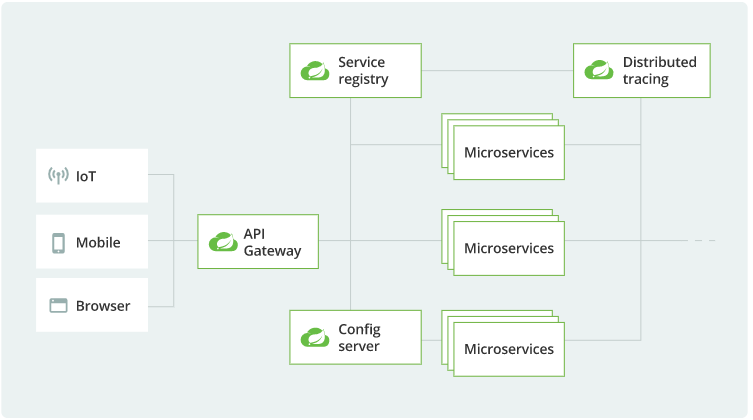
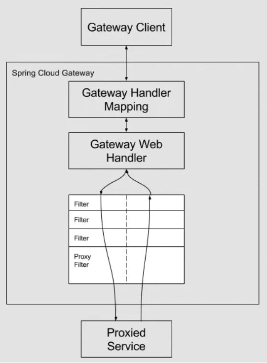

#springCloud
简介

       Developing distributed systems can be challenging(挑战性). 
       Complexity(复杂的) is moved from the application layer to the network layer 
    and demands greater interaction between services. Making your code ‘cloud-native’ means dealing 
    with 12-factor issues such as external configuration, statelessness, logging, and connecting to 
    backing services. The Spring Cloud suite of projects contains many of the services you need to 
    make your applications run in the cloud.
       分布式系统可能对于开发者来是比较具有挑战性的，
      复杂性从应用程序层搬到网络层和需求之间更多的互动服务。让你的代码成为“云本地”意味着要处理12个方面的问题，
    比如外部配置、无状态、日志和连接到后台服务。Spring Cloud项目套件包含使应用程序在云中运行所需的许多服务
##springCloud 架构两点
 

##springCloude主要组成部分
* Service discovery(官方解释如下)

    In the cloud, applications can’t always know the exact location of other services. 
    A service registry, such as Netflix Eureka, or a sidecar solution, such as HashiCorp Consul, can help. 
    Spring Cloud provides DiscoveryClient implementations for popular registries such as Eureka, Consul, Zookeeper, and even Kubernetes' built-in system. 
    There’s also a Spring Cloud Load Balancer to help you distribute the load carefully among your service instances.
* API gateway

    With so many clients and servers in play, it’s often helpful to include an API gateway in your cloud architecture. 
    A gateway can take care of securing and routing messages, hiding services, throttling load, and many other useful things. 
    Spring Cloud Gateway gives you precise control of your API layer,
    integrating Spring Cloud service discovery and client-side load-balancing solutions to simplify configuration and maintenance.  

* Cloud configuration

     In the cloud, configuration can’t simply be embedded inside the application.
     The configuration has to be flexible enough to cope with multiple applications, environments, 
     and service instances, as well as deal with dynamic changes without downtime. 
     Spring Cloud Config is designed to ease these burdens 
     and offers integration with version control systems like Git to help you keep your configuration safe.
* Circuit breakers

       Distributed systems can be unreliable. Requests might encounter timeouts or fail completely.
       A circuit breaker can help mitigate these issues, and Spring Cloud Circuit Breaker gives 
       you the choice of three popular options: Resilience4J, Sentinel, or Hystrix.
* Tracing
    

    Debugging distributed applications can be complex and take a long time. For any given failure, 
    you might need to piece together traces of information from several independent services.
     Spring Cloud Sleuth can instrument your applications in a predictable and repeatable way. 
     And when used in conjunction with Zipkin, you can zero in on any latency problems you might have.
* Testing

    In the cloud, you get extra points for having reliable, trustworthy, stable APIs—but getting there can be a journey.
    Contract-based testing is one technique that high-performing teams often use to stay on track. 
    It helps by formalizing the content of APIs and building tests around them to ensure code remains in check.
    
    Spring Cloud Contract provides contract-based testing support for REST and messaging-based APIs with contracts written in Groovy, Java, or Kotlin.
###1. Service discovery 服务注册与发现
    
      您将设置一个Netflix Eureka服务注册表，然后构建一个客户端，该客户端在注册表中注册自己并使用它解析自己的主机。
    服务注册表非常有用，因为它支持客户端负载平衡，并在不需要DNS的情况下将服务提供者与消费者解耦。
###2.  getAway
    
    Spring Cloud Gateway是Spring Cloud大家族的一个新进成员，在Spring Cloud 2.0之后用于取代非官方的Zuul。
    Getaway基于Spring 5.0与Spring WebFlux开发，采用Reactor响应式设计
 
 
 这是官方文档中提供的图，客户端发起请求到达Gateway，根据HandlerMapping到路由处理
 术语
 * 路由(Route)：路由为一组断言与一组过滤器的集合，他是网关的一个基本组件。
 * 断言(Predicate)：匹配路由的判断条件，例如Path=/demo，匹配后应用路由。
 * 过滤器(Filter)：过滤器可以对请求和返回进行修改，比如增加头信息等。
 * 地址(Uri)：匹配路由后转发的地址。 
