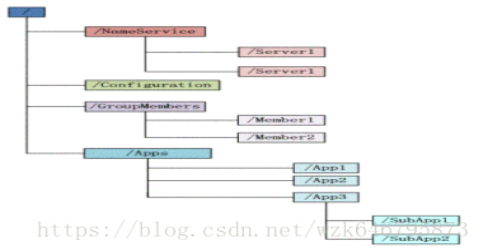
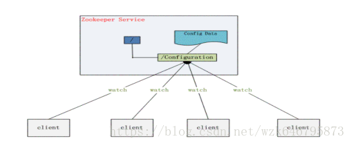
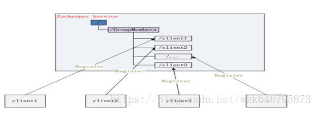
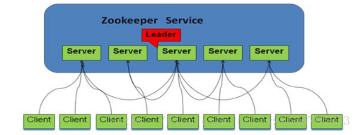
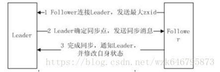

##zookeeper资料
### 1、 Zookeeper是什么？
分布、开源的应用程序协调服务,它是集群的管理者,监视着集群中各个节点的状态，根据节点的反馈进行下一步合理操作。主要解决分布式应用经常遇到的数据管理问题,如：统一命名服务、状态同步服务、集群管理、分布式应用配置项的管理等。

（Zookeeper 作为 Hadoop 项目中的一个子项目，是 Hadoop 集群管理的一个必不可少的模块，它主要用来控制集群中的数据，如它管理 Hadoop 集群中的 NameNode，还有 Hbase 中 Master Election、Server 之间状态同步等。）
### 2、Zookeeper提供什么？
Zookeepr提供文件系统及通知机制。

* 1 文件系统：zookeeper维护一个类似文件系统的数据结构:

每个子目录项如 NameService 都被称作为 znode，和文件系统一样，自由增加及删除，唯一不同其可存储数据。Znode分为四种类型

(1) PERSISTENT-持久化目录节点。（客户端与zookeeper断开连接后，该节点依旧存在)

(2) PERSISTENT_SEQUENTIAL-持久化顺序编号目录节点。（客户端与zookeeper断开连接后，该节点依旧存在，只是Zookeeper给该节点名称进行顺序编号）

(3) EPHEMERAL-临时目录节点（客户端与zookeeper断开连接后，该节点被删除）

(4) EPHEMERAL_SEQUENTIAL-临时顺序编号目录节点。（客户端与zookeeper断开连接后，该节点被删除，只是Zookeeper给该节点名称进行顺序编号）

* 1 通知机制：客户端注册监听它关心的目录节点，当目录节点发生变化（数据改变、被删除、子目录节点增加删除）时，zookeeper会通知客户端。

###3、Zookeeper能为我们做什么？
（1）命名服务：在zookeeper的文件系统里创建一个目录，即有唯一的path。在我们使用tborg无法确定上游程序的部署机器时即可与下游程序约定好path，通过path即能互相探索发现

（2）配置管理：把应用配置放置zookeeper上去,保存在 Zookeeper 的某个目录节点中，然后所有相关应用程序对这个目录节点进行监听，一旦配置信息发生变化，每个应用程序就会收到 Zookeeper 的通知，然后从 Zookeeper 获取新的配置信息应用到系统中就好。

 
（3）集群管理：节点（机器）增删及Master选取。节点增删：所有机器约定在父目录GroupMembers下创建临时目录节点，然后监听父目录节点的子节点变化消息。一旦有机器挂掉，该机器与 zookeeper的连接断开，其所创建的临时目录节点被删除，所有其他机器都收到通知：某个兄弟目录被删除，于是，所有人都知道：它上船了。新机器加入 也是类似，所有机器收到通知：新兄弟目录加入，highcount又有了。Master选取：所有机器创建临时顺序编号目录节点，每次选取编号最小的机器作为master就好

（4）分布式锁：基于zookeeper一致性文件系统,实现锁服务。锁服务分为保存独占及时序控制两类。保存独占：将zookeeper上的一个znode看作是一把锁，通过createznode的方式来实现。所有客户端都去创建 /distribute_lock 节点，最终成功创建的那个客户端也即拥有了这把锁。用完删除自己创建的distribute_lock 节点就释放锁。时序控制：基于/distribute_lock锁，所有客户端在它下面创建临时顺序编号目录节点，和选master一样，编号最小的获得锁，用完删除，依次方便。

（5）队列管理：分同步队列,FIFO队列（入队与出队），同步队列：当一个队列的成员都聚齐时，这个队列才可用，否则一直等待所有成员到达。在约定目录下创建临时目录节点，监听节点数目是否是我们要求的数目。FIFO队列：和分布式锁服务中的控制时序场景基本原理一致，入列有编号，出列按编号。

（6）分布式与数据复制：Zookeeper作为一个集群提供一致的数据服务，必然在所有机器间做数据复制。数据复制好处：
    
   * 容错：一个节点出错，不致于让整个系统停止工作，别的节点可以接管它的工作。
   * 提高系统的扩展能力：把负载分布到多个节点上，或者增加节点来提高系统的负载能力；
   * 性能提升：让客户端本地访问就近节点,提高用户访问速度。

###4、Paxos算法（数据一致性）
数据集群系统分：

（1）写主（writeMaster）,对数据的修改提交给指定的节点。读无此限制，可以读取任何一个节点。这种情况下客户端需要对读与写进行区别，俗称读写分离；

（2）写任意（对数据的修改可提交给任意的节点，跟读一样。这种情况下，客户端对集群节点的角色与变化透明。）对zookeeper来说，它采用的方式是写任意。通过增加机器，它的读吞吐能力和响应能力扩展性非常好，而写，随着机器的增多吞吐能力肯定下降（这也是它建立observer的原因），而响应能力则取决于具体实现方式，是延迟复制保持最终一致性，还是立即复制快速响应。

 原则：在一个分布式数据库系统中，如果各节点的初始状态一致，每个节点都执行相同的操作序列，那么他们最后能得到一个一致的状态。Paxos算法解决：保证每个节点执行相同的操作序列。 

 Paxos算法通过投票来对写操作进行全局编号，同一时刻，只有一个写操作被批准，同时并发的写操作要去争取选票，只有获得过半数选票的写操作才会被 批准（所以永远只会有一个写操作得到批准），其他的写操作竞争失败只好再发起一轮投票，就这样，在日复一日年复一年的投票中，所有写操作都被严格编号排序。编号严格递增，当一个节点接受了一个编号为100的写操作，之后又接受到编号为99的写操作（因为网络延迟等很多不可预见原因），它马上能意识到自己 数据不一致了，自动停止对外服务并重启同步过程。任何一个节点挂掉都不会影响整个集群的数据一致性（总2n+1台，除非挂掉大于n台）。
 
### 5、Zookeepr基本概念 
#### 5.1角色简介
 Zookeeper角色分为三类：
 
（1）领导者：负责进行投票的发起和决议,更新系统状态。

（2）学习者：
 
  ①跟随者：Follower用于接收客户请求并向客户端返回结果，在选中过程中参与投票。
  
  ②观察者：Observer可以接收客户端连接，将写请求转发给leader节点。但不参加投票过程,只同步leader状态。Observer目的在于扩展系统，提高读取速度。
 
（3）客户端：请求发起方。

 系统模型如图：
 
 
 ####5.2设计目的
 （1）一致性：client不论连接到哪个Server，展示给它都是同一个视图，这是zookeeper最重要的性能
 
 （2）可靠性：具有简单、健壮、良好的性能，如果消息m被到一台服务器接受，那么它将被所有的服务器接受。
 
 （3）实时性：Zookeeper保证客户端将在一个时间间隔范围内获得服务器的更新信息，或者服务器失效的信息。但由于网络延时等原因，Zookeeper不能保证两个客户端能同时得到刚更新的数据，如果需要最新数据，应该在读数据之前调用sync()接口
 
 （4）等待无关（wait-free）：慢的或者失效的client不得干预快速的client的请求，使得每个client都能有效的等待。
 
 （5）原子性：更新只能成功或者失败，没有中间状态。
 
 （6）顺序性：包括全局有序和偏序两种：全局有序是指如果在一台服务器上消息a在消息b前发布，则在所有Server上消息a都将在消息b前被发布；偏序是指如果一个消息b在消息a后被同一个发送者发布，a必将排在b前面。

###6、Zookeepr工作原理
Zookeeper的核心是原子广播，这个机制保证了各个Server之间的同步。实现这个机制的协议叫做Zab协议。Zab协议有两种模式，它们分别是恢复模式（选主）和广播模式（同步）。当服务启动或者在领导者崩溃后，Zab就进入了恢复模式，当领导者被选举出来，且大多数Server完成了和 leader的状态同步以后，恢复模式就结束了。状态同步保证了leader和Server具有相同的系统状态

为了保证事务的顺序一致性，zookeeper采用了递增的事务id号（zxid）来标识事务。所有的提议（proposal）都在被提出的时候加上 了zxid。实现中zxid是一个64位的数字，它高32位是epoch用来标识leader关系是否改变，每次一个leader被选出来，它都会有一个 新的epoch，标识当前属于那个leader的统治时期。低32位用于递增计数。
  
每个Server在工作过程中有三种状态：  

  （1）LOOKING：当前Server不知道leader是谁，正在搜寻。
  
  （2）LEADING：当前Server即为选举出来的leader。
  
  （3）FOLLOWING：leader已经选举出来，当前Server与之同步。
####6.1选主流程

  当leader崩溃或者leader失去大多数的follower，这时候zk进入恢复模式，恢复模式需要重新选举出一个新的leader，让所有的 Server都恢复到一个正确的状态。Zk的选举算法有两种：一种是基于basic paxos实现的，另外一种是基于fast paxos算法实现的。系统默认的选举算法为fast paxos。先介绍basic paxos流程：
 
  Basic paxos：当前Server发起选举的线程,向所有Server发起询问,选举线程收到所有回复,计算zxid最大Server,并推荐此为leader，若此提议获得n/2+1票通过,此为leader，否则重复上述流程，直到leader选出。
 
  Fast paxos:某Server首先向所有Server提议自己要成为leader，当其它Server收到提议以后，解决epoch和 zxid的冲突，并接受对方的提议，然后向对方发送接受提议完成的消息，重复这个流程，最后一定能选举出Leader。(即提议方解决其他所有epoch和 zxid的冲突,即为leader)。
 
####6.2同步流程 
 （1）Leader等待server连接；
 
 （2）Follower连接leader，将最大的zxid发送给leader；
 
 （3）Leader根据follower的zxid确定同步点，完成同步后通知follower 已经成为uptodate状态；
 
 （4）Follower收到uptodate消息后，又可以重新接受client的请求进行服务了。

 
 
 ####6.3主要功能（server）

 （1）Leader主要功能：①恢复数据②维持与Learner的心跳，接收Learner请求并判断Learner的请求消息类型；③Learner的消息类型主要有PING消息、REQUEST消息、ACK消息、REVALIDATE消息，根据不同的消息类型，进行不同的处理。
 
  PING消息是指Learner的心跳信息；REQUEST消息是Follower发送的提议信息，包括写请求及同步请求；ACK消息是 Follower的对提议的回复，超过半数的Follower通过，则commit该提议；REVALIDATE消息是用来延长SESSION有效时间。
 
 （2）Follower主要功能：①向Leader发送请求（PING消息、REQUEST消息、ACK消息、REVALIDATE消息）；②接收Leader消息并进行处理；③接收Client的请求，如果为写请求，发送给Leader进行投票；④返回Client结果。
 
###7、Zookeeper应用场景 
 
 （1）数据发布与订阅：发布与订阅即所谓的配置管理，顾名思义就是将数据发布到zk节点上，供订阅者动态获取数据，实现配置信息的集中式管理和动态更新。例如全局的配置信息，地址列表等就非常适合使用。
 
 （2）NameService：作为分布式命名服务，通过调用zk的create node api，能够很容易创建一个全局唯一的path，这个path就可以作为一个名称。
 
 （3）分布通知/协调：ZooKeeper 中特有watcher注册与异步通知机制，能够很好的实现分布式环境下不同系统之间的通知与协调，实现对数据变更的实时处理。使用方法通常是不同系统都对 ZK上同一个znode进行注册，监听znode的变化（包括znode本身内容及子节点的），其中一个系统update了znode，那么另一个系统能 够收到通知，并作出相应处理。使用zookeeper来进行分布式通知和协调能够大大降低系统之间的耦合。

 （4）分布式锁：主要得益于ZooKeeper为我们保证了数据的强一致性，即用户只要完全相信每时每刻，zk集群中任意节点（一个zk server）上的相同znode的数据是一定是相同的。锁服务可以分为两类，一个是保持独占，另一个是控制时序。控制时序中Zk的父节点（/distribute_lock）维持一份sequence,保证子节点创建的时序性，从而也形成了每个客户端的全局时序。
 
 （5）集群管理：①集群监控：a. 客户端在节点 x 上注册一个Watcher，那么如果x的子节点变化了，会通知该客户端。b. 创建EPHEMERAL类型的节点，一旦客户端和服务器的会话结束或过期，那么该节点就会消失。②Master选举：
 
   利用ZooKeeper的强一致性，能够保证在分布式高并发情况下节点创建的全局唯一性，即：同时有多个客户端请求创建 /currentMaster 节点，最终一定只有一个客户端请求能够创建成功。
 
 （6）分布式队列：一种常规先进先出,另一种待队列成员集齐后执行。
